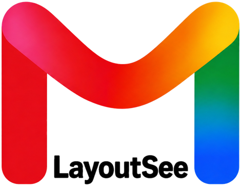
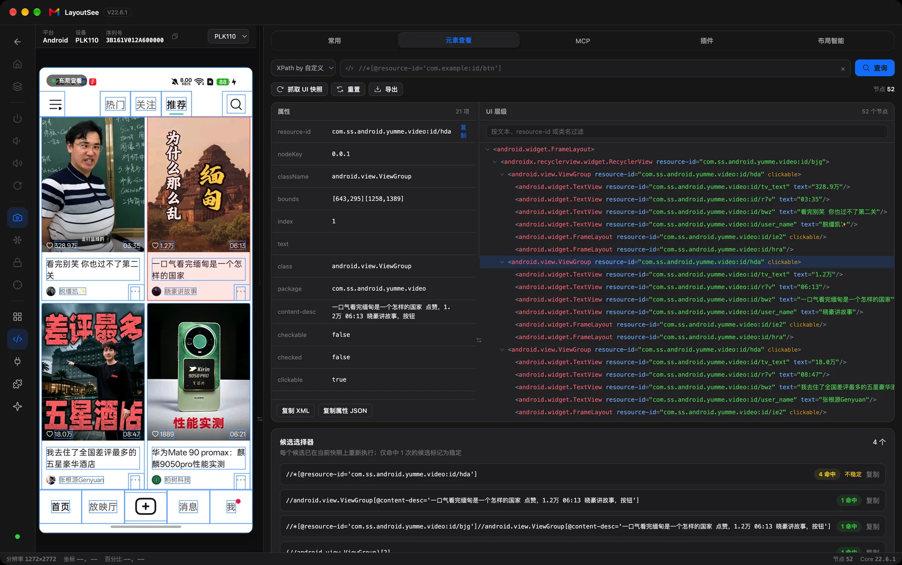
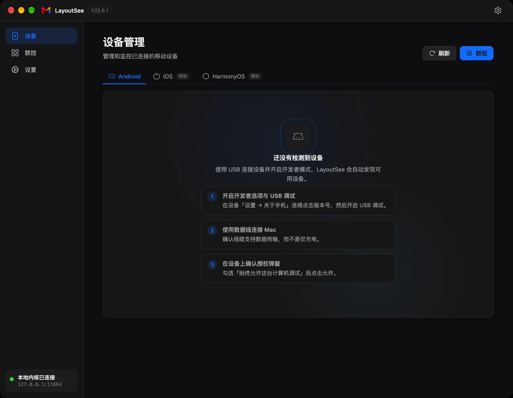
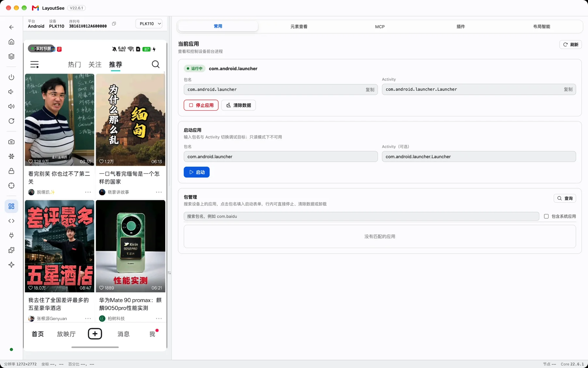
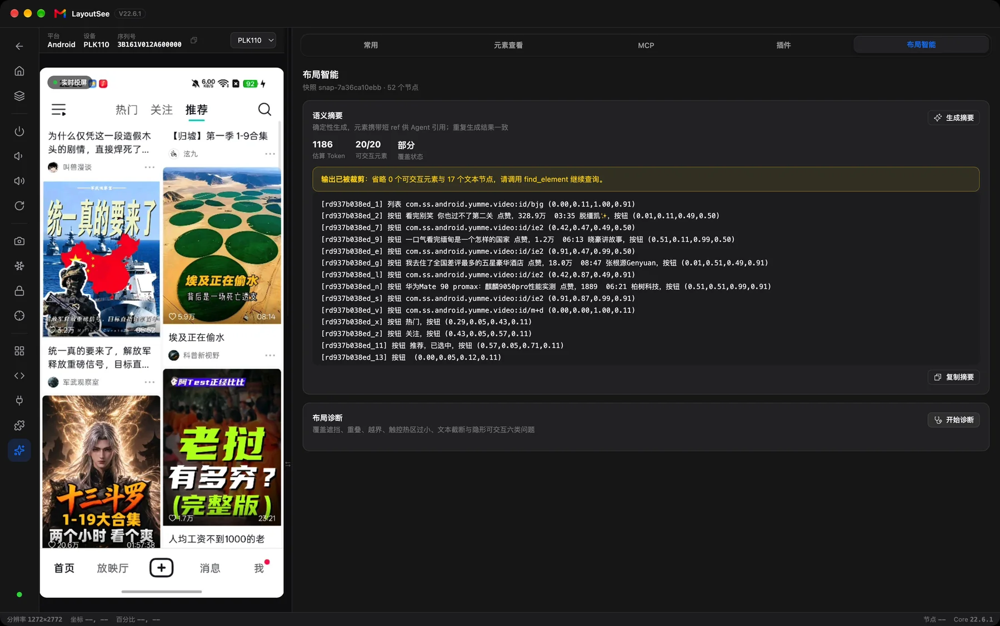
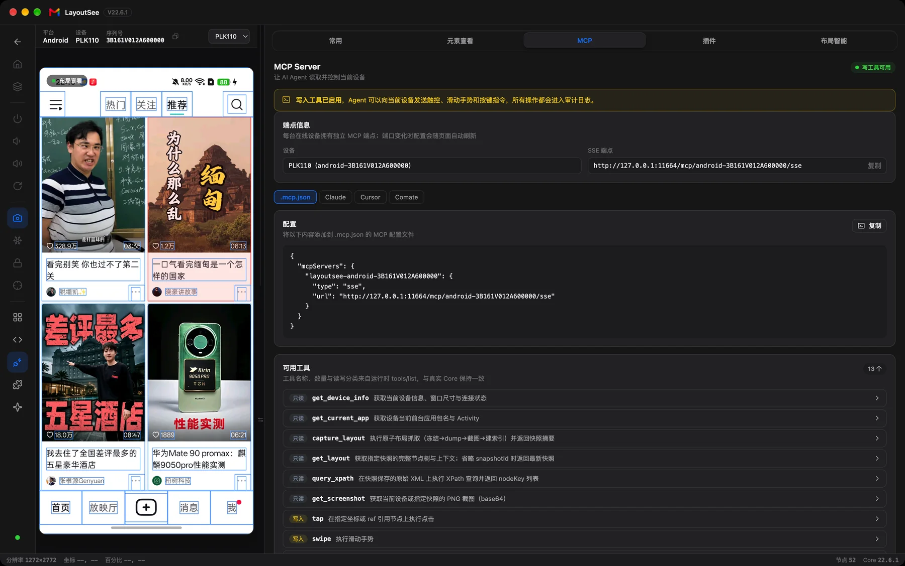
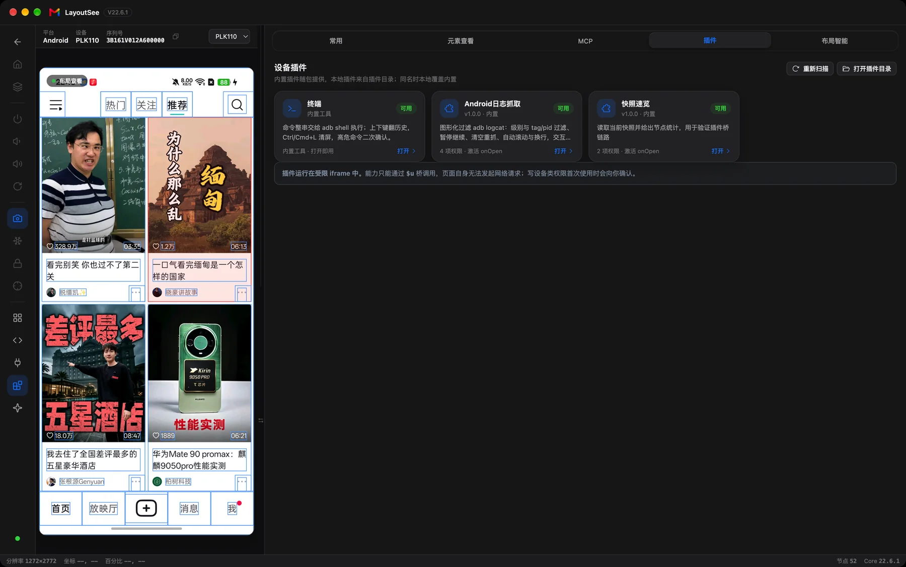
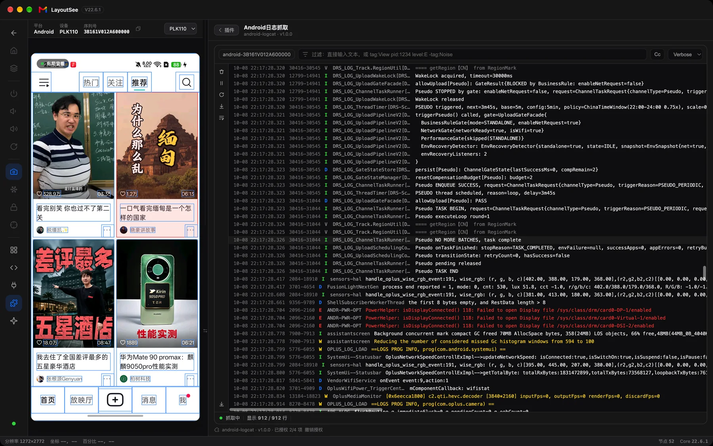
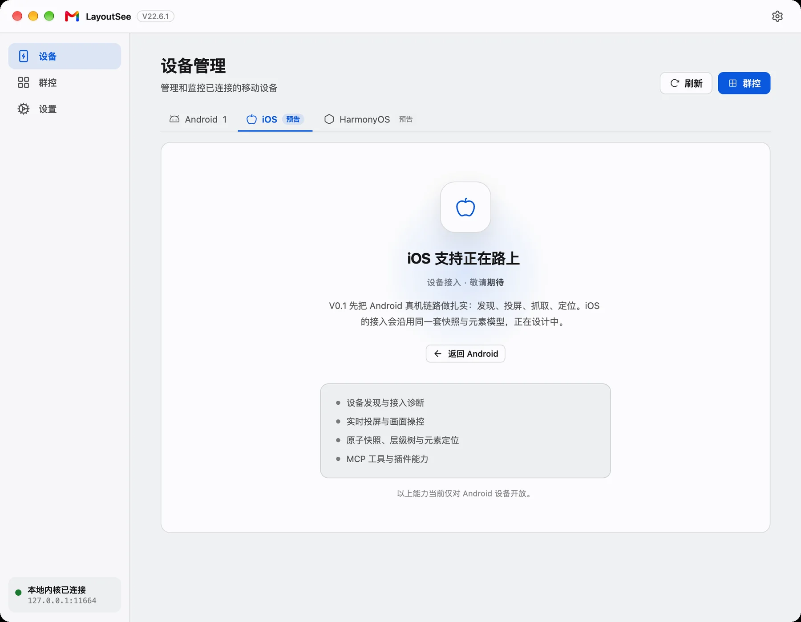

<p align="center">
  <picture>
    <source media="(prefers-color-scheme: dark)" srcset="./assets/readme/logo-dark.png">
    
  </picture>
</p>

中文 · [English](README.en.md)

<p align="center">
  
</p>

LayoutSee 是 macOS 上的移动端运行时视图工具。插上一台 Android 真机，它先做两件最直接的事：把手机画面搬进窗口——实时投屏，鼠标直接点、键盘直接打字；再把这个画面背后的 **View 树**摊开——每个控件的文本、resource-id、尺寸、位置、能不能点，都读得到、点得到。

AI Agent 写移动端代码早就不是问题，卡住它的是「看」。截图能让它看个大概，但说不清一个按钮多大、在哪、是不是被上层控件盖住了；换成 `uiautomator dump` 的 XML，又是几千行，人读不动，模型读不完还费 token。LayoutSee 补的是这一层：**一次抓取，同时拿到同一时刻的画面、层级、属性和坐标**，再裁成一份 Agent 一眼读完的清单，通过 MCP 接进它正在用的客户端。截图负责「看起来对不对」，View 树负责「结构上是什么」。

给移动端开发、QA 和 AI Agent 用。当前版本完整支持 Android，iOS 与 HarmonyOS 已在界面上预留位置。

## 它怎么工作

1. **一次抓取，四样东西对齐。** 冻结画面 → dump 层级 → 取这一帧的截图 → 建节点索引，四步在同一个快照里完成。快照上带着 schema 版本、平台、方向、窗口尺寸、抓取时刻和来源驱动；后面的树、高亮、属性、摘要、诊断都从这一份快照派生，不会出现「树是这一帧、图是另一帧」。

2. **点哪儿，查哪儿。** 在画面上点一个控件，树上自动展开父链、滚到对应节点；在树上选一个节点，画面同步框出它的 bounds。打开「审查模式」后，点画面变成选节点而不是注入 tap，排查时不会误碰真机。属性面板给的是原始属性全量——class、bounds、index、clickable、content-desc，一项不少。

3. **XPath 在原始 XML 上跑，选择器带命中数。** 查询用的是抓取时保存的原始层级文本，不从 JSON 树反推，避免语义漂移；选中节点能反向生成候选选择器，每条标注在当前这份快照里命中几次，命中超过一次的直接标「不稳定」。

4. **给 Agent 的不是 XML，是一份清单。** 语义摘要只保留可交互元素、文本节点和层级骨架，每个元素带一个短 `ref`，还给出归一化中心点，Agent 不用自己算坐标就能点。默认预算 1200 token，超了先压文本；可交互元素优先保留，不会因为预算被丢掉。同一份快照重复生成，结果完全一致。

5. **诊断只讲证据。** `diagnose_layout` 覆盖六类几何问题：重叠、遮挡、越界、触控热区过小、文本截断、隐形可交互。每条给出涉及的节点、量化证据（重叠面积占比、热区多少 dp、越界几个像素）和一段固定模板的建议，不找模型编解释。

6. **Agent 能动手，但手上有绳。** 只读模式是一道统一的写门禁，界面和 MCP 走同一个开关；所有写操作进审计日志，记清来源是界面、MCP 还是插件；MCP 工具列表里没有 shell，Agent 拿不到无边界的命令执行。`ref` 和快照绑定，换了页面还用旧 `ref` 会被拒绝，而不是点到别的地方。

7. **插件是接口，不是后门。** 每个插件用 manifest 声明自己要哪些权限、往工作台贡献什么、要不要注册 MCP 工具；代码跑在受限 iframe 里，能力只能通过 `$u` 桥调用，写设备这类权限第一次用会先问你。

## 安装

在 [Releases](https://github.com/IQQcode/LayoutSee/releases/latest) 下载对应架构的 DMG：Apple Silicon 选 `-arm64`，Intel 选 `-x64`。安装包还没有做签名公证，首次打开如果被系统拦下，去「系统设置 → 隐私与安全性」选择「仍要打开」。

手机侧准备好三件事：开启开发者选项与 USB 调试；用一根能传数据的数据线连上 Mac；在手机上勾选「始终允许这台计算机调试」并确认授权。

Android 链路依赖 `adb`，没有装也没关系——设备页会把这三步摆在面前，也可以在设置里指定 `adb` 路径，或者先 `brew install android-platform-tools`。

不弹注册窗、不校验 License、不联网：快照、存档、日志都只留在本地，内核默认只监听回环地址。

## 走一遍

### 先把设备接上

<p align="center">
  
</p>

设备页按平台分区列出设备：序列号、型号、状态、控制入口。每 5 秒自动刷新，插拔都会有提示；没有设备时给的是三步接入指引，而不是一片空白。旁边是群控入口：多台设备排成网格，每格单独刷新画面、可以单独冻结，双击进入工作台。

### 看着画面，直接操作

<p align="center">
  
</p>

Android 投屏走 scrcpy：H.264 视频流经 WebSocket 送到前端解码，机型不支持时降级到截图模式，但不会白屏。左边一列控制轨管设备本身——Home、最近任务、电源、音量、旋转、抓取快照、冻结画面、只读模式、审查模式。鼠标左键点击、拖拽滑动、中键 Home、右键 Back、滚轮上下滚动；键盘能直接打字，回车与退格同样下发到设备。「常用」Tab 管应用：看前台包名与 Activity，启动、停止、清数据。

### 抓一次快照：树、属性、摘要、诊断

<p align="center">
  
</p>

点一下「立即抓取」，同一时刻的画面、层级树、属性和坐标一起拿到。「元素查看」Tab 里是层级树、属性面板、XPath 查询和候选选择器；「布局智能」Tab 里是给 Agent 的那份摘要，以及布局诊断入口——就是上面这张：20 个可交互元素一个没漏，顺手省掉 17 个信息量低的文本节点。想知道 Agent 到底看到了什么，看这里就行，不用猜。

### 把端点交给 Agent

<p align="center">
  
</p>

MCP Tab 列出每台设备自己的 SSE 端点，配置片段在 `.mcp.json`、Claude、Cursor、Comate 之间切换，复制过去就能用。工具列表里能看到全部 12 个内置工具；「只读模式」开着的时候，写工具会被直接拦下。

## 12 个内置 MCP 工具

每台在线设备一个独立端点，设备断开端点即失效、重连自动恢复。内置工具 9 读 3 写，插件还能追加自己的工具，命名空间是 `plugin.<id>.<name>`。

| 工具 | 类型 | 做什么 |
| --- | :---: | --- |
| `capture_layout` | 读 | 原子抓取：冻结、dump、截图、建索引一次完成，返回 snapshotId、节点数、同步状态 |
| `get_layout` | 读 | 取指定快照的完整节点树与上下文，省略 id 就是最新快照 |
| `get_layout_summary` | 读 | 确定性语义摘要，元素带短 `ref` 与中心点 |
| `diagnose_layout` | 读 | 六类布局异常诊断，带量化证据与建议 |
| `find_element` | 读 | 按文本、描述或 resource-id 检索元素，返回 `ref` |
| `query_xpath` | 读 | 在快照的原始 XML 上执行 XPath，返回节点 key |
| `get_device_info` | 读 | 型号、serial、窗口尺寸、密度、朝向、只读状态 |
| `get_current_app` | 读 | 前台包名与 Activity |
| `get_screenshot` | 读 | 当前画面或指定快照的 PNG（base64） |
| `tap` | 写 | 按坐标或 `ref` 点击 |
| `swipe` | 写 | 滑动手势 |
| `input_text` | 写 | 文本输入 |

工具出错时返回结构化的错误码，而不是异常堆栈：`SNAPSHOT_STALE` 表示还没有可用快照，先抓一次；`READ_ONLY_MODE` 表示被只读模式挡下；`REF_NOT_FOUND` 表示那把 `ref` 已经随上一份快照失效，取一份新的即可。

## 插件

插件页默认躺着三块扩展：**终端**（内置的 adb shell，高危命令要二次确认）、**Android 日志抓取**、**快照速览**。后两个就放在 [`repos/plugins/`](./repos/plugins/)，想照着写可以直接抄。

<p align="center">
  
</p>

<p align="center">
  
</p>

写一个插件不需要构建步骤：建一个目录，放 `manifest.json` 和入口 HTML 就行。manifest 里说清三件事——要哪些权限（`device.read`、`device.write`、`storage.local`、`host.integration`）、贡献什么（加一个工作台 Tab，或者用 `mcpTools` 注册自己的工具）、什么范围内可用（宿主、设备平台、引擎版本区间）。插件跑在 iframe 里，页面发不出网络请求，能力只能通过 `$u` 桥调用。本地插件目录是 `~/Library/Application Support/LayoutSee/plugins/`，插件页有按钮直接打开。

## 平台与边界

| 平台 / 端 | 状态 |
| --- | --- |
| Android | 完整链路：投屏与操控、快照抓取、层级与属性、语义摘要、六类诊断、MCP、插件 |
| iOS | 界面上已预留（标注「预览」），接入尚未实现 |
| HarmonyOS | 同上 |
| 端 | macOS 应用（Apple Silicon / Intel 两个 DMG）；界面由本地内核托管，浏览器直连也是同一份界面 |

<p align="center">
  
</p>

还没做的：快照存档与 diff、`.lsnap` 离线导入导出、Windows 版、团队 Server 形态。这些在 [PRD](./docs/feature/UI-LayoutSee需求文档PRD.md) 里排在 V0.2 之后。另外两件明确不做：不比对设计稿，不分析静态 layout XML 源码。

## 从源码跑起来

```bash
npm install          # 安装 workspaces 依赖（contracts / web / mac）
npm run dev:web      # 浏览器联调：起 Core 并把界面开在 http://127.0.0.1:4173
npm run test:unit    # 契约、core、web、mac 的全部单测
npm run lint         # 三个 npm 工程的静态检查
npm run build:all    # 契约漂移门禁 + web 构建 + mac 主进程构建
npm run package:mac  # 出未签名 DMG 与解包 app
```

依赖 Node ≥ 22.12、Python 3.12（uv 管理）、macOS 与 `adb`。生产形态是内核托管前端产物：`uv run --project repos/core python -m layoutsee_core --nonce <64hex> --static-dir repos/web/dist`。各模块的构建与测试命令见 [source/index.md](./source/index.md)。

## 仓库里有什么

- [`repos/contracts`](./repos/contracts/) —— 跨进程契约的单一事实源：OpenAPI 与 JSON Schema，生成物有漂移门禁；
- [`repos/core`](./repos/core/) —— Python 内核：设备接入、原子快照、语义摘要、布局诊断、MCP 服务、插件宿主；
- [`repos/web`](./repos/web/) —— 工作台前端（Vite + React），浏览器与桌面壳共用同一份产物；
- [`repos/mac`](./repos/mac/) —— macOS 桌面壳（Electron）：原生窗口、内核进程守护与发行打包；
- [`repos/plugins`](./repos/plugins/) —— 随包插件示例：日志抓取与快照速览；
- [`skills/layout-see`](./skills/layout-see/) —— 教 Agent 用这套 MCP 读布局、跑诊断、按证据回答问题的 Skill。

这个仓库同时是一个工作区：PRD、设计规范、竞品调研、技术规格和 Agent 的工作规则都在里面。完整的文件树、目录职责与文档导航见 [docs/repo-structure.md](./docs/repo-structure.md)。

## 一起用的东西

- [`skills/layout-see`](./skills/layout-see/)：把这个 Skill 交给 Agent，它会知道什么时候抓快照、什么时候跑诊断，以及怎么回答「这个控件为什么点不到」这类问题。MCP 连不上时还有一条脚本直连本地端点的兜底路径。
- [uiautomator2](https://github.com/openatx/uiautomator2) 与 [scrcpy](https://github.com/Genymobile/scrcpy)：Android 侧的抓取与投屏都站在它们肩上。
- [uiautodev](https://github.com/codeskyblue/uiautodev)：内核的设备接入层二次开发自这个开源工程，架构上继承了它的统一节点契约与「控制面 / 媒体面分离」，产品层与 AI 适配层是重写的。
