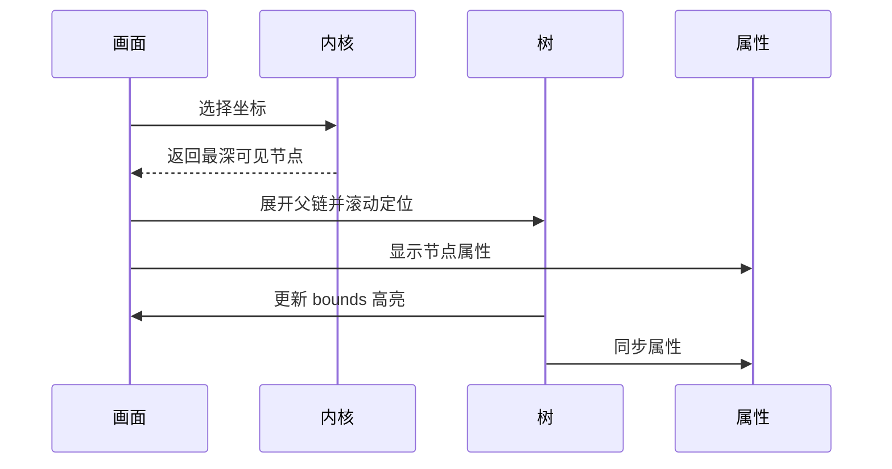

# LayoutSee 设计系统与界面规范

> 本文是 LayoutSee 的视觉与交互设计单一事实源，用于产品设计、前端实现、Stitch 出图和设计验收。
>
> [交互原型文档](./interaction-prototype.md)负责说明页面跳转和行为，[stich-design.md](./stich-design.md)保留为历史设计输入。当三者冲突时，以本文件为视觉与组件标准，以交互原型文档为行为标准。

## 1. 设计定义

### 1.1 产品定位

LayoutSee 是面向移动开发与 AI 协同场景的 macOS 桌面应用。它连接 Android、iOS、HarmonyOS 真机，提供实时投屏与操控、结构化 UI 层级抓取、语义摘要、布局异常诊断和 MCP 服务，把移动设备运行时视图转换为 AI Agent 可读、可定位、可操作的结构化资源。

视觉定位：**一个有 Apple 品质感、同时保持工具克制的开发者桌面工具。**

它应像 macOS 原生 App 一样安静，但能稳定承载画面、树、属性、诊断、配置和日志等高密度信息。

### 1.2 目标用户

- 移动端开发者：连接真机、查看前台应用、定位元素、复现布局问题。
- 测试与自动化工程师：获取确定性节点信息，运行诊断，导出快照。
- AI Agent 使用者：通过 MCP 获取紧凑、可信、可操作的运行时上下文。
- 插件开发者：在受控运行时中扩展调试与自动化能力。

### 1.3 核心任务

1. 发现并确认可用设备。
2. 进入设备工作台并操控真实画面。
3. 抓取 UI 快照，在画面、树、属性之间定位同一节点。
4. 查看语义摘要与布局异常证据。
5. 复制 MCP 配置，让 Agent 接入当前设备。
6. 在只读、安全、离线或异常场景中仍能理解当前状态和下一步。

### 1.4 设计判断

这是一次保留信息架构的系统化重设计，不是营销页，也不是实验性视觉作品。

| 旋钮 | 数值 | 设计含义 |
|---|---:|---|
| `DESIGN_VARIANCE` | 4 | 结构稳定，允许局部不对称，不做艺术化错位 |
| `MOTION_INTENSITY` | 3 | 只有悬停、反馈、状态切换和必要过渡 |
| `VISUAL_DENSITY` | 8 | 高密度工作台，依靠层级、对齐和分隔控制负荷 |

基础方向：macOS HIG 的层级与材质语言 + 自有语义 Token + 高密度开发工具模式。

不直接套用面向营销页的视觉模板，也不混用 Material、Fluent、Carbon 等完整设计系统。

### 1.5 原型审阅结论

应保留：

- macOS 标题栏和交通灯带来的原生窗口识别。
- 设备管理页的左侧一级导航、平台 Tab 和大面积安静留白。
- 工作台的三段式骨架：控制轨、设备画面、右侧任务面板。
- 单一蓝色选中态与浅灰中性色背景。
- 元素查看中的画面、属性、树三方联动结构。
- 插件空状态和 MCP 配置区的明确下一步。

应优化：

- 右侧工作台不能只在浅色大画布上堆边框卡片，需要明确内容层级和滚动归属。
- 元素树的彩色语法不能抢过节点选中态和诊断状态。
- 普通布尔值 `false` 不是错误，不使用危险红色表达。
- MCP 工具数量从真实能力动态读取，不写死为 9。
- 页面必须补齐加载、空、错误、离线、未授权、只读和部分可用状态。
- 标题栏、导航、画面和面板的尺寸需要统一为 4px 栅格。
- 图标必须来自同一图标体系，不使用 emoji、文本符号或手绘 SVG 代替。

## 2. 设计原则

### 2.1 内容优先

设备画面、UI 树、属性和诊断证据是主角。容器、描边、阴影和材质只负责组织信息，不负责制造视觉效果。

### 2.2 状态透明

连接、抓取、冻结、只读、离线、未授权、MCP 可用性都要显式呈现。禁止静默失败，禁止只靠颜色表达状态。

### 2.3 精确可验证

涉及定位和诊断的结论必须带证据，包括 bounds、尺寸、命中数、token 估算、耗时和规则说明。数字使用等宽字体与等宽数字。

### 2.4 一次只突出一个上下文

品牌蓝只表示当前上下文、主要操作、选中和焦点。成功、警告、危险色只表达真实语义，不参与装饰。

### 2.5 密度分区

- 管理页采用中等密度，强调扫描和入口。
- 工作台采用高密度，强调对齐和局部滚动。
- 弹窗采用低到中密度，只放完成当前决策所需的信息。

### 2.6 原生感来自细节

原生感来自系统字体、连续圆角、窗口材质、精确间距、短促反馈和键盘路径，不来自大面积毛玻璃、外发光或复杂渐变。

### 2.7 可恢复优先

错误信息必须同时回答三个问题：发生了什么、哪些内容仍可用、用户下一步可以做什么。

## 3. 信息架构

### 3.1 一级导航

| 导航项 | 目标 | V1 状态 | 说明 |
|---|---|---|---|
| 主页 | 产品概览 | 待确认 | 未落地时隐藏，不保留死入口 |
| 设备 | 设备管理 | 可用 | 应用启动后的默认页面 |
| 应用 | 跨设备应用管理 | 待确认 | 未落地时隐藏 |
| 命令 | 命令执行 | 待确认 | 未落地时隐藏 |
| 日志 | 日志与审计 | 可用 | 接收错误、插件、MCP 的上下文入口 |
| 设置 | 全局设置 | 可用 | 标题栏齿轮与侧栏入口指向同一页面 |

说明：若产品决定保留未来导航项，则必须禁用并展示明确版本说明。隐藏是默认方案，避免用户面对可见但不可完成的入口。

### 3.2 设备域层级

```text
设备管理
├── 群控
└── 设备工作台
    ├── 常用
    ├── 插件
    ├── 元素查看
    ├── MCP
    └── 布局智能
```

### 3.3 主任务路径


### 3.4 页面上下文保留

- 从设备管理进入工作台时携带 `deviceId`。
- 工作台切换 Tab 时保留当前快照和选中节点。
- 切换设备时保留当前 Tab，但清空快照、查询和选中节点。
- 从插件或 MCP 跳转日志页时携带过滤条件。
- 从错误进入设置页时定位到对应设置分组，返回后回到来源页。

## 4. 全局窗口与布局

### 4.1 窗口基准

| 属性 | 规范 |
|---|---|
| 原型基准 | 1480 x 1060 |
| 最小窗口 | 1280 x 800 |
| 默认窗口 | 1440 x 900 |
| 标题栏高度 | 80px |
| 交通灯避让 | 左侧 92px |
| 内容最小高度 | `calc(100dvh - 80px)` |
| 网格 | 4px 基础栅格 |

窗口小于最小尺寸时由原生壳限制缩放，不为桌面工作台生成移动卡片布局。

### 4.2 管理页骨架

```text
┌─────────────────────────────────────────────────────────────┐
│ 交通灯  LayoutSee                             刷新 主题 设置 │
├──────────────┬──────────────────────────────────────────────┤
│ 一级导航 208 │ 页面标题                                     │
│              │ 工具栏                                       │
│              │ 平台 Tab                                     │
│              │ 主内容                                       │
│              │                                              │
│ 状态区       │                                              │
└──────────────┴──────────────────────────────────────────────┘
```

- 一级导航宽 208px，导航项高 52px。
- 内容区水平内边距 48px，顶部内边距 36px。
- 内容最大宽度不锁死，表格与工作台随窗口增长。
- 页面标题、工具栏和主内容左边界必须对齐。

### 4.3 工作台骨架

```text
┌────────┬──────────────────────────┬───────────────────────────┐
│ 导航与 │ 设备信息条               │ 任务 Tab                  │
│ 控制轨 │ 设备画面                 │ 当前任务内容              │
│ 96     │ 360-760                  │ 最小 520                  │
└────────┴──────────────────────────┴───────────────────────────┘
```

- 控制轨宽 96px，导航和设备控制用分组与空白区分。
- 设备区默认宽 560px，可在 360-760px 之间拖拽。
- 右侧任务面板最小宽 520px。
- 分隔条可视宽 1px，鼠标命中宽 8px，悬停变为品牌蓝。
- 拖拽结果按设备保存，双击分隔条恢复默认宽度。
- 窗口宽度不足时，先将展开导航折叠为控制轨，再压缩设备区，不压缩任务面板到 520px 以下。

### 4.4 滚动归属

- 标题栏和一级导航固定。
- 管理页内容区整体滚动。
- 工作台设备画面默认固定在可视区内。
- 右侧面板在 Tab 内容内部滚动，Tab 栏固定在面板顶部。
- 元素查看中属性列与树列分别滚动，避免一个超长树拖动全部内容。
- 弹窗打开后锁定底层滚动，关闭后恢复原位置。

### 4.5 层级体系

| 层级 | 用途 |
|---:|---|
| 0 | 页面背景、设备画布 |
| 10 | 固定标题栏、固定侧栏、固定 Tab 栏 |
| 20 | 下拉菜单、Tooltip、Toast |
| 30 | 模态遮罩与弹窗 |
| 40 | 系统级错误与权限确认 |

禁止随意添加新的层级数值。设备画面叠加层位于画面内部，不进入全局层级。

## 5. Token 架构

### 5.1 三层结构

1. 原始 Token：基础色、字号、间距、圆角、时长。
2. 语义 Token：背景、文字、描边、品牌、状态、叠加层。
3. 组件 Token：按钮、导航、表格、树、设备框、弹窗。

组件只能引用语义 Token，禁止在组件样式中直接写原始色值。

### 5.2 色彩原则

- 一套冷中性灰阶，一种品牌蓝。
- 页面不使用紫色 AI 渐变、霓虹外发光或多色装饰。
- 语义色不承担普通选中态。
- 深浅主题保持相同的层级关系，不做局部主题反转。
- 不使用纯黑 `#000000` 作为大面积背景。

### 5.3 浅色主题

| Token | 值 | 用途 |
|---|---|---|
| `color.bg.app` | `#f7f7f8` | 窗口内容背景 |
| `color.bg.sidebar` | `rgba(249,249,250,.82)` | 侧栏材质回退 |
| `color.bg.panel` | `#fcfcfd` | 面板、标题栏、表格 |
| `color.bg.subtle` | `#f1f2f4` | 分段容器、弱分组 |
| `color.bg.hover` | `rgba(29,29,31,.05)` | 悬停 |
| `color.bg.selected` | `rgba(0,113,227,.10)` | 导航、树、列表选中 |
| `color.bg.elevated` | `#fcfcfd` | 菜单、弹窗、Toast |
| `color.bg.canvas` | `#f3f4f6` | 设备画布 |
| `color.bg.device-frame` | `#17171a` | 设备外框 |
| `color.text.primary` | `#1d1d1f` | 主文字 |
| `color.text.secondary` | `rgba(29,29,31,.68)` | 说明、表头 |
| `color.text.tertiary` | `rgba(29,29,31,.48)` | 占位、弱信息 |
| `color.text.inverse` | `#fcfcfd` | 深色按钮文字，与品牌蓝对比度 4.58:1 |
| `color.border.default` | `rgba(29,29,31,.12)` | 默认描边 |
| `color.border.strong` | `rgba(29,29,31,.20)` | 强分隔、悬停描边 |
| `color.brand` | `#0071e3` | 主要操作、选中、焦点 |
| `color.brand.hover` | `#0077ed` | 品牌按钮悬停 |
| `color.brand.active` | `#0067ce` | 品牌按钮按下 |
| `color.success` | `#16883f` | 成功、在线 |
| `color.warning` | `#9a6700` | 警告、部分可用 |
| `color.danger` | `#d70015` | 错误、危险操作 |
| `color.info` | `#53657a` | 中性提示 |

### 5.4 深色主题

| Token | 值 | 用途 |
|---|---|---|
| `color.bg.app` | `#151517` | 窗口内容背景 |
| `color.bg.sidebar` | `rgba(28,28,30,.82)` | 侧栏材质回退 |
| `color.bg.panel` | `#1c1c1e` | 面板、标题栏、表格 |
| `color.bg.subtle` | `#262629` | 分段容器、弱分组 |
| `color.bg.hover` | `rgba(248,248,250,.08)` | 悬停 |
| `color.bg.selected` | `rgba(10,132,255,.20)` | 导航、树、列表选中 |
| `color.bg.elevated` | `#2c2c2e` | 菜单、弹窗、Toast |
| `color.bg.canvas` | `#101012` | 设备画布 |
| `color.bg.device-frame` | `#0b0b0d` | 设备外框 |
| `color.text.primary` | `#f5f5f7` | 主文字 |
| `color.text.secondary` | `rgba(245,245,247,.68)` | 说明、表头 |
| `color.text.tertiary` | `rgba(245,245,247,.44)` | 占位、弱信息 |
| `color.text.inverse` | `#17171a` | 浅色控件文字 |
| `color.border.default` | `rgba(245,245,247,.12)` | 默认描边 |
| `color.border.strong` | `rgba(245,245,247,.22)` | 强分隔、悬停描边 |
| `color.brand` | `#0a84ff` | 主要操作、选中、焦点 |
| `color.brand.hover` | `#3b97ff` | 品牌按钮悬停 |
| `color.brand.active` | `#0876e3` | 品牌按钮按下 |
| `color.success` | `#32d74b` | 成功、在线 |
| `color.warning` | `#ffd60a` | 警告、部分可用 |
| `color.danger` | `#ff453a` | 错误、危险操作 |
| `color.info` | `#8e9daf` | 中性提示 |

### 5.5 平台色

平台色只用于平台图标或短标签，不用于按钮、导航和大面积背景。

| 平台 | 颜色 |
|---|---|
| Android | `#3ddc84` |
| iOS | `color.text.primary` |
| HarmonyOS | `#e8541e` |

### 5.6 画面叠加层

| 状态 | 视觉 |
|---|---|
| 普通节点 | 品牌蓝 1px，45% 透明度，无填充 |
| 悬停节点 | 品牌蓝 1.5px，80% 透明度，无填充 |
| 选中节点 | 品牌蓝 2px，12% 填充 |
| XPath 命中 | 品牌蓝 1.5px 虚线，8% 填充 |
| 诊断错误 | `danger` 2px，12% 填充，附错误图标 |
| 诊断警告 | `warning` 2px，12% 填充，附警告图标 |
| 诊断提示 | `info` 1.5px，10% 填充，附信息图标 |

叠加层颜色之外必须有线型、宽度或图标差异，保证色觉异常用户仍能区分。

### 5.7 语法高亮

语法色用于 XML、XPath 和 JSON，不外溢到普通界面文案。

| Token | Light | Dark |
|---|---|---|
| `syntax.punctuation` | `#68707c` | `#a8afb9` |
| `syntax.tag` | `#a1262f` | `#ff8a8f` |
| `syntax.attribute` | `#1254a3` | `#79b8ff` |
| `syntax.string` | `#8d3a12` | `#f2a97f` |
| `syntax.number` | `#087d4e` | `#63d7a0` |
| `syntax.comment` | `#6b7280` | `#9299a3` |

选中行始终以 `color.bg.selected` 统领，语法色在选中背景上仍需达到 4.5:1 对比度。

### 5.8 布尔与状态值

- 普通 `true` 与 `false` 使用等宽主文字，不用红绿表达。
- 当值代表成功或失败结果时，使用状态图标 + 文案 + 语义色。
- `enabled=false`、`clickable=false` 属于属性事实，不是错误。
- 表格状态必须同时包含图标或状态灯和文字，例如「已连接」「未授权」。

## 6. 排版、间距与形状

### 6.1 字体

| 场景 | 字体栈 |
|---|---|
| 主界面 | `-apple-system, BlinkMacSystemFont, "SF Pro Text", "PingFang SC", sans-serif` |
| 标题 | `"SF Pro Display", -apple-system, "PingFang SC", sans-serif` |
| 代码与数字 | `"SF Mono", ui-monospace, Menlo, Monaco, "PingFang SC", monospace` |

不引入网页字体，不使用衬线字体，不使用 Inter 作为默认字体。

### 6.2 字号阶梯

| Token | 字号 | 行高 | 用途 |
|---|---:|---:|---|
| `type.micro` | 10px | 14px | 极少量角标 |
| `type.caption` | 12px | 16px | 树、代码辅助、Tooltip |
| `type.meta` | 13px | 18px | 表头、属性、辅助信息 |
| `type.body` | 14px | 20px | 正文、导航、按钮 |
| `type.body-strong` | 15px | 20px | 重要行内容 |
| `type.section` | 17px | 24px | 卡片与区块标题 |
| `type.panel` | 20px | 28px | 面板标题、弹窗标题 |
| `type.page` | 28px | 36px | 页面标题 |

字重只使用 400、500、600。页面标题 600，卡片标题 600，正文 400，按钮与导航 500。

### 6.3 数字与代码

- 序列号、包名、Activity、XPath、bounds、尺寸、端口、耗时和工具名使用等宽字体。
- 数字表格使用 `font-variant-numeric: tabular-nums`。
- 长序列号不得省略关键前后缀。空间不足时使用中间省略，并提供完整 Tooltip 与复制按钮。
- 代码块不自动换行，默认横向滚动。复制按钮固定在代码块右上角。

### 6.4 间距

采用 4px 栅格：`4, 8, 12, 16, 20, 24, 32, 40, 48`。

| 场景 | 间距 |
|---|---:|
| 图标与标签 | 8px |
| 同组按钮 | 8px |
| 表单字段之间 | 16px |
| 卡片内部 | 20px 或 24px |
| 同级区块之间 | 24px |
| 页面标题到工具栏 | 24px |
| 页面大区块之间 | 32px |
| 内容区水平内边距 | 48px |

### 6.5 圆角规则

这是一个有明确用途映射的混合圆角系统。

| 圆角 | 用途 |
|---:|---|
| 4px | 复选框、小型状态标签 |
| 8px | 按钮、输入框、导航项、图标按钮 |
| 12px | 卡片、表格容器、弹窗、代码块 |
| 16px | 空状态、群控设备格子 |
| 24px | 设备外框 |
| 999px | 分段控件容器、状态胶囊 |

禁止出现 6px、10px、14px 等未定义圆角。胶囊只用于分段控件和短标签，不用于普通按钮。

### 6.6 描边与阴影

- 表格、卡片和输入框使用 1px 描边，不叠加阴影。
- 菜单、Toast 和弹窗使用阴影表达脱离文档流。
- 设备外框允许一组低饱和冷色阴影，衬托真实设备。
- 禁止纯黑外阴影、霓虹外发光和大面积玻璃卡片。

| 场景 | Light | Dark |
|---|---|---|
| 轻浮层 | `0 4px 16px rgba(20,24,32,.10)` | `0 6px 20px rgba(0,0,0,.36)` |
| 弹窗 | `0 20px 56px rgba(20,24,32,.16)` | `0 24px 64px rgba(0,0,0,.52)` |
| 设备外框 | `0 16px 36px rgba(35,42,54,.16)` | `0 18px 42px rgba(0,0,0,.52)` |

### 6.7 材质

- 原生标题栏和侧栏使用 `NSVisualEffectView`。
- WebView 回退使用半透明背景与 `backdrop-filter: blur(20px) saturate(150%)`。
- 数据表、属性、树、代码和画面必须使用不透明背景，避免降低可读性。
- `prefers-reduced-transparency` 开启时全部回退为不透明语义背景。

## 7. 图标与图形

### 7.1 图标体系

- 应用自有图标统一使用 Phosphor Icons Regular。
- 描边统一为 1.5px，激活态不改变描边粗细。
- macOS 交通灯和系统菜单由系统绘制，不模拟。
- 禁止使用 emoji、文本符号、手绘 SVG 或混入第二套应用图标库。

### 7.2 尺寸与触达区

| 场景 | 图标 | 触达区 |
|---|---:|---:|
| 行内 | 14px | 随行 |
| 按钮 | 16px | 36 x 36px 或 40px 高 |
| 导航与控制轨 | 22px | 40 x 40px |
| 空状态 | 48px | 非交互 |

### 7.3 图标语义

- `House`：主页。
- `DeviceMobile`：设备。
- `Stack`：应用。
- `TerminalWindow`：命令。
- `ClipboardText`：日志。
- `GearSix`：设置。
- `ArrowLeft`：页面返回。
- `ArrowCounterClockwise`：刷新。
- `MagnifyingGlass`：元素审查或查询，必须通过 Tooltip 区分。
- `PuzzlePiece`：插件。
- `VideoCamera`：截图与录屏。
- `Lock`：只读模式。
- `Snowflake`：冻结画面。

## 8. 动效与反馈

### 8.1 动效原则

每个动画都必须表达层级、反馈或状态变化。禁止装饰性循环动画。

| Token | 时长 | 用途 |
|---|---:|---|
| `motion.fast` | 100ms | 悬停颜色、按压反馈 |
| `motion.base` | 180ms | Tab、选中、Tooltip |
| `motion.slow` | 260ms | 弹窗、侧栏折叠、面板切换 |
| `motion.ease` | `cubic-bezier(.2,.8,.2,1)` | 标准缓动 |

### 8.2 允许的动效

- 按钮按下：`translateY(1px)` 或 `scale(.98)`，100ms。
- 选中态：背景与文字颜色过渡，180ms。
- 侧栏折叠：宽度与标签透明度过渡，260ms，图标中心位置不跳动。
- 弹窗：透明度 0 到 1，缩放 .98 到 1，260ms。
- Toast：透明度 0 到 1，上移 8px 到 0，180ms。
- 骨架屏：低对比透明度呼吸，1200ms，仅加载期间存在。
- 状态灯：只有启动中或重连中允许呼吸动画。

### 8.3 禁止的动效

- 滚动视差、磁吸按钮、鼠标跟随、持续漂浮。
- 颜色流动、渐变文字、外发光脉冲。
- 使用 `window.addEventListener("scroll")` 驱动界面状态。
- 用动画掩盖慢请求或替代明确进度反馈。

### 8.4 减弱动态效果

`prefers-reduced-motion: reduce` 时：

- 所有过渡时间归零。
- 状态灯改为静态图标和文案。
- 骨架屏不呼吸，使用静态占位。
- 弹窗不缩放，只做即时显示。

## 9. 核心组件

### 9.1 按钮

| 变体 | 视觉 | 用途 |
|---|---|---|
| Primary | 品牌蓝底，反白文字 | 当前区域唯一主要操作 |
| Secondary | 透明底，默认描边 | 刷新、查询、重置、启动 |
| Ghost | 透明底，无描边 | 图标按钮、低优先级操作 |
| Danger | 危险色底，反白文字 | 停止应用、删除、危险写操作 |

规范：

- 默认高度 40px，紧凑高度 36px。
- 左右内边距 14px 或 16px，标签不换行。
- 一个区域最多一个 Primary。
- Danger 必须二次确认并说明对象和后果。
- 禁用态保留标签可读性，使用 45% 透明度并提供原因 Tooltip。
- 键盘焦点为 2px 品牌色焦点环，外偏移 2px。
- 按钮文字对比度至少 4.5:1。

### 9.2 图标按钮

- 36 x 36px 或 40 x 40px，圆角 8px。
- 无文字时必须提供 Tooltip 和可访问名称。
- 状态类按钮激活时使用 `color.bg.selected` + 品牌色图标，避免大面积实蓝占据控制轨。
- 危险图标按钮在悬停前保持中性，确认后才进入危险态。

### 9.3 一级导航项

- 高 52px，左右内边距 12px，图标 22px，文字 14px medium。
- 激活态为浅蓝背景 + 品牌蓝图标与文字。
- 不使用左侧彩色竖线。
- 折叠态只显示图标，Tooltip 在右侧出现。
- 当前设备域的二级页面仍保持「设备」激活。

### 9.4 Tab

平台 Tab：

- 用于 Android、iOS、HarmonyOS 数据分区。
- 高 52px，激活文字和底部 2px 指示线使用品牌蓝。
- Tab 容器下方只有一条分隔线。

任务 Tab：

- 用于常用、插件、元素查看、MCP、布局智能。
- 高 44px，使用浅灰分段容器，激活项为面板底色 + 品牌蓝文字。
- 不同时使用白色浮卡、蓝色描边和蓝色下划线。只保留背景与文字两个信号。
- Tab 标签在 1280px 最小窗口下不得换行。

### 9.5 输入框

- 标签位于输入框上方，不使用占位符代替标签。
- 默认高度 40px，XPath 输入为 44px。
- 默认描边 1px，焦点环 2px 品牌蓝。
- 辅助文字位于输入框下方，错误文字紧随其后。
- 包名、Activity、XPath、端口和路径使用等宽字体。
- 清除按钮仅在有内容且悬停或聚焦时出现。

### 9.6 复选框与开关

- 复选框 16 x 16px，圆角 4px，选中为品牌蓝底。
- 半选态使用白色短横线，不使用第三种颜色。
- 开关只用于立即生效的二元设置。
- 高风险开关开启前显示确认弹窗，关闭不需要确认。
- 标签和控件整行可点，焦点顺序保持一致。

### 9.7 表格

- 表头高 44px，数据行高 52px，合计行高 44px。
- 只在行与行之间使用单侧分隔线，不给每个单元格画框。
- 表格容器圆角 12px，外描边 1px，无阴影。
- 表头 13px medium，数据 14px regular。
- 数字列右对齐，文本列左对齐，操作列右对齐。
- 序列号使用等宽字体，悬停显示复制按钮。
- 排序和筛选只有在产品真实支持时显示。
- 行本身不作为主入口，避免误触。进入工作台使用明确的「控制」按钮。

### 9.8 状态灯与状态标签

- 状态灯直径 8px，只用于实时连接状态。
- 状态灯旁必须有文字。
- 启动中使用警告色呼吸，离线使用中性灰，未授权使用危险色。
- 只读、冻结、离线回看使用短标签，标签包含图标和文案。

### 9.9 卡片与分组

- 只有独立任务、可折叠区块或明确边界才使用卡片。
- 同一面板内连续信息优先用留白和分组标题，不重复套卡片。
- 卡片圆角 12px，描边 1px，内边距 20px 或 24px。
- 插件、配置、诊断等不同内容不能全部使用相同卡片模板。

### 9.10 空状态

结构固定为：图标、标题、说明、一个主要动作，可选一个文字链接。

| 场景 | 标题 | 主要动作 |
|---|---|---|
| 无设备 | 未检测到设备 | 重新检测 |
| 群控未选设备 | 未选择设备 | 无，指向左侧选择 |
| 无插件 | 暂无插件 | 浏览插件 |
| 无快照 | 尚未抓取布局 | 抓取当前界面 |
| 查询零命中 | 未匹配到节点 | 修改 XPath |
| 无诊断问题 | 未发现布局异常 | 无 |
| 无日志 | 当前筛选下没有记录 | 清除筛选 |

空状态虚线框只用于需要用户放入内容的区域。成功型空状态不使用虚线框。

### 9.11 骨架屏与加载

- 设备表格使用与最终列宽一致的 3 行骨架。
- 应用列表使用与最终行高一致的骨架。
- 树抓取不使用全屏 spinner，保留旧快照并在树顶部显示更新状态。
- 首次进入工作台时，设备画面和右侧面板分别加载，避免整页遮罩。
- 超过 400ms 才显示加载反馈，短请求不闪烁。

### 9.12 错误、横幅与 Toast

- 表单错误内联显示。
- 设备离线、只读和离线回看使用区域横幅。
- 复制成功、保存成功、设备连接变化使用 Toast。
- Toast 最长 5 秒，可手动关闭，不用于需要用户处理的错误。
- 技术错误详情放在可展开区域，默认显示易懂说明和下一步。

### 9.13 弹窗

- 宽 440-520px，最大高度不超过窗口可视高度的 80%。
- 标题 20px semibold，正文 14px。
- 操作区右对齐，次要操作在左，主要操作在右。
- 关闭按钮和 Esc 行为一致。
- 危险确认必须显示对象名称，不能只写「确定吗」。

### 9.14 Tooltip

- 延迟 300ms，离开后 80ms 消失。
- 控制轨、折叠导航和无文字图标按钮必须提供。
- Tooltip 不承载关键操作和长说明。
- 与窗口边缘保持至少 8px 距离。

## 10. 页面规范

### 10.1 设备管理页

对应原型：[01-首页-设备管理-新版.png](./redesign/01-首页-设备管理-新版.png)

结构：页面标题 → 工具栏 → 平台 Tab → 设备表格 → 合计行。

关键规范：

- 页面标题「设备管理」使用 28px semibold，副标题 14px secondary。
- 「刷新」与「群控」使用 Secondary，不争夺主操作。
- 平台 Tab 顺序固定为 Android、iOS、HarmonyOS。
- Alpha 状态使用 12px 中性标签，不用括号附在 Tab 文字中。
- 表格列序固定为 `# / 平台 / 序列号 / 型号 / 产品 / 状态 / 操作`。
- 「控制」是行内明确入口，使用品牌色文字与边框。
- 状态异常时点击状态文字打开接入诊断。
- 合计行使用弱背景，不加阴影。

状态：

| 状态 | 呈现 |
|---|---|
| 首次加载 | 3 行结构化骨架 |
| 无设备 | 三步接入指引 + 重新检测 |
| 未授权 | 危险状态 + 诊断入口，控制禁用 |
| 工具链缺失 | 指定路径 + 安装文档 |
| 枚举超时 | 顶部警告横幅 + 查看诊断 |
| 内核失败 | 全页错误状态 + 重试 + 打开日志 |

### 10.2 群控页

对应原型：[02-群控页-多设备控制-新版.png](./redesign/02-群控页-多设备控制-新版.png)

- 左栏宽 320px，包含返回、全选和设备列表。
- 右区显示所选设备网格，未选择时显示居中引导。
- 网格按数量与可用宽度使用 2-3 列，间距 16px。
- 每个设备格子保持真实画面比例，不拉伸。
- 设备格悬停时显示设备名、状态和「控制」入口。
- 单击只选中当前格，双击进入单设备工作台。
- 选择超过 6 台时自动降低帧率，并显示一次警告横幅。
- 某台设备离线时只冻结该格，不影响其他设备。

### 10.3 工作台公共区

对应原型 03-06。

设备信息条：

- 高 64px，返回按钮、平台、型号、产品、序列号和复制按钮从左到右排列。
- 平台是信息标签，不使用大面积平台色。
- 整段设备信息可打开设备切换菜单。
- 切换设备期间旧画面保持并覆盖「正在切换设备」。

控制轨：

- 导航与设备控制分组，中间使用 24px 空白和一条短分隔线。
- 按键型操作使用 Ghost，状态型操作使用选中背景。
- 只读模式下所有写操作禁用并显示锁图标。
- 当前模式同时由按钮状态和画面角标表达。

设备画面：

- 居中等比缩放，最大化利用可用高度。
- 设备外框圆角 24px，内边距 6px，使用低对比阴影。
- 画面左下显示坐标，右上显示审查、冻结、只读等模式标签。
- 审查模式下单击选择节点，不向设备发送 tap。
- 设备断开时保留最后一帧并覆盖离线层。

### 10.4 常用 Tab

对应原型：[03-布局页-常用tab-新版.png](./redesign/03-布局页-常用tab-新版.png)

- 默认卡片标题为「当前应用」。
- 包名与 Activity 使用明确标签、等宽输入。
- 「刷新」为 Primary，「停止」为 Danger，「启动」为 Secondary。
- 「停止」弹窗必须包含包名和影响说明。
- 只读模式下「停止」「启动」禁用，「刷新」可用。
- 卡片下方可增加已安装应用列表，列表与当前应用卡片使用不同分组形式，避免重复套卡片。

### 10.5 元素查看 Tab

对应原型：[04-布局页-元素查看tab-新版.png](./redesign/04-布局页-元素查看tab-新版.png)

结构：XPath 查询 → 操作条与选中摘要 → 属性列 → 层级树。

- XPath 输入高度 44px，Enter 执行查询。
- 查询结果显示「命中 N」，零命中不清空当前选中。
- 「刷新 UI」执行原子抓取，抓取期间保留旧快照。
- 选中摘要显示 Tag、Size、bounds，并提供复制。
- 属性列宽 300-340px，键列 120px，值列自适应。
- 属性布尔值保持中性，不用红绿。
- 树使用 12px SF Mono，行高 28px，缩进 16px。
- 树超过 2000 个节点时启用虚拟滚动。
- 画面、树、属性三方联动应在 200ms 内完成视觉响应。
- XPath 命中、当前选中和诊断标注必须可以同时辨认。

异常：

- dump 失败：保留截图，树区内联错误，提供重试与切换驱动。
- 层级为空：说明安全键盘、系统弹窗或无障碍树不可用的可能原因。
- 抓取不同步：顶部警告横幅说明截图与层级可能不同步。
- 大树：仅渲染可视节点与选中路径的画面框。

### 10.6 插件 Tab

对应原型：[05-布局页-插件tab-新版.png](./redesign/05-布局页-插件tab-新版.png)

- 标题「设备插件」，说明「扩展当前设备的调试与自动化能力」。
- 无插件时使用虚线引导区，主要动作「浏览插件」。
- 有插件时按插件声明的 `card` 或 `tab` 方式展示。
- 插件卡片包含图标、名称、版本、短说明和更多菜单。
- 单个插件加载失败只影响自己的容器，不阻塞工作台。
- `$u.shell` 等高风险能力必须展示插件 id、命令和授权范围。
- iframe 内容遵循宿主主题、圆角和焦点规范，不允许覆盖全局导航。

### 10.7 MCP Tab

对应原型：[06-布局页-MCPtab-新版.png](./redesign/06-布局页-MCPtab-新版.png)

- 标题「MCP Server」，副标题使用中文「连接 AI Agent 与当前设备」。
- 客户端切换包括 `.mcp.json`、Claude、Cursor、MCP Inspector。
- 配置卡片包含标题、复制按钮和真实 JSON。
- 端口、设备 id 和协议从运行时读取，不写死。
- 工具列表数量动态展示。
- 工具按「设备信息」「画面与布局」「输入操作」「高阶能力」分组，默认展开当前最相关分组。
- 每个工具展示名称、中文说明和读写类型。
- 写工具在只读模式下显示锁图标与被拦截说明。
- 设备离线时保留配置，但显示端点暂不可用。
- 提供「查看调用记录」入口，跳转日志页并带过滤条件。

### 10.8 布局智能 Tab

该页原型未覆盖，属于必须补齐的产品差异化界面。

使用三个不同层级区块，不使用三个相同卡片：

1. 摘要头部：token 估算、压缩比、复制、裁剪策略。
2. 语义摘要主体：可折叠层级文本，等宽字体，支持定位回画面。
3. 诊断结果：按错误、警告、提示分组，展示量化证据与建议。

快照存档与 diff 属于后续能力，未实现时隐藏入口，不在 V1 界面放置禁用大卡片。

### 10.9 日志页

- 顶部过滤区使用一行紧凑控件：类型、来源、时间、关键字。
- 记录表包含时间、类型、来源、对象、结果和耗时。
- 详情使用右侧抽屉，宽 480px。
- 参数和返回值默认折叠敏感字段。
- 从其他页面进入时展示可见的过滤条件，并提供清除入口。

### 10.10 设置页

- 左侧分组导航宽 200px，右侧表单最大宽 680px。
- 分组包括外观、设备与驱动、投屏、存档、安全、关于。
- 标签在上，说明在下，控件与文本形成明确对齐。
- 主题选择支持浅色、深色、跟随系统。
- 监听地址从 `127.0.0.1` 改为 `0.0.0.0` 时强制确认并要求凭据。
- 清理存档前显示将删除的数量、时间范围和空间。

### 10.11 接入诊断弹窗

- 宽 500px，按平台展示检查项。
- 每项包含结果图标、名称、说明和修复建议。
- 检查结果为通过、失败、未知三态。
- 底部操作为「关闭」「复制诊断信息」「重新检测」。
- 重新检测期间保留旧结果并显示逐项更新，不清空弹窗。

## 11. 交互规范

### 11.1 画面、树、属性联动



- 视觉反馈目标小于 200ms。
- 当前选中只允许一个。
- XPath 命中可以有多个，不改变当前选中。
- Esc 第一次清除查询命中，第二次清除节点选中，第三次退出审查模式。

### 11.2 原子抓取

抓取流程：冻结画面 → dump 层级 → 截图 → 生成节点索引 → 同步释放。

- 该流程作为一个用户操作呈现。
- 任一步失败都要说明已保留的内容。
- 冻结失败但抓取继续时显示不同步警告。
- 重复点击不产生并发抓取。

### 11.3 设备控制

- 左键单击映射 tap。
- 左键拖拽映射 swipe。
- 右键映射 Back。
- 中键映射 Home。
- 滚轮映射垂直 swipe。
- 物理键盘输入映射按键或剪贴板通道。
- 审查模式下禁用以上点击注入，键盘快捷键仍遵循模式说明。

### 11.4 键盘路径

| 快捷键 | 行为 |
|---|---|
| `Cmd+R` | 刷新当前页面 |
| `Cmd+1..6` | 切换可用一级导航 |
| `Cmd+[` | 返回上一层 |
| `Cmd+Shift+D` | 抓取布局 |
| `Cmd+Shift+F` | 冻结或解冻画面 |
| `Enter` | 执行 XPath 或展开树节点 |
| `ArrowUp / ArrowDown` | 移动树选中 |
| `Cmd+C` | 复制当前可复制值 |
| `Esc` | 按上下文逐级退出 |

快捷键必须出现在菜单栏和 Tooltip 中，不能只写在文档里。

### 11.5 焦点管理

- 页面进入后焦点不自动落入输入框。
- 弹窗打开时焦点进入首个可交互控件，关闭后回到触发元素。
- Tab 切换后焦点停留在被选择的 Tab，不跳到内容首项。
- 树使用 roving tabindex，只保留当前节点可聚焦。
- 隐藏、折叠和禁用内容不进入 Tab 顺序。

## 12. 状态与恢复

### 12.1 全局状态矩阵

| 状态 | 保留内容 | 反馈 | 用户动作 |
|---|---|---|---|
| 启动中 | 窗口框架 | 区域骨架 + 启动文案 | 等待 |
| 内核失败 | 日志路径 | 全页错误 | 重试、打开日志 |
| 设备离线 | 最后一帧和快照 | 画面遮罩 + 状态横幅 | 重试、返回设备页 |
| 未授权 | 设备行 | 危险状态 + 原因 | 打开诊断 |
| 抓取失败 | 旧快照或截图 | 树区内联错误 | 重试、切换驱动 |
| 部分不同步 | 截图与层级 | 警告横幅 | 重新冻结抓取 |
| 只读 | 全部读能力 | 常驻锁标签和横幅 | 关闭只读或继续查看 |
| 离线回看 | 导入快照 | 常驻离线标签 | 退出回看 |
| 插件失败 | 其他插件和工作台 | 插件容器内错误 | 重载、查看日志 |
| MCP 不可用 | 配置内容 | 端点不可用横幅 | 重连设备、查看日志 |

### 12.2 状态文案结构

统一格式：

1. 简短标题：说明当前状态。
2. 一句原因：说明已知原因或可能原因。
3. 主要动作：最可能解决问题的操作。
4. 次要动作：日志、设置或文档入口。

禁止使用「出错了」「未知错误」作为唯一文案。

### 12.3 乐观与保守更新

- 复制、Tab 切换、局部展开可即时反馈。
- 设备写操作、停止应用、端口切换和插件授权必须等待真实结果。
- 失败后恢复原状态，并保留错误上下文。
- 不以 Toast 假装后端操作已经成功。

## 13. 可访问性

### 13.1 对比度

- 正文和按钮文字至少达到 WCAG AA 4.5:1。
- 大字和图标至少达到 3:1。
- Placeholder、禁用文字、焦点环和错误文字也需要可读。
- 设备画面上的叠加线需在浅色和深色画面上都可辨认，必要时增加 1px 反差内描边。

### 13.2 非颜色编码

- 状态同时使用图标、文字和颜色。
- 诊断级别同时使用图标形状和标签。
- XPath 命中使用虚线，当前选中使用实线。
- 开关、复选框和 Tab 具备明确的选中语义属性。

### 13.3 触达与键盘

- 所有独立控件触达区至少 36 x 36px。
- 图标按钮必须可键盘聚焦。
- 焦点环不可被 `overflow: hidden` 裁切。
- 拖拽分隔条支持键盘左右键，每次移动 16px，Shift + 方向键移动 64px。

### 13.4 辅助技术

- 所有图标按钮提供中文可访问名称。
- 状态变化通过 `aria-live="polite"` 宣告，危险错误使用 `assertive`。
- 树使用 `role="tree"`、`treeitem` 和正确的 `aria-expanded`。
- Tab 使用完整的 `tablist`、`tab`、`tabpanel` 关系。
- 代码复制成功不只依赖 Toast，还更新按钮可访问名称。

## 14. 工程落地约束

### 14.1 主题实现

- 根节点使用 `data-theme="light|dark"`。
- `system` 模式监听 `prefers-color-scheme`，并与原生 `NSAppearance` 同步。
- 首屏在 HTML 注入主题，避免加载后闪烁。
- 所有组件只引用 CSS 语义变量。

### 14.2 图标依赖

Web UI 使用 `@phosphor-icons/react`。引入前必须确认 `package.json`，若不存在再安装。原生系统控件继续由 macOS 绘制。

### 14.3 性能

- 树超过 2000 节点启用虚拟滚动。
- 画面叠加层只渲染可见节点、选中路径和诊断节点。
- 拖拽和画面坐标使用 requestAnimationFrame 或独立渲染状态，不触发整棵 React 树重渲染。
- 动画只改变 `transform` 和 `opacity`。
- 切换 Tab 不销毁当前快照数据。
- 设备画面和右侧面板分开加载与恢复。

### 14.4 安全显示

- 日志、Toast 和错误详情不得展示凭据、完整 token 或用户隐私内容。
- 复制 MCP 配置前显示真实监听地址和协议。
- 监听到非本机地址时使用常驻警告。
- 插件 shell 授权必须显示插件 id、命令和授权范围。
- 只读模式是内核门禁，界面禁用只是同步反馈，不能代替后端校验。

### 14.5 CSS 语义变量基线

```css
:root {
  /* 浅色主题 */
  --ls-bg-app: #f7f7f8;
  --ls-bg-panel: #fcfcfd;
  --ls-bg-subtle: #f1f2f4;
  --ls-bg-canvas: #f3f4f6;
  --ls-bg-device-frame: #17171a;
  --ls-text-primary: #1d1d1f;
  --ls-text-secondary: rgba(29, 29, 31, .68);
  --ls-text-tertiary: rgba(29, 29, 31, .48);
  --ls-border: rgba(29, 29, 31, .12);
  --ls-border-strong: rgba(29, 29, 31, .20);
  --ls-brand: #0071e3;
  --ls-brand-hover: #0077ed;
  --ls-brand-active: #0067ce;
  --ls-success: #16883f;
  --ls-warning: #9a6700;
  --ls-danger: #d70015;
  --ls-info: #53657a;
  --ls-radius-control: 8px;
  --ls-radius-card: 12px;
  --ls-radius-empty: 16px;
  --ls-radius-device: 24px;
  --ls-titlebar-height: 80px;
  --ls-sidebar-width: 208px;
  --ls-control-rail-width: 96px;
}

[data-theme="dark"] {
  --ls-bg-app: #151517;
  --ls-bg-panel: #1c1c1e;
  --ls-bg-subtle: #262629;
  --ls-bg-canvas: #101012;
  --ls-bg-device-frame: #0b0b0d;
  --ls-text-primary: #f5f5f7;
  --ls-text-secondary: rgba(245, 245, 247, .68);
  --ls-text-tertiary: rgba(245, 245, 247, .44);
  --ls-border: rgba(245, 245, 247, .12);
  --ls-border-strong: rgba(245, 245, 247, .22);
  --ls-brand: #0a84ff;
  --ls-brand-hover: #3b97ff;
  --ls-brand-active: #0876e3;
  --ls-success: #32d74b;
  --ls-warning: #ffd60a;
  --ls-danger: #ff453a;
  --ls-info: #8e9daf;
}
```

## 15. Stitch 与设计交付

### 15.1 出图约束

- 终端固定为 macOS 桌面应用，不生成网页营销页或移动端布局。
- 基准画板 1480 x 1060，同时验证 1280 x 800。
- 只使用一套冷中性灰和品牌蓝。
- 标题栏与侧栏允许轻材质，内容区保持不透明。
- 不使用紫色渐变、霓虹、全屏深色网页标题栏、装饰性玻璃卡片。
- 不使用 emoji 或手绘图标。
- 表格、树和代码必须呈现真实信息密度，不用大号卡片代替。
- 每张画板必须包含真实状态，不只画理想成功态。

### 15.2 必备画板

1. 设备管理，已连接设备。
2. 设备管理，无设备。
3. 设备管理，未授权或工具链缺失。
4. 群控，未选择设备。
5. 群控，多设备已选择。
6. 工作台，常用 Tab。
7. 工作台，元素查看默认态。
8. 工作台，XPath 多命中。
9. 工作台，抓取失败但保留截图。
10. 工作台，插件空状态。
11. 工作台，插件已安装与单插件失败。
12. 工作台，MCP 可用。
13. 工作台，MCP 只读或设备离线。
14. 工作台，布局智能诊断结果。
15. 接入诊断弹窗。
16. 日志页与详情抽屉。
17. 设置页浅色主题。
18. 工作台深色主题。

### 15.3 画板命名

```text
P1 设备管理 已连接 Light 1480x1060
P1 设备管理 空状态 Light 1280x800
P3 元素查看 多命中 Light 1480x1060
P3 MCP 只读 Dark 1480x1060
```

命名包含页面、状态、主题和尺寸，不使用版本号或装饰性编号。

## 16. 验收清单

### 16.1 视觉一致性

- [ ] 全局只有一个品牌强调色。
- [ ] 深浅主题使用同一语义层级，没有局部反转。
- [ ] 不包含纯黑大背景、紫色 AI 渐变、霓虹外发光。
- [ ] 应用图标来自同一图标库，描边统一。
- [ ] 按钮、卡片、空状态和设备框遵守圆角用途映射。
- [ ] 卡片仅用于真实分组，没有连续重复套卡片。

### 16.2 信息密度

- [ ] 管理页可在 5 秒内扫描设备平台、序列号、状态和操作。
- [ ] 工作台首屏同时看见设备画面、当前 Tab 和主要内容。
- [ ] 元素查看同时可见 XPath、属性和树。
- [ ] 代码、树、序列号和数值使用等宽字体。
- [ ] 长树和长列表使用虚拟滚动。

### 16.3 交互状态

- [ ] 每个异步区块有加载、成功、空、错误和重试路径。
- [ ] 离线、只读、冻结和审查模式显式显示。
- [ ] 危险操作二次确认并显示对象。
- [ ] 错误信息包含可执行下一步。
- [ ] 设备掉线时保留最后一帧和可用快照。

### 16.4 可访问性

- [ ] 正文和按钮达到 WCAG AA 对比度。
- [ ] 状态不只靠颜色表达。
- [ ] 所有图标按钮有 Tooltip 和可访问名称。
- [ ] 键盘可完成导航、抓取、查询、树选择和退出。
- [ ] 焦点环可见且不被裁切。
- [ ] 减弱动态和降低透明度偏好有明确回退。

### 16.5 原型对齐

- [ ] 设备管理列序与原型 01 一致。
- [ ] 群控先选择设备再显示网格，与原型 02 一致。
- [ ] 工作台为控制轨、设备画面、右侧面板三段式。
- [ ] 任务 Tab 顺序为常用、插件、元素查看、MCP、布局智能。
- [ ] 元素查看保持画面、属性、树三方联动。
- [ ] MCP 配置和工具数量使用运行时真实数据。

## 17. 待产品确认

1. 主页、应用、命令是否进入 V1。默认未实现时隐藏。
2. 冻结画面与只读模式是否都放入控制轨末端。
3. V1 实际 MCP 工具清单与分组，以及是否包含 3 个高阶工具。
4. 布局智能 Tab 的 V1 范围，至少应包含语义摘要和异常诊断。
5. 群控是否只预览，还是支持输入广播。当前按只预览设计。
6. 插件目录是否进入 App 内浏览器，还是继续打开 Finder。

在这些问题确认前，设计和实现不得自行扩大功能范围。
