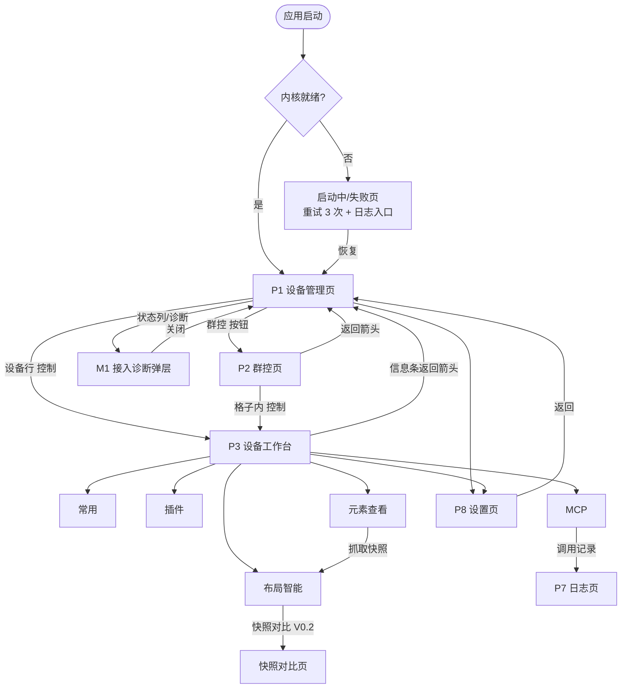
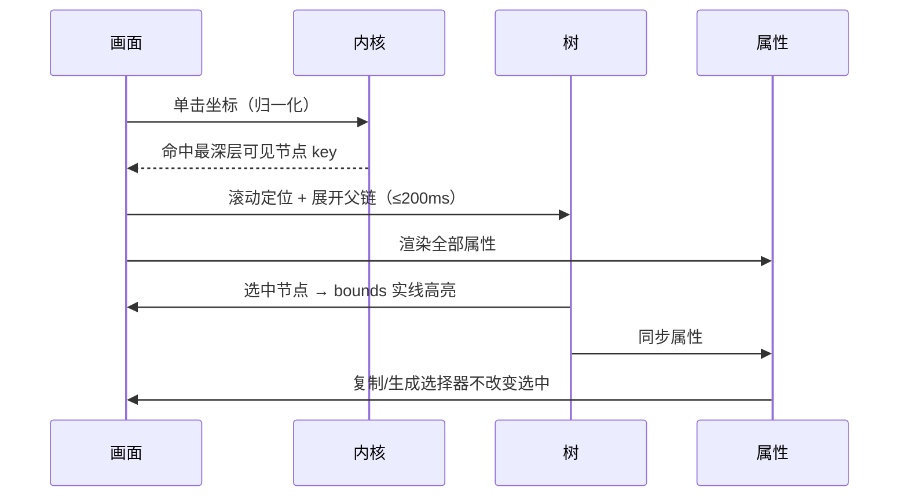

# LayoutSee 交互原型文档

> 版本：v0.2（新版原型）｜ 日期：2026-08-26 ｜ 适配终端：macOS App（原生壳 + 内嵌 Web UI）
> 原型来源：[docs/designs/redesign](./redesign/) 01–06（新版）
> 关联文档：[PRD](../feature/UI-LayoutSee需求文档PRD.md)、[视觉设计规范](./DESIGN.md)、[竞品功能梳理](../research/uiauto-analysis/uiautodev-desktop-function.md)、[竞品运行验证](../research/uiauto-analysis/uiautodev-run-verification.md)

## 0. 文档说明

### 0.1 三份文档的分工

| 文档 | 回答的问题 |
|---|---|
| PRD | 做什么功能、规约与验收是什么 |
| 本文档（交互原型） | 界面由哪些区域和元素组成、点击后发生什么、状态如何流转 |
| DESIGN.md（视觉规范） | 这些元素长什么样：Token、尺寸、色彩、动效 |

### 0.2 尺寸标注约定

本文档尺寸按原型图 1x 像素测量并向 4pt 栅格取整，允许 ±2px 实现误差。原型基准窗口 1480×1060，最小窗口 1280×800。

### 0.3 功能语义来源

原型图只提供界面结构，行为语义来自两处：一是 PRD 第四章的功能规约与异常 Case，二是竞品实机验证结论（控制栏按键注入、scrcpy 投屏、XPath 查询、9 个 MCP 工具、插件 `$u` 运行时、`/mcp/{id}/sse` 端点形态）。原型未覆盖但 PRD 要求的能力，本文档以「原型未覆盖，本文档补充」标注。

---

## 1. 信息架构

### 1.1 导航层级

新版引入常驻左侧主导航侧栏，导航模型从「顶部工具栏 + 页面返回」改为「侧栏一级导航 + 页内二级 Tab」。

```
主导航侧栏（一级）
├── 主页        Home
├── 设备        设备管理页（默认落地页）
│                ├── 群控页（二级，从设备页进入，侧栏仍停留在「设备」）
│                └── 设备工作台（二级，侧栏折叠为图标态）
│                     └── Tab：常用 / 插件 / 元素查看 / MCP（三级）
├── 应用        应用管理页
├── 命令        命令执行页
├── 日志        日志与审计页
└── 设置        设置页
```

### 1.2 页面清单

| ID | 页面 | 入口 | 出口 | 原型图 | 版本 |
|---|---|---|---|---|---|
| P0 | 全局框架（标题栏 + 侧栏） | 应用启动 | — | 01–06 | V0.1 |
| P1 | 设备管理页 | 侧栏「设备」、启动默认落地 | 工作台、群控页、诊断弹层 | 01 | V0.1 |
| P2 | 群控页 | P1「群控」按钮 | 返回 P1、单设备工作台 | 02 | V0.1 |
| P3 | 设备工作台 | P1 设备行「控制」、P2 格子快捷入口 | 返回 P1 | 03–06 | V0.1 |
| P3-A | Tab 常用 | P3 默认 Tab | — | 03 | V0.1 |
| P3-B | Tab 插件 | P3 Tab / 控制栏插件按钮 | 插件目录、日志页 | 05 | V0.1 |
| P3-C | Tab 元素查看 | P3 Tab / 控制栏审查按钮 | — | 04 | V0.1 |
| P3-D | Tab MCP | P3 Tab | 调用记录（日志页） | 06 | V0.1 |
| P3-E | Tab 布局智能 | P3 Tab | 快照对比页（V0.2） | 原型未覆盖 | V0.1 |
| P4 | 主页 | 侧栏「主页」 | 各功能入口 | 侧栏项已存在，页面未出图 | V0.2 |
| P5 | 应用页 | 侧栏「应用」 | — | 同上 | V0.2 |
| P6 | 命令页 | 侧栏「命令」 | — | 同上 | V0.2 |
| P7 | 日志页 | 侧栏「日志」、状态灯、MCP 调用记录 | — | 同上 | V0.1 |
| P8 | 设置页 | 侧栏「设置」、标题栏齿轮、各处「打开设置」 | 返回来源页 | 同上 | V0.1 |
| M1 | 接入诊断弹层 | P1 状态列、诊断按钮、抓取失败提示 | 关闭回来源页 | 原型未覆盖 | V0.1 |

侧栏「主页 / 应用 / 命令」三项在新版原型中已出现，但没有对应页面图，且 PRD V0.1 功能清单未定义这三个页面。处理方式见第 9 章待确认项。

### 1.3 页面流转图



**主流程：** 设备管理页 → 控制 → 工作台 → 元素查看抓取布局 → 选中节点定位问题 → 切到 MCP 复制端点 → Agent 接管继续调试。

---

## 2. 全局框架（P0）

### 2.1 区域划分

```
┌──────────────────────────────────────────────────────────────┐
│ ○○○  LayoutSee                          [刷新] [主题] [设置] │ 标题栏 80
├────────────┬─────────────────────────────────────────────────┤
│ 主页       │                                                 │
│ 设备 ●     │              内容区（页面自有布局）              │
│ 应用       │                                                 │
│ 命令       │                                                 │
│ 日志       │                                                 │
│ 设置       │                                                 │
│            │                                                 │
│ ─────────  │                                                 │
│ 内核状态灯 │                                                 │
└────────────┴─────────────────────────────────────────────────┘
   210                            剩余宽度
```

- 单窗口应用，不使用系统标签页与多窗口。
- 新版**移除底部全局状态栏**（旧版有）。内核状态灯、只读标识、版本号移到侧栏底部常驻区，原型未覆盖，本文档补充。
- 标题栏与侧栏在所有页面常驻；侧栏在设备工作台自动折叠为图标态（见 2.3）。

### 2.2 标题栏

| 元素 | 位置 | 交互 | 跳转/结果 |
|---|---|---|---|
| 交通灯 | 左，系统绘制 | 系统行为 | 关闭时回收内核进程 |
| 应用名 `LayoutSee` | 交通灯右侧 16px | 不可点击 | — |
| 刷新（circular-arrow） | 右 1 | 单击 | 刷新当前页面数据：P1 重新枚举设备；P3 重连投屏并刷新设备信息；执行中图标 spin 并禁用 3s |
| 主题（sun / moon） | 右 2 | 单击 | 在 `light → dark → system` 三态间循环，图标随当前态变化，Tooltip 显示下一态 |
| 设置（gear） | 右 3 | 单击 | 打开 P8 设置页，侧栏「设置」同步高亮 |

三个按钮均为 36×36 ghost 图标按钮，Tooltip 延迟 300ms。窗口宽度小于 1024px 时刷新按钮收进溢出菜单。

### 2.3 主导航侧栏

**展开态**（宽 210px，P1/P2/P4–P8 使用）：图标 22px + 文字 14px，项高 56px，左右内边距 12px。
**图标态**（宽 96px，P3 设备工作台使用）：仅图标居中，Tooltip 右侧弹出显示名称。切换动画 200ms 宽度过渡。

| 项 | 图标 | 单击跳转 | 状态 |
|---|---|---|---|
| 主页 | home | P4 主页 | V0.2 前置灰并 Tooltip「V0.2 提供」 |
| 设备 | smartphone | P1 设备管理页 | 默认高亮；在 P2/P3 中保持高亮 |
| 应用 | layers | P5 应用页 | 同主页 |
| 命令 | terminal | P6 命令页 | 同主页 |
| 日志 | clipboard | P7 日志页 | 常驻可用 |
| 设置 | gear | P8 设置页 | 常驻可用 |

- 选中项：`brand-soft` 圆角底 + `brand` 图标与文字；悬停未选中项：`hover` 底。
- 图标态下选中项为同款圆角方块高亮，见原型 03–06 顶部「主页」图标。
- 键盘：`Cmd+1..6` 直达对应导航项；`Cmd+[` 返回上一页面。
- 侧栏底部常驻区（本文档补充）：8px 内核状态灯 + 文字「服务正常 / 重启中 / 已停止」，单击进入 P7 日志页；只读模式开启时该区域追加 `warning` 色锁形徽标，Tooltip 说明「只读模式已开启，写操作被拒绝」。

### 2.4 全局反馈机制

| 机制 | 触发 | 呈现 | 消失 |
|---|---|---|---|
| Toast | 复制成功、设备增删、存档完成 | 窗口右上，语义色前缀图标 | 5s 自动，可手动关闭 |
| 顶部横幅 | 只读模式开启、离线回看模式、枚举缓慢、快照 `sync: best-effort` | 内容区顶部细条，横贯全宽 | 条件解除即消失，回看模式常驻 |
| 内联错误 | 表单校验、抓取失败、插件加载失败 | 出错元素下方或所属区块内 | 重新操作即清除 |
| 遮罩 loading | 内核启动、设备重连、切换设备 | 覆盖对应区域 + spinner + 文案 | 就绪即撤 |
| 骨架屏 | 设备列表首次枚举、应用列表加载 | 占位行 | 数据到达替换 |

错误提示统一为「问题 + 可执行下一步」结构，禁止裸异常堆栈直出；技术细节放在可折叠的「详情」区。

### 2.5 全局快捷键

| 快捷键 | 作用 | 生效范围 |
|---|---|---|
| `Cmd+R` | 刷新当前页数据 | 全局 |
| `Cmd+1..6` | 切换侧栏导航项 | 全局 |
| `Cmd+[` | 返回上一页面 | P2/P3/P8 |
| `Esc` | 关闭浮层 → 清空当前选中节点 → 退出全屏画面 | 按优先级依次响应 |
| `Cmd+C` | 复制上下文标识（序列号 / MCP 端点 / 属性值） | 焦点所在区域 |
| `Enter` | XPath 输入框执行查询；树上展开节点 | P3-C |
| `↑ / ↓` | 树上移动选中节点 | P3-C |
| `Cmd+Shift+D` | 抓取布局快照（等价控制栏审查按钮） | P3 |
| `Cmd+Shift+F` | 冻结 / 解冻画面 | P3 |

---

## 3. 设备管理页（P1，原型 01）

### 3.1 结构

```
标题区    设备管理 / 管理和监控已连接的 Android 设备
工具栏    [↻ 刷新]  [⠿ 群控]
平台 Tab  Android | iOS (Alpha) | HarmonyOS (Alpha)
表格卡片  # | 平台 | 序列号 | 型号 | 产品 | 状态 | 操作
          1 | Android | 3B161V012A600000 | N/A | N/A | ● 已连接 | [控制]
合计行    共 1 台设备
```

内容区内边距 48px，标题 24px semibold，副标题 13px `foreground-subtle`，副标题文案随当前平台 Tab 变化。

### 3.2 元素与交互

| 元素 | 交互 | 结果 |
|---|---|---|
| 刷新 | 单击 | 立即重新枚举；按钮进入 loading 并禁用 3s；与 5s 自动轮询互不冲突，轮询期间不打断用户滚动位置 |
| 群控 | 单击 | 进入 P2 群控页；已连接设备数 < 2 时置灰 + Tooltip「至少需要 2 台已连接设备」 |
| 平台 Tab | 单击 | 切换列表数据源，不重新枚举其他平台；Tab 状态记入会话，重启后回落 Android |
| 表格行 | 悬停 | 行底 `hover`；不整行可点，避免误触 |
| 序列号单元格 | 单击 | 复制序列号，Toast「已复制序列号」；hover 时右侧出现复制图标 |
| 状态单元格 | 单击（仅异常态） | 打开 M1 接入诊断弹层，并定位到失败项 |
| 控制 | 单击 | 进入 P3 设备工作台，携带 `deviceId`；`status ≠ connected` 时置灰 + Tooltip 给出原因 |
| 合计行 | — | 展示当前 Tab 设备总数，异常设备数 > 0 时追加「其中 N 台异常」链接，单击筛选异常设备 |

### 3.3 状态矩阵

| 状态 | 触发 | 呈现 |
|---|---|---|
| 首次加载 | 进入页面 | 3 行骨架屏，500ms 内出现 |
| 空列表 | 枚举结果为空 | 表格区替换为虚线卡片空状态：手机图标 48 + 「未检测到设备」+ 三步指引（开启 USB 调试 / 更换数据线 / 确认手机授权弹窗）+ 「重新检测」按钮 |
| 工具链缺失 | adb / hdc 不在 PATH | 该平台 Tab 内容替换为引导态：「未找到 adb」+ 「指定 adb 路径」（跳 P8 设置页并定位到驱动分组）+ 「查看安装文档」 |
| 设备未授权 | adb 返回 unauthorized | 状态列红点 + 「未授权」；控制置灰；行尾出现「诊断」文字按钮 |
| 设备启动中 | booting / unhealthy | 状态灯呼吸动画 + 「启动中」；控制置灰 |
| 设备掉线 | 轮询发现消失 | 行淡出移除 + Toast「设备 xxx 已断开」；若该设备正在工作台中打开，工作台冻结画面并浮层提示 |
| 枚举超时 | 单次超过 5s | 顶部横幅「设备枚举缓慢，可能有设备响应异常」+ 「查看诊断」 |
| 内核未就绪 | `/api/info` 失败 | 全屏 loading「正在启动服务」；3 次重启失败后错误页 + 「打开日志目录」+ 「复制诊断信息」 |

### 3.4 M1 接入诊断弹层

宽 480px 居中弹窗。内容为诊断项列表，每项 = 结果图标（pass 绿勾 / fail 红叉 / unknown 灰点）+ 项名 + 说明 + 可执行修复建议；底部操作 [关闭] [复制诊断信息] [重新检测]。Android 检查 adb 可执行、设备授权、uiautomator2 服务；iOS 检查 usbmuxd、DDI、WDA `/status`、tunnel；Harmony 检查 hdc 与设备在线。诊断在设备首次出现、进入工作台前、抓取失败后各自动执行一次。

---

## 4. 群控页（P2，原型 02）

### 4.1 结构

侧栏保持展开态且「设备」仍高亮（群控是设备域的二级页面）。内容区左右两栏：

- **左栏（宽 320px）**：返回按钮（36×36 方形 ghost）+ 标题「多设备控制」；下方「全选 (N)」复选框 + 1px 分隔线 + 设备复选项列表，每项 = 复选框 + 设备 id（mono，如 `a-3B161V012A600000`）。
- **右栏**：已选设备的画面网格；未选任何设备时为虚线卡片空状态「未选择设备 / 请从左侧选择要控制的设备」。

### 4.2 交互

| 元素 | 交互 | 结果 |
|---|---|---|
| 返回箭头 | 单击 / `Cmd+[` | 回 P1 设备管理页，断开所有群控画面流 |
| 全选 | 单击 | 全选或全不选；部分选中时显示半选态；括号内数字为可选设备总数 |
| 设备复选项 | 单击复选框或行 | 勾选即建立该设备画面流（默认 15fps / 720p 上限），取消即释放 |
| 设备复选项 | 悬停 | 行底 `hover`，右侧出现「单独控制」文字按钮，单击进入该设备 P3 工作台 |
| 网格格子 | 悬停 | 底部浮出条：设备名 + 状态灯 + [控制] 快捷入口 |
| 网格格子 | 单击画面 | V0.1 不注入触控（同步广播为 V1.0）；单击仅选中该格并高亮边框 |
| 网格格子 | 双击 | 进入该设备 P3 工作台 |

网格列数按窗口宽度与选中数量自适应 2–3 列，格子间距 16px。选中设备数超过 6 台时提示「同屏设备较多，已自动降低帧率」。设备中途掉线时该格画面冻结并覆盖「已断开」浮层，不影响其他格子。

---

## 5. 设备工作台（P3，原型 03–06）

### 5.1 布局

```
┌────┬──────────────────────┬──────────────────────────────────┐
│图标│ ‹ Android model: PLK110 product: PLK110 3B161V0…  [复制] │
│态侧│──────────────────────┼──────────────────────────────────┤
│栏  │                      │  常用 │ 插件 │ 元素查看 │ MCP      │
│ +  │   设备画面 canvas     ├──────────────────────────────────┤
│控制│   （等比居中 +        │                                  │
│栏  │    设备外框）         │        右侧功能面板               │
│ 96 │        ~600（可拖拽） │            剩余宽度               │
└────┴──────────────────────┴──────────────────────────────────┘
```

- 进入工作台时侧栏自动折叠为图标态，设备控制按钮竖排在同一列内、与导航项之间用 1px 分隔线隔开（原型 03–06 左列）。
- 画面区与右侧面板之间为可拖拽分隔线，画面区宽度范围 360–900px，拖拽结果按设备记忆。
- 元素查看 Tab 激活时右侧面板内部再分为「属性栏 + 树栏」两栏（原型 04）。

### 5.2 设备信息条

高 64px，元素依次为：返回箭头（‹）、`Android` 平台标签、`model: PLK110`、`product: PLK110`、序列号（mono）、复制图标。

| 元素 | 交互 | 结果 |
|---|---|---|
| 返回箭头 | 单击 / `Cmd+[` | 回 P1，释放投屏连接与叠加层状态 |
| 设备信息文本 | 单击 | 展开设备选择下拉，列出全部已连接设备，选中即在当前工作台切换设备（3s 内新画面就绪，旧连接释放，右侧面板状态重置） |
| 复制图标 | 单击 | 复制序列号 + Toast |

### 5.3 竖排控制栏

按键类按钮走注入通道，状态类按钮切换本地状态。全部为 36×36 触达区 + Tooltip。

| 序 | 图标 | 功能 | 类型 | 交互与约束 |
|---|---|---|---|---|
| 1 | arrow-left | Back | 写 | 单击注入返回键；等价画面右键 |
| 2 | clock / history | Recents 最近任务 | 写 | 单击注入 Recents |
| 3 | menu | Home | 写 | 单击注入 Home；等价画面中键 |
| 4 | power | 电源键 | 写 | 单击注入 Power；长按 Tooltip 提示不支持长按 |
| 5 | volume-2 | 音量加 | 写 | 单击注入 |
| 6 | volume-1 | 音量减 | 写 | 单击注入 |
| 7 | smartphone | 旋转设备 | 写 | 单击触发旋转并重新获取 windowSize，画面比例随之变化 |
| 8 | bug | 接入诊断 | 读 | 单击打开 M1 诊断弹层（当前设备） |
| 9 | search / crosshair | 审查元素（抓取 + 叠加层） | 读 | 单击执行「冻结 → dump → 截图」原子抓取，完成后自动切到元素查看 Tab 并点亮本按钮；再次单击清除叠加层并熄灭；抓取中图标 spin 且重复单击不发起第二次请求 |
| 10 | puzzle | 插件面板 | 读 | 单击切到插件 Tab 并点亮本按钮 |
| 11 | video | 录屏 / 截图 | 写 | 单击复制当前帧到剪贴板；下拉（长按或右键）提供「另存截图」「开始录屏」（录屏为 V0.2） |

补充按钮（原型未覆盖，PRD 要求，本文档补充）：**冻结画面**（snowflake，状态类，激活时画面右上出现「已冻结」角标）与**只读模式**（lock，状态类，开启时写类按钮整体置灰并加锁图标，画面点击被拒绝并 Toast 说明）。二者置于控制栏末尾，与录屏按钮之间加分隔线。

状态类按钮激活态用 `brand` 实底 + 反白图标（原型 04 的审查按钮、原型 05 的插件按钮即此态）；未激活为 ghost + `foreground-subtle` 图标。只读模式开启时，第 1–7、11 项统一置灰。

### 5.4 设备画面区

| 交互 | 映射 | 说明 |
|---|---|---|
| 左键单击 | tap | 300ms 内设备响应 |
| 左键拖拽 | touchDown → Move → Up（swipe） | 方向与距离与鼠标轨迹一致 |
| 中键 | Home | 与控制栏一致 |
| 右键 | Back | 与控制栏一致 |
| 滚轮 | 垂直 swipe | — |
| 物理键盘 | keyEvent / text | 支持中文剪贴板粘贴，输入法不支持时自动走剪贴板通道并 Toast 说明 |
| 悬停 | 坐标提示 | 画面左下角实时显示像素坐标与百分比（mono） |
| 叠加层已开启时悬停 | 节点预高亮 | 悬停节点描边加深，不改变当前选中 |
| 叠加层已开启时单击 | 选中最深层可见命中节点 | 触发三方联动（见 5.6），此时不注入 tap |

叠加层开启即进入「审查模式」，画面单击语义从「操作设备」切换为「选择节点」；模式差异通过画面右上角胶囊标识（`审查中` / `已冻结` / `只读`）明示。设备中途断开时画面冻结 + 半透明遮罩 + 「设备已断开，重连后可继续」+ [重试]，不跳回首页；视频流中断自动重连 3 次（1s / 2s / 4s）。

### 5.5 右侧面板 Tab 栏

分段控件（原型 03–06 顶部），高 48px，容器为浅灰 pill，激活项白底卡片 + `brand` 文字 + 底部 2px `brand` 指示线。顺序固定为：**常用 → 插件 → 元素查看 → MCP →（布局智能）**，与新版原型一致（旧版顺序为常用/元素查看/布局智能/插件/MCP，本次以原型为准）。布局智能 Tab 原型未出图，追加在 MCP 之后。

| 交互 | 结果 |
|---|---|
| 单击 Tab | 切换面板内容，不重新抓取；已抓取快照在 Tab 间共享 |
| 切 Tab 到元素查看 | 若无快照，面板内展示空状态「尚未抓取布局」+ [抓取当前界面] 按钮 |
| 控制栏审查 / 插件按钮 | 反向联动到对应 Tab 并高亮该按钮 |
| 切换设备 | 保留当前 Tab 选择，清空快照与选中节点 |

### 5.6 Tab 常用（P3-A，原型 03）

卡片「获取当前 App」：包名输入框（默认填充当前前台包名，mono）、Activity 输入框（mono）、按钮行 [刷新（主按钮）] [停止（危险按钮）] [启动（次按钮）]。

| 元素 | 交互 | 结果 |
|---|---|---|
| 刷新 | 单击 | 重新读取前台应用，回填两个输入框；失败时输入框下方内联报错 |
| 停止 | 单击 | 二次确认弹窗（展示包名）后 force-stop；只读模式下拒绝并说明 |
| 启动 | 单击 | 按包名 + Activity 启动；Activity 为空时按默认启动器入口启动 |
| 包名输入框 | 输入 | 校验包名格式，非法时即时报错且不发请求 |

原型未覆盖但 PRD 要求（本文档补充）：卡片下方追加「已安装应用」区块，含搜索框 + 虚拟滚动列表，每行 = 包名（mono）+ 应用名 + [启动] [停止]，并支持单击行回填到上方输入框。

### 5.7 Tab 插件（P3-B，原型 05）

区块标题「设备插件」+ 副标题「扩展当前设备的调试与自动化能力」。

| 状态 | 呈现 | 交互 |
|---|---|---|
| 空（原型 05） | 虚线卡片 + 拼图图标 48 + 「暂无插件」+ 「安装插件后，可在这里查看和配置」+ [浏览插件]（主按钮） | 单击 [浏览插件] 打开本机插件目录 `~/.layoutsee/plugins`；辅以文字链「插件开发文档」 |
| 有插件（`display: card`） | 插件卡片网格，卡片 = 图标 + 名称 + 版本 + 描述 + iframe 内容区 | 卡片右上「⋯」菜单：重新加载 / 打开日志 / 插件主页 |
| 有插件（`display: tab`） | 该插件在 Tab 栏追加独立 Tab | 单击进入插件整页 iframe |
| 加载失败 | 卡片区域内联错误「插件入口加载失败（404）」+ [重新加载] + [查看日志] | 单击 [查看日志] 跳 P7 日志页并过滤该插件 |
| 平台不匹配 | 卡片置灰 + 标注「不适用于当前平台」 | 不加载 iframe |

插件调用 `$u.shell` 时弹出授权确认（展示插件 id 与将执行的命令），选项为 [本次允许] [始终允许该插件] [拒绝]，全部调用写入审计日志。

### 5.8 Tab 元素查看（P3-C，原型 04）

#### 5.8.1 结构

```
Tab 栏
XPath 输入行   [ //*[@text='Settings']                    ]  [🔍 查询]
操作行         [↻ 刷新 UI] [⟲ 重置]        Tag: android.widget.LinearLayout  Size: 1154×376
双栏区         属性表（bounds/class/package/checkable…）  │  XML 层级树
```

#### 5.8.2 元素与交互

| 元素 | 交互 | 结果 |
|---|---|---|
| XPath 输入框 | 输入 | 语法错误时下方即时内联报错且不发请求；mono 字体 |
| XPath 输入框 | `Enter` | 等价单击查询 |
| 查询 | 单击 | 服务端基于抓取时保留的原始 XML 匹配；命中节点在树中定位展开、在画面用虚线框标注；结果计数展示为「命中 N」；0 命中提示「未匹配到节点（0 命中）」且不清空当前选中；无快照时提示「请先抓取当前界面」并高亮 [刷新 UI] |
| 刷新 UI | 单击 | 执行原子抓取（冻结 → dump → 截图）；进行中按钮 loading，重复单击不发起第二次请求；P90 ≤ 2s；冻结失败时顶部黄条「截图与层级可能不同步，建议先冻结画面」 |
| 重置 | 单击 | 清空选中节点、XPath 输入与查询高亮，保留快照与叠加层 |
| Tag / Size 信息 | 单击 | 复制对应文本 |
| 属性表行 | 单击值 | 复制该属性值 + Toast；布尔值 true 绿 / false 红 |
| XML 树折叠三角 | 单击 | 展开或折叠该节点；`Enter` 等价 |
| XML 树节点行 | 单击 | 选中该节点，触发三方联动 |
| XML 树 | `↑ / ↓` | 在可见节点间移动选中，滚动跟随 |
| XML 树节点行 | 右键 | 上下文菜单：复制节点 XML / 复制 XPath / 生成选择器 / 在画面中定位 |

原型未覆盖但 PRD 要求（本文档补充）：操作行右侧追加 [生成选择器]（选中节点后可用，输出候选列表，每条标注当前快照命中数，命中数 > 1 标注「不稳定」）、[导出快照] / [导入快照]（V0.2，导入后进入离线回看模式，全局横幅常驻且所有写入口禁用）、树顶部属性过滤输入框（按 text / resource-id / class 过滤）。

#### 5.8.3 三方联动



任意一侧的选择，其余两侧必须同步；选中态在画面为 2px 实线 + 半透明填充，XPath 命中为 1.5px 虚线，两者可同时存在且视觉可区分。

#### 5.8.4 异常态

| 场景 | 呈现 |
|---|---|
| dump 失败 | 树区内联「层级抓取失败，已重试 1 次」+ [切换 adb 驱动] + 折叠的原始错误详情 |
| 层级为空 | 保留截图，树区空状态「当前界面不提供可访问层级，可能是安全键盘或系统弹窗」 |
| 节点缺失（如微信） | 提示「部分应用需开启系统无障碍的随选朗读后才暴露层级」+ 文档链接 |
| 层级超时 | 「层级抓取超时，已保留截图」+ [重试] |
| 大树（> 2000 节点） | 树启用虚拟滚动，叠加层仅渲染视口内与选中路径节点 |

### 5.9 Tab MCP（P3-D，原型 06）

#### 5.9.1 结构

区块标题「MCP Server」+ 副标题「Model Context Protocol integration」→ 客户端分段切换（`.mcp.json` / Claude / Cursor / MCP Inspector）→「配置」卡片（右上复制图标 + JSON 代码块）→「可用工具」卡片（右上计数「9 个」+ 工具列表）。

#### 5.9.2 元素与交互

| 元素 | 交互 | 结果 |
|---|---|---|
| 客户端分段项 | 单击 | 切换配置内容：`.mcp.json` 展示标准片段；Claude 展示配置文件路径与片段；Cursor 提供 [一键添加]（deeplink）；MCP Inspector 提供 [打开 Inspector]（V0.2，V0.1 置灰并说明） |
| 配置卡片复制图标 | 单击 | 复制完整 JSON + Toast「已复制配置」 |
| JSON 代码块 | 选中文本 | 可选可复制，语法高亮，端口始终与内核实际监听端口一致；端口切换时内容自动刷新并出横幅「服务端口已切换为 xxxxx，请更新 Agent 配置」 |
| 工具行 | 悬停 | 底 `hover`，右侧出现参数摘要 Tooltip |
| 工具行 | 单击 | 展开该工具详情：入参、返回、读/写类型徽标；写类工具在只读模式下标注「当前被只读模式拦截」 |
| 计数徽标 | — | 展示当前可用工具数；V0.1 应为 12（9 原子 + 3 高阶），原型图为竞品对齐的 9，需按实际工具集渲染 |

原型未覆盖但 PRD 要求（本文档补充）：卡片区追加**只读模式开关**（开启时本区域出现 `warning` 横幅「只读模式已开启，MCP 写工具将返回 READ_ONLY_MODE」）与**调用记录入口**（单击跳 P7 日志页并过滤 `mcp_tool_call`）。设备离线时端点返回 503，本页顶部横幅提示「设备离线，端点暂不可用，重连后自动恢复」。

### 5.10 Tab 布局智能（P3-E，原型未覆盖）

结构为三个纵向区块，均为圆角 12 卡片：

1. **语义摘要**：头部展示 token 估算与压缩比（原始 XML 字符数 → 摘要字符数）+ [复制] + [裁剪策略]；正文为 mono 可折叠层级；被截断时标注「摘要已截断，省略 N 个低优先级元素」。
2. **异常诊断**：[开始诊断] 主按钮 → 结果列表按 severity 排序（error / warning / info 图标 + 类型 + 涉及节点 + 量化证据 + 建议）。单击结果项：画面用对应语义色框出涉及节点并连线标注，同时树定位到该节点；再次单击取消标注。无问题时展示通过态「未发现布局异常（已检查 6 类规则，N 个节点）」。
3. **快照存档与 diff（V0.2）**：存档列表 + [标记为基线] + [与基线对比] → 进入快照对比页（双栏 diff，左右画面同步高亮差异节点）。V0.1 该区块置灰并标注「V0.2 提供」。

诊断与摘要均依赖当前快照，无快照时区块展示「请先抓取当前界面」+ [抓取] 按钮。

---

## 6. 侧栏新增页面（P4–P6，原型仅有导航项）

原型侧栏出现「主页 / 应用 / 命令」三项，PRD V0.1 未定义对应页面。本文档给出最小落地建议，最终范围需产品确认（见第 9 章）：

| 页面 | 建议内容 | 建议版本 |
|---|---|---|
| P4 主页 | 概览卡片：设备数与状态分布、内核与端口状态、最近抓取记录、MCP 端点快捷复制、快速入口（刷新设备 / 打开设置 / 查看日志） | V0.2 |
| P5 应用页 | 跨设备应用视角：选择设备 → 已安装应用列表（搜索 + 虚拟滚动）+ 启停 + 安装（拖入 apk）；与工作台常用 Tab 共用同一份能力 | V0.2 |
| P6 命令页 | adb / hdc 命令执行台：设备选择 + 命令输入 + 历史记录 + 输出区；写类命令需显式确认并全量审计；只读模式下禁用 | V0.2 |

V0.1 阶段三项在侧栏中置灰 + Tooltip「V0.2 提供」，避免出现点击无响应的死入口。

## 7. 日志页（P7）

单页三区：过滤条（类型：抓取 / MCP 调用 / 写操作 / 插件 / 内核；时间范围；关键字）→ 记录表（时间、类型、来源 ui/mcp/plugin、对象、结果、耗时）→ 详情抽屉（完整参数与返回，敏感内容不落盘）。底部操作 [打开日志目录] [导出当前筛选结果]。从状态灯、MCP 调用记录、插件错误入口进入时自动带上对应过滤条件。

## 8. 设置页（P8）

分组导航（左）+ 表单（右），分组与项：

| 分组 | 项 |
|---|---|
| 外观 | 主题（浅色 / 深色 / 跟随系统）、界面密度（标准 / 紧凑，V0.2） |
| 设备与驱动 | Android 驱动（uiautomator2 / adb dump，切换即时生效）、adb 路径、hdc 路径、轮询间隔（默认 5s）、目标 display |
| 投屏 | 单设备帧率上限、群控帧率与分辨率上限、断流重连次数 |
| 存档 | 快照存档根目录、位置偏移阈值、[清理 30 天前存档]（二次确认并展示删除数量与空间） |
| 安全 | 只读模式默认值、监听地址（默认 127.0.0.1，暴露 0.0.0.0 需强制设置凭据）、CORS 白名单、插件 shell 授权管理（已授权插件列表 + 撤销） |
| 关于 | 版本号（前端与内核一致性校验结果）、[打开日志目录]、[复制诊断信息] |

修改即时保存并 Toast「已保存」；涉及监听地址等高风险项时先弹确认说明风险。

---

## 9. 与 PRD 及旧版设计的差异与待确认项

### 9.1 新版原型带来的结构性变化

| 维度 | 旧版（assets/pic 01–06 与 stich-design.md v0.1） | 新版原型（docs/designs/redesign） | 影响 |
|---|---|---|---|
| 全局导航 | 无侧栏，顶部工具栏 + 页面返回 | 常驻左侧侧栏，6 个一级导航项 | 信息架构重写，见第 1、2 章 |
| 底部状态栏 | 有（版本 / 内核状态灯 / 只读标识） | 无 | 状态信息移到侧栏底部常驻区 |
| 工作台侧栏 | 无侧栏，控制栏独立一列 | 侧栏折叠为图标态，控制栏并入同一列 | 控制栏与导航共列，需分隔线区分语义 |
| 面板 Tab 顺序 | 常用 / 元素查看 / 布局智能 / 插件 / MCP | 常用 / 插件 / 元素查看 / MCP | 以原型为准，布局智能追加在末位 |
| 设备表格 | 状态灯 + 平台 + 型号 + 产品 + 序列号 + 状态 + 操作 | # + 平台 + 序列号 + 型号 + 产品 + 状态 + 操作 | 以原型为准，序号列前置 |
| 主操作按钮 | 刷新为主按钮（brand 实底） | 刷新与群控均为次按钮（outline） | 首页无强视觉主按钮，主按钮留给「控制」与面板内主操作 |
| 平台 Tab 文案 | Android / iOS / HarmonyOS | Android / iOS (Alpha) / HarmonyOS (Alpha) | 明示 Alpha 状态 |
| 群控页 | 直接进入多设备网格 | 先选设备（左栏勾选）再出画面 | 新增「未选择设备」空状态 |

### 9.2 需要产品确认的问题

1. **侧栏「主页 / 应用 / 命令」的范围与版本**：三项在原型中已出现但 PRD V0.1 无对应功能。本文档按 V0.1 置灰、V0.2 落地处理，第 6 章给出建议范围，需确认是否采纳，或在 V0.1 直接从侧栏移除。
2. **控制栏按钮集合**：原型 11 个按钮中未见「冻结画面」与「只读模式」，而两者是 PRD B.3 的验收项（冻结原子抓取、只读全局门禁）。本文档补充在控制栏末尾，需确认摆放位置，或改为放在画面区右上角常驻控件。
3. **MCP 工具计数**：原型显示 9 个（竞品对齐），PRD V0.1 定义 12 个（含 `get_layout_summary` / `diagnose_layout` / `find_element`）。渲染值以实际工具集为准，需确认原型是否需同步更新。
4. **布局智能 Tab 缺图**：语义摘要与异常诊断是 PRD 的核心差异化能力（P0，V0.1），但新版原型未出图。本文档第 5.10 节给出结构定义，建议补出原型图后回填。
5. **控制栏图标语义**：原型中 `menu`（☰）与 `clock` 两枚图标对应 Home 与 Recents 的映射关系需设计确认，避免与竞品「中键 Home / 右键 Back」的肌肉记忆冲突。
6. **PRD 3.6 页面流转图**需按本文档第 1.3 节更新，PRD 4.1 / 4.2 / 4.6 的「原型/交互方式」段落中指向 `assets/pic/*` 的引用需改为指向 `docs/designs/redesign/*`。

---

## 附录 A：全局跳转矩阵

| 来源 | 触发元素 | 目标 | 附带上下文 |
|---|---|---|---|
| 任意页 | 侧栏导航项 | P1 / P4 / P5 / P6 / P7 / P8 | — |
| 任意页 | 标题栏齿轮 | P8 设置页 | 来源页记录，返回时回到来源 |
| 任意页 | 侧栏底部状态灯 | P7 日志页 | 过滤「内核」 |
| P1 | 设备行「控制」 | P3 设备工作台 | deviceId |
| P1 | 「群控」 | P2 群控页 | 当前平台已连接设备集合 |
| P1 | 状态列 / 「诊断」 | M1 诊断弹层 | deviceId + 失败项定位 |
| P1 | 工具链缺失引导 | P8 设置页 | 定位到「设备与驱动」分组 |
| P2 | 返回箭头 | P1 | 释放全部画面流 |
| P2 | 格子双击 / 「控制」 | P3 | deviceId |
| P3 | 信息条返回箭头 | P1 | 释放投屏与快照 |
| P3 | 信息条设备文本 | 设备切换下拉（同页） | 切换后重置面板状态 |
| P3 | 控制栏审查按钮 | Tab 元素查看（同页） | 抓取完成后自动切换 |
| P3 | 控制栏插件按钮 | Tab 插件（同页） | — |
| P3 | 控制栏 bug 按钮 | M1 诊断弹层 | 当前 deviceId |
| P3-B | 插件「查看日志」 | P7 日志页 | 过滤该插件 id |
| P3-B | 「浏览插件」 | 系统文件管理器 | `~/.layoutsee/plugins` |
| P3-D | 「调用记录」 | P7 日志页 | 过滤 `mcp_tool_call` + deviceId |
| P3-D | Cursor「一键添加」 | 外部应用（deeplink） | 端点 URL |
| P3-E | 「与基线对比」 | 快照对比页（V0.2） | baseId + targetId |
| 各处错误 | 「打开设置」 | P8 | 定位到相关分组 |
| 各处错误 | 「查看日志」/「打开日志目录」 | P7 / 系统文件管理器 | 过滤条件 |


