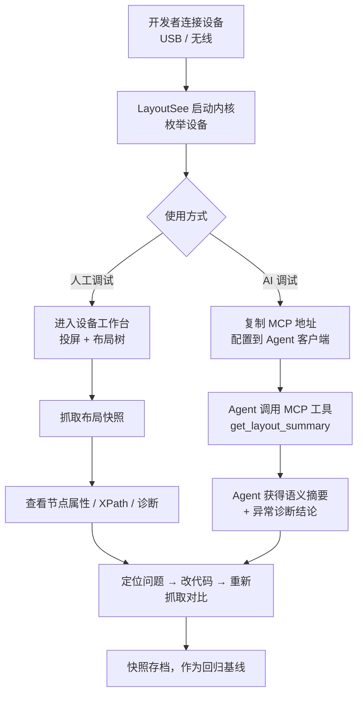

# 🧾 UI-LayoutSee 产品需求文档（PRD）

## 变更记录

| 版本 | 变更日期 | 变更项位置 | 变更内容 | 记录人 | 公示时间 |
|------|---------|-----------|---------|-------|---------|
| 0.9 | 2026-08-25 | - | 初版创建，基于 UIAutoDev 调研三份文档与用户需求确认 | jiazihui | 待评审 |

## 相关文档

| 文档类型 | 链接 |
|---------|------|
| 竞品架构调研 | [uiautodev-analysis.md](../research/uiauto-analysis/uiautodev-analysis.md) |
| 竞品功能清单 | [uiautodev-desktop-function.md](../research/uiauto-analysis/uiautodev-desktop-function.md) |
| 竞品运行验证 | [uiautodev-run-verification.md](../research/uiauto-analysis/uiautodev-run-verification.md) |
| 视觉设计基准 | [zcode-client-design-spec.md](../research/design/zcode-client-design-spec.md) |
| 设计风格参考 | [stich-design.md](../designs/stich-design.md) |
| 竞品界面截图 | [assets/pic/](../../assets/pic/) 01 至 06 |
| 参考源码 | [source/uiautodev](../../source/uiautodev) |

## 名词解释

| 术语 | 解释 |
|-----|-----|
| 布局快照（LayoutSnapshot） | 一次视图抓取的完整结果：设备标识、平台、方向、窗口尺寸、时间戳、节点树、截图引用，全系统唯一布局事实来源 |
| Node | 跨平台统一的视图节点契约，含 key（树路径）、name、bounds（归一化）、rect（像素）、properties（原始属性）、children |
| 视图感知 | Agent 通过结构化节点树而非像素截图理解界面，可读到 resource-id、text、bounds、可点击性等确定性信息 |
| 语义化布局摘要 | 将原始节点树裁剪聚合为面向 LLM 的低 token 结构描述，保留可交互元素与层级骨架，元素带短引用 ref |
| 布局异常诊断 | 基于节点几何关系自动识别遮挡、重叠、越界、触控热区过小等问题，输出类型/严重度/证据 |
| MCP | Model Context Protocol，AI 客户端调用外部工具的协议，本产品以 SSE 方式按设备暴露能力 |
| 内核（Core） | 本地运行的设备接入与 API 服务进程，复用 uiautodev 的 Python driver 层二次开发，默认监听 127.0.0.1:11663 |
| 壳（Shell） | 桌面客户端外壳，负责窗口、进程守护、发行与系统集成 |
| ADB / uiautomator2 | Android 调试桥与其上的 UI 自动化服务，Android 抓取链路依赖 |
| WDA | WebDriverAgent，iOS 视图抓取与操控依赖的设备侧服务 |
| HDC | HarmonyOS 设备连接工具，鸿蒙抓取链路依赖 |
| scrcpy | Android 实时投屏与输入注入方案，视频经 H.264 流传输 |

---

# 一、业务背景及目标

## 1.1 背景

**业务背景。** AI 编程 Agent 已经能胜任移动端的代码编写，但在「验证界面是否符合预期」这一环节仍然瞎摸。当前主流做法是让 Agent 截图后用视觉模型判断，这条路存在三个硬伤：截图丢失了 resource-id、text、bounds、可点击性等确定性属性，Agent 只能猜；视觉判断无法回答「这个按钮多大、在哪、是否被遮挡、点击热区是否够」这类工程问题；每轮判断都要消耗大量图像 token，链路慢且不稳定。

结论是移动端 UI 调试缺一个「结构化视图感知层」：让 Agent 拿到的是可推理的 View 树，而不是一张图。

**产品背景。** 竞品 UIAutoDev Desktop 已经验证了这条路的技术可行性：Python 侧通过 ADB / uiautomator2 / WDA / HDC 拿到原生层级，统一为 `Node` 树，再通过 HTTP 控制面 + WebSocket 媒体面暴露给网页端，并以 SSE MCP 暴露 9 个工具给 AI 客户端。但它有三个不适合直接采用的地方：

1. 主体闭源、未注册每 20 分钟弹窗、License 受限，无法作为团队基础设施长期依赖。
2. MCP 工具只是设备原子操作的搬运（screenshot / dump_xml / tap / swipe），没有面向 Agent 的语义压缩与诊断能力，Agent 拿到的仍是几千行原始 XML。
3. 服务端安全策略宽松（`allow_origins=["*"]` 且开启凭据、插件 shell 能力无审计），不适合直接暴露。

本项目 LayoutSee 复用其开源 Python 内核（`source/uiautodev`）的设备接入层做二次开发，重写产品层与 AI 适配层，目标是成为「面向 Agent 的移动端运行时视图感知入口」。当前工作区已具备：竞品源码、三份调研文档、六张界面截图、ZCode 客户端视觉规范，以及 `repos/mac`、`repos/web` 两个目标工程目录。

### 目标用户与用户故事

| 用户类型 | 描述 | 核心诉求 |
|---------|------|---------|
| 移动端开发工程师 | 本地调试自己负责的 App 界面 | 快速看到画面 + 层级树，点哪查哪 |
| QA 工程师 | 复现问题、核对还原度、准备自动化定位符 | 稳定选择器、快照存档、回归 diff |
| AI Agent（Claude / Cursor / Comate / 自研） | 通过 MCP 调用设备能力完成开发与验证任务 | 结构化、低 token、语义清晰的视图感知工具集 |
| 插件开发者 | 编写 HTML 插件扩展工作台 | 受限但够用的运行时 API |
| 团队管理员（V1.0） | 部署与运维团队 Server、管理设备池 | 鉴权、占用管理、审计 |

**典型用户故事：**

1. 作为一个 AI Agent（通过 MCP 接入），我希望调用 `get_layout_summary` 获得低 token 的语义摘要并用其中的 `ref` 直接 `tap`，以便于精确操作控件，而不是靠截图猜坐标。
2. 作为一个移动端开发者，我希望在 macOS 上打开 LayoutSee 即看到手机实时画面与 UI 层级树，点击画面元素即在树中定位并展示全部属性，以便于快速排查布局与控件问题。
3. 作为一个 QA 工程师，我希望用 XPath 查询验证定位表达式、生成标注命中数的选择器并导出存档，以便于回归对比与提单留证。
4. 作为一个平台负责人，我希望 LayoutSee 无 License 弹窗、全部能力本地可用、支持内部定制（品牌、协议、工具集），以便于批量部署到研发与测试环境。
5. 作为一个使用鸿蒙设备的开发者，我希望后续版本中鸿蒙设备也能被同一棵树形 UI 查看（HDC 接入），以便于鸿蒙应用获得与 Android 一致的调试体验。

### 产品价值（一句话）

> LayoutSee 把「移动设备运行时视图」变成 Agent 可读、可定位、可操作的结构化资源，通过 MCP 无缝接入 AI 工作流，让 AI 开发移动应用时看得见、摸得着。

## 1.2 业务目标与指标

| 目标 | 指标 | 当前值 | 目标值 |
|-----|-----|-------|-------|
| 让 Agent 以结构化方式感知界面 | Agent 单轮获取可交互元素清单的 token 消耗 | 截图方案约 1500 至 2500 token/轮；原始 XML 约 8000 token+ | 语义摘要 ≤ 1200 token/轮 |
| 提升 Agent 定位元素的准确率 | 指定元素坐标定位正确率（人工抽样 50 例） | 纯视觉方案约 60% 至 70% | ≥ 95% |
| 布局抓取链路稳定可用 | Android 单次 dump 成功率（连续 100 次） | UIAutoDev 无公开数据 | ≥ 98%，失败给出可执行诊断 |
| 抓取响应速度 | 单次布局快照端到端耗时（P90，Android 真机） | UIAutoDev 实测约 1.5 至 3s | ≤ 2s |
| 替代竞品，去除使用限制 | 团队内 UIAutoDev 使用者迁移比例 | 0 | V1.0 后 ≥ 80% |
| 覆盖多端多平台 | 端 × 平台组合覆盖数 | 0 / 9 | V1.0 达成 9 / 9 |

## 1.3 关键举措

1. **复用而非重写设备接入层。** 直接继承 uiautodev 的 Android / iOS / Harmony driver 与 scrcpy 实现，把研发投入集中在产品层与 AI 适配层，避免重复解决 ADB、WDA、HDC 的兼容性长尾。
2. **把布局快照升级为一等公民。** 引入带版本号的 `LayoutSnapshot`（平台、方向、窗口尺寸、时间戳、schema 版本、节点树、截图引用），替代竞品「散装截图 + 散装 hierarchy」的模型，让存档、diff、诊断、MCP 输出共享同一份契约。
3. **MCP 层做语义压缩而不是原子搬运。** 在对齐竞品 9 个原子工具之上，提供语义摘要、元素语义查找、异常诊断、快照 diff 四类高阶工具，让 Agent 少调用、少读、少猜。
4. **一份前端跑三端。** Web 前端为唯一 UI 实现，桌面壳内嵌同一份产物，macOS 优先发行，Windows 复用同一构建，避免三端 UI 重复建设。
5. **安全边界前置。** 默认仅监听 `127.0.0.1`、收紧 CORS、插件 shell 与设备写操作全量审计，把竞品暴露的风险在第一版就关掉。

---

# 二、同类产品分析

| 产品 | 处理方式 | 借鉴价值 | 适用性评估 |
|-----|---------|---------|----------|
| UIAutoDev Desktop / Server | Python 驱动层统一 `Node` 树；HTTP 控制面 + WebSocket 媒体面；scrcpy 投屏；HTML 插件 iframe；每设备一个 SSE MCP 端点 | 架构直接可用：统一节点契约、归一化 bounds、控制媒体分离、每设备独立 MCP 端点、插件 iframe 隔离 | 高度适用，作为二次开发基线。需替换：License 限制、宽松 CORS、无语义化 MCP、无诊断能力 |
| Android Studio Layout Inspector | IDE 内置，读取应用进程 View 树，支持 3D 层级与属性溯源到源码 | 层级 3D 展开、属性到源码的溯源思路、重组计数等运行时指标 | 部分适用。它强依赖 IDE 与 debuggable 应用，无法给 Agent 用，也不支持 release 包与非 Android 平台 |
| Appium Inspector | 通过 WebDriver 协议连接 Appium Server 抓取层级，跨 Android / iOS | 跨平台选择器生成（XPath、accessibility id）、录制回放 | 部分适用。启动链路重、面向自动化测试脚本而非 AI Agent，无 MCP 能力 |
| uiautodev Chrome 插件 | 浏览器插件把网页消息转发到 localhost:20242，绕过跨域 | 纯浏览器场景的本地服务连接方案，可作为 Web 端降级路径 | 备选方案。V1.0 前不投入，优先用同源部署解决跨域 |
| WebDriverAgent / usbmux 生态 | iOS 侧标准方案，依赖 Developer Disk Image、签名、iOS 17+ tunnel | 是 iOS 唯一可行路径，必须接入 | 必须适用，但前置条件多，需在产品内做接入诊断而非静默失败 |

**核心结论：** 竞品架构可直接继承，产品差异化必须放在 AI 适配层与工程可信度（诊断、审计、稳定性）上，而不是重做投屏与驱动。

---

# 三、整体解决方案

## 3.1 产品形态与总体架构

LayoutSee 采用「内核 Core + 统一 Web UI + 壳 Shell」三层结构，UI 只写一份，三端复用：

```
┌────────────────────────────────────────────────────────────────┐
│  壳 Shell：macOS App [V0.1] → 浏览器直连 [V0.2] → Windows App [V0.3]│
│  壳 = 原生窗口 + 内嵌 Web UI + 内核 sidecar 启停守护 + 托盘          │
├────────────────────────────────────────────────────────────────┤
│  统一 Web UI（设备管理 / 画面区 / 元素查看 / 布局智能 / MCP / 插件）  │
├────────────────────────────────────────────────────────────────┤
│  内核 Core（本地服务，默认仅监听 127.0.0.1:11663）                  │
│  ├─ 设备接入层：Android（ADB/uiautomator2）│ iOS（WDA+usbmux）│ Harmony（HDC）│
│  ├─ 数据模型层：Node 树 / LayoutSnapshot（schema 版本化）           │
│  ├─ 控制面 HTTP API + 媒体面 WebSocket（scrcpy 视频与控制流）       │
│  ├─ MCP 服务：per-device SSE 端点 / 9 原子工具 / 高阶语义工具 / 审计 │
│  └─ 诊断子系统：adb、u2、WDA、tunnel、hdc 各环节状态显式化          │
└────────────────────────────────────────────────────────────────┘
```

**关键设计约束（来自调研，作为技术方案的硬性输入）**：

1. **Node 契约**：`key`（树路径，如 `0-1-0`）、`name`（Android=class，iOS=XCUIElementType*，Harmony=JSON 节点类型）、`bounds`（归一化四元组）、`rect`（像素，Android/Harmony 提供）、`properties`（平台原始属性）、`children`（递归子树）；
2. **LayoutSnapshot 字段**：`schemaVersion`、`deviceId`、`platform`、`orientation`、`windowSize`、`capturedAt`、`screenshotRef`、`nodeTree`、`source`（u2/adb/wda/hdc/import），任何 dump、截图、MCP 输出必须携带；
3. **控制面 / 媒体面分离**：HTTP 负责设备列表、快照、命令、文件；WebSocket 负责实时画面与触控/按键双向流。前端、MCP、插件只依赖协议，不直接接触 ADB/WDA；
4. **坐标约定**：UI 高亮基于归一化 `bounds` × 渲染尺寸；点击注入基于比例坐标 × 设备真实分辨率。旋转、安全区、辅助功能缩放变化后必须重新获取 `windowSize`，禁止复用旧值；
5. **内核运行环境固化**：调研验证确认 Python 3.12 下 adbutils 无可用 wheel、系统 Python 缺依赖，发行版必须捆绑固定版本 Python 运行时（3.10）+ 锁定依赖，杜绝「一键启动失败」类问题；
6. **网络边界**：内核默认仅监听 `127.0.0.1`；CORS 仅放行本地前端来源；远程访问须显式开启并强制鉴权（见 4.10）；
7. **同源部署**：Web 端由内核直接托管前端静态资源，不引入线上站点代理、不依赖浏览器插件，这是与竞品最大的部署差异，避免跨域与缓存隔离问题。

## 3.2 业务流程图



**关键业务阶段：**

1. 接入阶段：移动端开发者 / QA → 连接设备并确认链路健康 → 得到可用设备列表与接入诊断结论。
2. 人工调试阶段：开发者 → 在工作台投屏操作、抓取布局、查看属性与 XPath → 定位视觉或交互问题。
3. AI 协同阶段：开发者把 MCP 端点交给 Agent → Agent 自主抓取、读摘要、诊断、执行操作 → 输出结论或修复代码。
4. 回归阶段：开发者 / Agent → 存档快照并与基线 diff → 判断改动是否引入布局回归。

## 3.3 上下游数据流转图

```
上游（设备侧）                本系统                          下游（消费方）
┌──────────────┐      ┌───────────────────────┐      ┌──────────────────┐
│ Android      │      │  Driver 层（复用）      │      │ 桌面壳 UI（macOS）│
│  adb / u2    │─────▶│   ↓                   │─────▶│ Web 前端（浏览器）│
│ iOS          │      │  LayoutSnapshot 构建   │      │ AI Agent（MCP）  │
│  usbmux/WDA  │─────▶│   ↓                   │─────▶│ HTML 插件（iframe）│
│ Harmony      │      │  语义摘要 / 诊断 / 存档 │      │ 本地文件（导出）  │
│  hdc         │─────▶│  HTTP 控制面 + WS 媒体面│─────▶│ layout-inspector │
└──────────────┘      └───────────────────────┘      └──────────────────┘
```

**数据流向：**

- 上游输入：设备侧工具链（adb / uiautomator2 / WDA / hdc / scrcpy-server）提供原始 XML 或 JSON 层级、原始截图、H.264 视频流。
- 本系统处理：解析为统一 `Node` 树 → 组装 `LayoutSnapshot` → 派生语义摘要与诊断结果 → 落地存档目录。
- 下游输出：UI 消费快照做叠加渲染与属性展示；MCP 消费摘要与诊断；插件通过 `$u` 运行时 API 消费设备能力；导出文件供 `layout-inspector` skill 离线解析。

## 3.4 实体关系图

```
Device 1 ──── N LayoutSnapshot 1 ──── 1 NodeTree 1 ──── N Node（自引用树）
   │                   │
   │                   ├── 1 Screenshot（PNG/JPEG 引用）
   │                   ├── 1 LayoutSummary（语义摘要，派生）
   │                   └── N Diagnostic（异常诊断项，派生）
   │
   ├── 1 McpEndpoint（每设备一个 SSE 地址）
   ├── 1 DeviceHealth（接入诊断状态）
   └── N ActionLog（设备写操作审计）

SnapshotArchive 1 ──── N LayoutSnapshot（存档集合，支持两两 diff）
Plugin N ──── N Device（按 platform 字段声明适用范围）
```

**核心实体：**

- `Device`：设备唯一标识 `id = platform_prefix + "-" + serial`（前缀 a/i/h）+ platform + model + status，与 `LayoutSnapshot` 为 1:N。
- `LayoutSnapshot`：一次抓取的不可变结果，含 `schema_version`、`platform`、`orientation`、`window_size`、`captured_at`、`node_tree`、`screenshot_ref`。
- `Node`：视图节点，含 `key`、`name`、`bounds`（归一化）、`rect`（像素）、`properties`（平台原始属性）、`children`。
- `LayoutSummary`：由 NodeTree 派生的低 token 结构，只保留可交互节点、有文本节点与层级骨架，元素带短引用 `ref`。
- `Diagnostic`：诊断项，含 `type`（遮挡 / 重叠 / 越界 / 热区过小 / 文本截断 / 隐形可交互）、`severity`、`nodeKeys`、`evidence`、`suggestion`。
- `McpEndpoint`：与 `Device` 1:1，SSE 地址形如 `http://127.0.0.1:11663/mcp/{platform_prefix}-{serial}/sse`。
- `ActionLog`：所有改变设备状态的操作记录（tap / swipe / input / shell / app 启停），含调用来源（UI / MCP / 插件）。

## 3.5 功能清单与优先级

> 版本定义：**V0.1**＝MVP（macOS App + Android，对齐 UIAutoDev 全部能力）；**V0.2**＝Web 端交付 + iOS Alpha + 快照回归；**V0.3**＝Harmony Alpha + Windows App；**V1.0**＝团队 Server 形态与安全治理。

| 一级菜单 | 二级菜单 | 三级功能 | 迭代类型 | 功能说明 | 业务优先级 | 迭代计划 |
|---------|---------|---------|--------|---------|----------|---------|
| 设备管理 | 设备列表 | 平台分区列表 | 新增 | 按 Android / iOS / Harmony 分区展示序列号、型号、状态、操作列 | P0 | V0.1 |
| 设备管理 | 设备列表 | 手动刷新与自动轮询 | 新增 | 手动刷新按钮 + 5s 轮询增量更新，设备增删有 toast 提示 | P0 | V0.1 |
| 设备管理 | 设备列表 | 序列号复制 | 新增 | 一键复制设备标识到剪贴板 | P1 | V0.1 |
| 设备管理 | 接入诊断 | 链路健康检查 | 新增 | 检查 adb 可用性、u2 服务、WDA 状态、tunnel、hdc，给出可执行修复建议 | P0 | V0.1（Android）/ V0.2（iOS）/ V0.3（Harmony） |
| 设备管理 | 群控 | 多设备网格视图 | 新增 | 多设备同屏，降 fps 与分辨率控制带宽 | P1 | V0.1 |
| 设备管理 | 群控 | 同步操作广播 | 新增 | 一次输入广播到选中设备（tap / 文本 / 按键） | P2 | V1.0 |
| 设备工作台 | 实时投屏 | scrcpy 画面渲染 | 新增 | WebSocket 传 H.264，前端 WebCodecs 解码渲染 | P0 | V0.1 |
| 设备工作台 | 实时投屏 | 鼠标映射操作 | 新增 | 左键 tap、拖拽 swipe、中键 Home、右键 Back、滚轮竖向滑动 | P0 | V0.1 |
| 设备工作台 | 实时投屏 | 坐标实时显示 | 新增 | 悬停显示像素坐标与百分比 | P1 | V0.1 |
| 设备工作台 | 实时投屏 | 键盘输入与中文粘贴 | 新增 | 物理键盘直输，支持中文剪贴板粘贴 | P1 | V0.1 |
| 设备工作台 | 控制栏 | 导航键与电源音量 | 新增 | Home / Back / Recents / Power / Volume± | P0 | V0.1 |
| 设备工作台 | 控制栏 | 截图复制与保存 | 新增 | 复制当前帧到剪贴板，或另存到本地 | P1 | V0.1 |
| 设备工作台 | 控制栏 | 冻结画面 | 新增 | 冻结投屏，避免抓取期间界面变动 | P0 | V0.1 |
| 设备工作台 | 控制栏 | 旋转设备 | 新增 | 触发设备旋转并刷新 window size | P1 | V0.1 |
| 设备工作台 | 控制栏 | 抓取 / 清除层级叠加 | 新增 | Dump Hierarchy 与 Clear Hierarchy | P0 | V0.1 |
| 设备工作台 | 控制栏 | 裁切屏幕 | 新增 | 框选区域截图导出 | P2 | V0.2 |
| 设备工作台 | 控制栏 | 只读模式 | 新增 | 关闭触控注入，防止误操作真机 | P0 | V0.1 |
| 设备工作台 | 常用面板 | 前台应用识别 | 新增 | 一键读取当前包名与 Activity | P0 | V0.1 |
| 设备工作台 | 常用面板 | 应用启停与列表 | 新增 | 输入包名启动 / 停止，刷新已安装应用列表 | P1 | V0.1 |
| 设备工作台 | 常用面板 | 安装应用 | 新增 | 拖入 apk / ipa / hap 安装 | P2 | V0.2 |
| 元素查看 | 布局树 | 层级树浏览与折叠 | 新增 | 树形展示节点，支持展开折叠与虚拟滚动 | P0 | V0.1 |
| 元素查看 | 布局树 | 树与画面双向联动 | 新增 | 画面点选定位到节点，选中节点在画面高亮 bounds | P0 | V0.1 |
| 元素查看 | 布局树 | 节点属性面板 | 新增 | 展示 class、bounds、size、resource-id、text、可交互标志位等全部属性 | P0 | V0.1 |
| 元素查看 | 布局树 | 属性搜索与过滤 | 新增 | 按 text / resource-id / class 关键字过滤树 | P1 | V0.1 |
| 元素查看 | XPath | XPath 查询与高亮 | 新增 | 输入 XPath 查询命中节点并在树与画面高亮 | P0 | V0.1 |
| 元素查看 | XPath | 选择器反查生成 | 新增 | 选中节点生成候选 XPath / resource-id 选择器并标注唯一性 | P1 | V0.1 |
| 元素查看 | 快照文件 | 导入导出 | 新增 | 导出 `.lsnap`（含快照 JSON + 截图），支持离线导入回看 | P1 | V0.2 |
| 布局智能 | 语义摘要 | 摘要生成与裁剪策略 | 新增 | 保留可交互节点、有文本节点、层级骨架，输出低 token 结构 | P0 | V0.1 |
| 布局智能 | 语义摘要 | 摘要面板可视化 | 新增 | UI 内查看摘要内容与 token 估算，可复制 | P1 | V0.1 |
| 布局智能 | 异常诊断 | 遮挡与重叠检测 | 新增 | 检测可交互节点被上层节点覆盖、同层节点几何重叠 | P0 | V0.1 |
| 布局智能 | 异常诊断 | 越界与热区检测 | 新增 | 检测节点超出窗口、触控热区小于 44dp、文本节点疑似截断 | P0 | V0.1 |
| 布局智能 | 异常诊断 | 诊断结果可视化 | 新增 | 画面上标注问题节点，列表按 severity 排序 | P1 | V0.1 |
| 布局智能 | 快照存档 | 存档与基线管理 | 新增 | 快照落盘归档，可标记为基线，按设备与应用分组 | P1 | V0.2 |
| 布局智能 | 快照 diff | 两快照结构对比 | 新增 | 对比节点增删、位置偏移、文本变化，输出结构化 diff | P1 | V0.2 |
| 布局智能 | Skill 联动 | 导出 layout-inspector 可读格式 | 新增 | 导出与 `layout-inspector` skill 兼容的文件与目录约定 | P1 | V0.2 |
| MCP 服务 | 端点管理 | 每设备 SSE 端点 | 新增 | 设备接入即生成独立 SSE 端点，设备断开即回收 | P0 | V0.1 |
| MCP 服务 | 配置分发 | 配置片段与一键接入 | 新增 | 展示 `.mcp.json` 片段，提供 Claude / Cursor / Comate 一键接入 | P0 | V0.1 |
| MCP 服务 | 原子工具 | 对齐竞品 9 工具 | 新增 | get_window_size、get_device_info、screenshot、dump_xml、tap、swipe、input_text、press_key、find_elements_by_xpath | P0 | V0.1 |
| MCP 服务 | 高阶工具 | get_layout_summary | 新增 | 返回语义摘要，替代 Agent 直读原始 XML | P0 | V0.1 |
| MCP 服务 | 高阶工具 | diagnose_layout | 新增 | 返回布局异常诊断结论与证据 | P0 | V0.1 |
| MCP 服务 | 高阶工具 | find_element | 新增 | 按自然语言描述或属性组合查元素，返回唯一命中与点击坐标 | P0 | V0.1 |
| MCP 服务 | 高阶工具 | save_snapshot / diff_snapshots | 新增 | 存档与对比，供 Agent 做回归判断 | P1 | V0.2 |
| MCP 服务 | 调试 | 内置 Inspector | 新增 | 内置工具调用调试面板，查看请求与响应 | P2 | V0.2 |
| 插件系统 | 插件加载 | 目录扫描与 iframe 嵌入 | 新增 | 扫描 `~/.layoutsee/plugins`，按 `plugin.json` 以 card / tab 模式嵌入 | P1 | V0.1 |
| 插件系统 | 运行时 API | `$u` 运行时注入 | 新增 | 注入 deviceId、snapshot、summary、shell、fetch 等能力 | P1 | V0.1 |
| 插件系统 | 插件管理 | 启停 / 安装 / 卸载 | 新增 | 上传 zip 安装、启用禁用、卸载、面板刷新 | P2 | V0.2 |
| 平台适配 | Android | u2 与 adb 双驱动 | 复用 | 默认 uiautomator2，可降级纯 adb dump；dump 冲突自动重试 | P0 | V0.1 |
| 平台适配 | iOS | WDA 抓取与慢速投屏 | 复用 | 层级树 + 截图 + tap，自动检测并启动 tunnel 与 WDA | P1 | V0.2 |
| 平台适配 | Harmony | hdc 抓取与 UiDriver 交互 | 复用 | 截图、层级树、基础交互 | P1 | V0.3 |
| 端交付 | macOS App | 桌面壳与内核守护 | 新增 | 原生窗口 + 内嵌 Web 产物 + Python 内核 sidecar 进程守护 | P0 | V0.1 |
| 端交付 | macOS App | 自动更新与日志目录 | 新增 | 版本检查更新，菜单打开日志目录 | P2 | V0.2 |
| 端交付 | Web 端 | 浏览器直连本地内核 | 新增 | 同源部署访问 `127.0.0.1`，与桌面壳共用同一份前端产物 | P1 | V0.2 |
| 端交付 | Windows App | 同构打包 | 新增 | 复用同一前端与内核，产出 Windows 安装包 | P1 | V0.3 |
| 端交付 | 团队 Server | 远程多设备服务 | 新增 | 独立部署，账号鉴权 + 设备占用锁 + 操作审计 | P2 | V1.0 |
| 系统与安全 | 监听策略 | 默认本地回环 | 新增 | 默认仅 `127.0.0.1`，暴露到 0.0.0.0 需显式开启并强制设置凭据 | P0 | V0.1 |
| 系统与安全 | 访问控制 | CORS 白名单 | 新增 | 仅放行本地前端来源，不使用通配来源 + 凭据组合 | P0 | V0.1 |
| 系统与安全 | 审计 | 写操作日志 | 新增 | tap / swipe / input / shell / 应用启停全量记录调用来源 | P0 | V0.1 |
| 系统与安全 | 设置 | 主题与偏好 | 新增 | 深浅主题跟随系统，驱动选择、轮询间隔、存档目录可配置 | P1 | V0.1 |

### 3.5.1 端 × 移动平台支持矩阵

> 用户明确要求最终覆盖三端 × 三平台，此处给出落地顺序。同一格内标注优先级与版本。

- **macOS App**（第一优先级发行物）
  - Android：P0，V0.1，完整能力（投屏 + 布局 + 智能 + MCP + 插件）
  - iOS：P1，V0.2，Alpha（层级 + 截图 + 慢速投屏 + 基础 tap，MCP 工具集受限）
  - HarmonyOS：P1，V0.3，Alpha（层级 + 截图 + 基础交互）
- **Web 端**（与 macOS 共用前端产物）
  - Android：P1，V0.2，完整能力，需解决浏览器访问本地服务的同源与权限问题
  - iOS：P2，V0.3，Alpha
  - HarmonyOS：P2，V1.0，Alpha
- **Windows App**（同构打包）
  - Android：P1，V0.3，完整能力
  - iOS：P2，V1.0，仅层级与截图，投屏受 usbmux 限制视验证结论决定
  - HarmonyOS：P2，V1.0，Alpha

**排序理由：** macOS + Android 是团队当前主力开发组合，链路依赖最少（仅需 adb），能最快验证「Agent 视图感知」这一核心假设。iOS 前置条件多（签名、DDI、tunnel），放在核心能力验证之后。Windows 属于打包与环境适配工作量，技术风险低但用户面窄，放在 V0.3。团队 Server 涉及鉴权、设备占用、审计，属于基础设施化阶段，放在 V1.0。

## 3.6 页面流转图

```
[设备管理页]（首页）
   │ 点击设备行 Control
   ▼
[设备工作台]（投屏 + 控制栏 + 右侧面板）
   ├── Tab 常用      → 应用启停与前台识别
   ├── Tab 元素查看   → 布局树 / 属性 / XPath ──→ [快照详情]（诊断 + 摘要 + diff）
   ├── Tab 布局智能   → 摘要 / 诊断 / 存档列表 ──→ [快照对比]（双栏 diff）
   ├── Tab 插件      → 插件卡片 / 插件独立 tab
   └── Tab MCP       → 端点地址 / 配置片段 / 工具列表
   │ 返回
   ▼
[设备管理页] ──→ [群控页]（多设备网格）
[设备管理页] ──→ [设置页]（主题 / 驱动 / 存档目录 / 监听与安全）
[任意页] ──→ [接入诊断弹层]（链路异常时可从设备行或全局提示进入）
```

**主流程：** 设备管理页 → 触发 Control → 设备工作台 → 切到元素查看 → 抓取布局 → 选中节点定位问题 → 切到 MCP 复制端点 → Agent 接管继续调试。

## 3.7 角色及权限

### 3.7.1 系统所有角色

| 角色 | 角色描述 | 本次是否影响 | 影响说明 |
|-----|---------|-----------|---------|
| 移动端开发者 | 本地调试自己负责的 App 界面 | 是 | 主要使用者，全功能可用 |
| QA 工程师 | 复现问题、核对还原度、准备自动化定位符 | 是 | 重点使用元素查看与选择器生成、快照存档 |
| AI Agent | 通过 MCP 调用设备能力完成开发与验证任务 | 是 | 新增消费方，只能通过 MCP 工具集访问，受只读模式与审计约束 |
| 插件开发者 | 编写 HTML 插件扩展工作台 | 是 | 通过 `$u` 运行时 API 访问设备能力 |
| 团队管理员 | 部署与运维团队 Server、管理设备池 | 是（V1.0） | V0.x 无此角色，V1.0 引入鉴权与审计管理 |
| 设计师 | 走查视觉还原度 | 否 | 本期不做设计稿对比，仅可使用截图与诊断结果 |

### 3.7.2 权限矩阵

| 角色 | 菜单权限 | 数据权限 | 功能权限 |
|-----|---------|---------|---------|
| 移动端开发者 / QA | 全部页面 | 本机可见设备与本地存档 | 读 + 写（投屏操控、应用启停、抓取、存档、导出） |
| AI Agent（MCP） | 无 UI | 被授权设备的快照与摘要 | 读全部；写受「只读模式」开关与审计限制；不可执行任意 shell（V0.1 不开放 shell 工具） |
| 插件 | 仅自身 iframe | 当前设备 | 读 + 受限写；`$u.shell` 需用户显式授权并记录审计 |
| 团队管理员（V1.0） | 全部页面 + 管理页 | 设备池全部 | 设备分配、占用锁释放、审计查询 |

### 3.7.3 页面流转及权限

V0.x 为单机本地工具，不做登录态，所有 UI 页面对本机使用者开放。权限边界体现在两处：一是「只读模式」开关，开启后 UI 与 MCP 的写操作统一被拒绝并给出明确错误；二是 MCP 与插件不具备 UI 页面访问能力，只能走受限接口。V1.0 团队 Server 形态下，未认证请求一律拒绝，设备被他人占用时仅允许只读观察。

---

# 四、功能设计

## 4.1 设备管理与接入诊断

### 角色及对应功能描述

| 角色 | 功能描述 | 改动说明 |
|-----|---------|---------|
| 开发者 / QA | 查看设备列表、刷新、进入工作台、查看链路诊断 | 新增 |
| AI Agent | 通过 `get_device_info` 读设备信息，不感知列表页 | 新增 |

### 原型/交互方式

参考 `assets/pic/01-首页-设备管理.png`。首页为设备管理页：标题区 + 刷新 / 群控按钮 + 平台 Tab（Android / iOS / HarmonyOS）+ 设备表格（序号、平台、序列号、型号、产品、状态、操作）+ 底部合计。

**交互流程：**

1. 用户启动应用，内核自动枚举设备，列表 500ms 内出骨架屏，枚举完成后填充。
2. 每 5s 自动轮询一次；设备新增或移除时列表增量更新，并出 toast 提示设备变化。
3. 设备状态异常（unauthorized / offline / WDA 未就绪）时，状态列显示红点与原因短语，点击展开诊断弹层。
4. 点击 Control 进入设备工作台，切换设备无需返回首页，可在工作台顶部下拉切换。

### 数据结构（字段）

| 字段 | 字段类型 | 是否必输 | 数据来源 | 取值范围 | 备注 |
|-----|---------|---------|---------|---------|-----|
| id | String | 是 | 内核生成 | `{platform_prefix}-{serial}` | 平台前缀 a / i / h |
| platform | Enum | 是 | Provider | android / ios / harmony | |
| serial | String | 是 | adb / usbmux / hdc | - | iOS 为 udid |
| model | String | 否 | 设备属性 | - | 读取失败显示 N/A |
| product | String | 否 | 设备属性 | - | 读取失败显示 N/A |
| status | Enum | 是 | Provider | connected / unauthorized / offline / booting / unhealthy | |
| health | Object | 是 | 诊断模块 | 见下 | 含各前置项 pass/fail 与建议 |
| lastSeenAt | Timestamp | 是 | 内核 | - | 用于判定掉线 |

### 功能按钮

| 按钮 | 权限 | 是否高亮显示 | 触发条件 | 备注 |
|-----|-----|------------|---------|-----|
| 刷新 | 全部 | 是 | 常驻可点 | 进行中显示 loading 并禁用 3s |
| 群控 | 全部 | 是 | 连接设备数 ≥ 2 | 少于 2 台时置灰并 tooltip 说明 |
| Control | 全部 | 是 | status = connected | 其他状态置灰，tooltip 给出原因 |
| 复制序列号 | 全部 | 否 | 常驻 | 复制成功出 toast |
| 诊断 | 全部 | 否 | health 存在 fail 项 | 打开诊断弹层 |

### 功能规约

1. **设备唯一标识规则**：`id = platform_prefix + "-" + serial`，前缀 Android 为 `a`、iOS 为 `i`、Harmony 为 `h`。同一物理设备通过不同链路（USB / 无线）出现两条记录时，按 serial 去重，链路信息作为附加标签。
2. **枚举来源**：Android 走 adbutils 枚举；iOS 走 usbmux 设备列表；Harmony 走 `hdc list targets`。任一平台工具链缺失时，该平台 Tab 展示「未检测到 xxx 工具链」引导，而非空列表。
3. **诊断项定义**：Android 检查 adb 可执行、设备授权状态、uiautomator2 服务可用性；iOS 检查 usbmuxd、Developer Disk Image 挂载、WDA `/status` 可达、iOS 17+ tunnel 运行；Harmony 检查 hdc 可执行与设备在线。每项输出 `pass | fail | unknown` 与一条可执行修复建议。
4. **诊断触发时机**：设备首次出现时、进入工作台前、抓取失败后各执行一次；用户可手动重试。
5. **驱动选择**：Android 默认 uiautomator2，设置页可切换为纯 adb dump；切换后即时生效，无需重启内核。
6. **校验规则**：手动输入的无线设备地址需匹配 `host:port` 格式，端口范围 1 至 65535，非法输入即时报错不发起连接。

### 异常Case

| 场景 | 触发条件 | 处理方式 | 展示内容 |
|-----|---------|---------|---------|
| 无任何设备 | 枚举结果为空 | 展示空状态与接入指引 | 「未检测到设备」+ 检查 USB 调试 / 数据线 / 授权弹窗的三步指引 |
| 设备未授权 | adb 返回 unauthorized | 状态标红，禁用 Control | 「设备未授权，请在手机上确认调试授权弹窗」 |
| 工具链缺失 | adb / hdc 不在 PATH | 平台 Tab 展示引导 | 「未找到 adb，可在设置中指定路径或安装 platform-tools」+ 打开设置入口 |
| iOS 前置未就绪 | WDA `/status` 不可达 | 尝试自动拉起一次，失败后展示诊断 | 逐项列出 usbmuxd / DDI / WDA / tunnel 状态与修复命令 |
| 设备中途掉线 | 轮询发现设备消失 | 工作台冻结画面并浮层提示，不直接跳回首页 | 「设备已断开，重连后可继续」+ 重试按钮 |
| 枚举超时 | 单次枚举超过 5s | 中断本次并保留上次结果 | 顶部条提示「设备枚举缓慢，可能有设备响应异常」 |
| 内核未启动 | 前端请求 `/api/info` 失败 | 桌面壳自动重启内核，最多 3 次 | 全屏 loading + 「正在启动服务」，3 次失败展示日志入口 |

## 4.2 布局快照抓取与元素查看

### 角色及对应功能描述

| 角色 | 功能描述 | 改动说明 |
|-----|---------|---------|
| 开发者 | 抓取布局、查看节点属性、生成选择器、定位遮挡问题 | 新增 |
| QA | 生成稳定定位符、导出快照留证 | 新增 |
| AI Agent | 通过 `dump_xml` / `get_layout_summary` / `find_element` 消费同一份快照 | 新增 |

### 原型/交互方式

参考 `assets/pic/04-布局页-元素查看tab.png`。三栏布局：左侧投屏画面（带 bounds 叠加层）、中间节点属性面板（Tag / Size / 属性表）、右侧层级树（XML 风格缩进，可折叠）。顶部为 XPath 输入框 + 查询按钮，下方为「刷新 UI」「重置」按钮。

**交互流程：**

1. 用户点击「刷新 UI」，内核先冻结当前帧再抓取，避免截图与层级不同步。
2. 抓取完成后，画面叠加所有节点的蓝色边框，选中节点用红色高亮。
3. 用户在画面上点击任意位置，选中命中的最深层可见节点，右侧树自动滚动定位并展开父链。
4. 用户在树上选中节点，中间面板展示全部属性，画面同步高亮。
5. 用户点击属性面板的「生成选择器」，得到候选选择器列表，每条标注在当前快照中的命中数量。

### 数据结构（字段）

| 字段 | 字段类型 | 是否必输 | 数据来源 | 取值范围 | 备注 |
|-----|---------|---------|---------|---------|-----|
| schemaVersion | String | 是 | 内核 | 语义化版本 | 首版 `1.0`，前端按版本兼容 |
| deviceId | String | 是 | 设备管理 | - | |
| platform | Enum | 是 | Driver | android / ios / harmony | |
| orientation | Enum | 是 | Driver | portrait / landscape | |
| windowSize | Object | 是 | Driver | `{width, height}` 像素 | 抓取时刻的真实窗口尺寸 |
| capturedAt | Timestamp | 是 | 内核 | - | ISO 8601 |
| screenshotRef | String | 是 | 内核 | 本地路径或内存句柄 | 与节点树同一时刻 |
| nodeTree | Node | 是 | Driver 解析 | 见下 | 根节点 |
| source | Enum | 是 | 内核 | u2 / adb / wda / hdc / import | 用于问题归因 |
| node.key | String | 是 | 解析器 | 如 `0-1-0` | 树路径，快照内唯一 |
| node.name | String | 是 | 原始层级 | class 或 XCUIElementType | |
| node.bounds | Array | 是 | 解析器 | 四元组，0 至 1 | 归一化，适配缩放 |
| node.rect | Object | 否 | 解析器 | 像素 x/y/width/height | Android 与 Harmony 提供 |
| node.properties | Map | 是 | 原始层级 | - | 原样保留平台属性 |
| node.children | Array | 否 | 解析器 | - | 递归 |

### 功能按钮

| 按钮 | 权限 | 是否高亮显示 | 触发条件 | 备注 |
|-----|-----|------------|---------|-----|
| 刷新 UI | 全部 | 是 | 设备在线 | 抓取中禁用并显示进度 |
| 重置 | 全部 | 否 | 已有选中节点 | 清空选中与叠加层，保留快照 |
| 查询（XPath） | 全部 | 是 | 输入框非空且已有快照 | 空快照时提示先抓取 |
| 生成选择器 | 全部 | 否 | 已选中节点 | 输出候选列表并可复制 |
| 导出快照 | 全部 | 否 | 已有快照 | 导出 `.lsnap` |
| 导入快照 | 全部 | 否 | 常驻 | 进入离线回看模式，禁用所有写操作 |

### 功能规约

1. **抓取原子性**：一次抓取必须产出「同一时刻」的截图与层级。实现上先冻结画面帧，再 dump 层级，再取该帧截图；若冻结失败则先截图后 dump，并在快照上标记 `sync: best-effort`。
2. **坐标换算**：所有 UI 高亮基于归一化 `bounds` × 当前渲染尺寸；所有点击注入基于比例坐标 × 设备真实分辨率。旋转、安全区变化、辅助功能缩放变化后必须重新获取 `windowSize`，禁止复用旧值。
3. **多屏过滤**：Android 存在多 display 时按 `display-id` 过滤，默认取主屏，设置项可选择目标屏。
4. **不可见节点处理**：iOS 侧 `visible=false` 节点默认过滤；Android 侧保留但标记 `visible: false`，树上以灰色显示，可在过滤器中隐藏。
5. **XPath 校验在服务端执行**：使用抓取时保留的原始 XML 做匹配，禁止从 JSON 树反向重建 XML，避免语义漂移。iOS 与 Harmony 同样保留原始层级文本。
6. **选择器生成策略**：优先级依次为唯一 `resource-id`、`resource-id + index`、唯一 `text`、`class + 层级路径`；每条候选必须回填「当前快照命中数」，命中数大于 1 的候选标注为不稳定。
7. **大树性能**：节点数超过 2000 时树采用虚拟滚动，叠加层只渲染当前视口内与选中路径上的节点边框。
8. **校验规则**：XPath 语法错误时不发请求，输入框下方即时报错；导入文件必须校验 `schemaVersion` 与结构完整性，不兼容时拒绝导入并说明原因。

### 异常Case

| 场景 | 触发条件 | 处理方式 | 展示内容 |
|-----|---------|---------|---------|
| dump 失败 | uiautomator 服务异常 / `app_process` 冲突 | 杀掉冲突进程后自动重试一次，仍失败则建议切换 adb 驱动 | 「层级抓取失败，已重试 1 次」+ 切换驱动按钮 + 原始错误详情折叠区 |
| 层级为空 | 系统弹窗或安全键盘遮挡 | 保留截图，节点树展示空状态 | 「当前界面不提供可访问层级，可能是安全键盘或系统弹窗」 |
| 微信等应用节点缺失 | 无障碍服务未开启 | 展示已知问题提示 | 「部分应用需开启系统无障碍的随选朗读后才暴露层级」 |
| 截图成功但层级超时 | dump 超过 10s | 中断 dump，保留截图并标记快照不完整 | 「层级抓取超时，已保留截图」+ 重试按钮 |
| XPath 无命中 | 查询结果为空 | 不清空当前选中 | 「未匹配到节点（0 命中）」 |
| 抓取期间界面变化 | 未冻结成功且界面在动 | 快照标记 `sync: best-effort` | 树顶部黄条「截图与层级可能不同步，建议先冻结画面」 |
| 导入不兼容快照 | schemaVersion 大于当前支持 | 拒绝导入 | 「快照版本 x.y 高于当前应用支持版本，请升级 LayoutSee」 |

## 4.3 语义化布局摘要

### 角色及对应功能描述

| 角色 | 功能描述 | 改动说明 |
|-----|---------|---------|
| AI Agent | 调用 `get_layout_summary` 获取低 token 结构描述，替代直读原始 XML | 新增，核心差异化 |
| 开发者 | 在 UI 摘要面板查看 Agent 实际看到的内容，便于排查 Agent 判断偏差 | 新增 |

### 原型/交互方式

布局智能 Tab 内「语义摘要」区块：顶部展示 token 估算与压缩比（原始 XML 字符数 → 摘要字符数），下方为摘要正文（等宽字体，可折叠层级），右上角提供「复制」与「配置裁剪策略」入口。

### 数据结构（字段）

| 字段 | 字段类型 | 是否必输 | 数据来源 | 取值范围 | 备注 |
|-----|---------|---------|---------|---------|-----|
| summaryVersion | String | 是 | 内核 | 语义化版本 | 摘要格式版本 |
| screen | Object | 是 | 快照 | `{platform, orientation, size, app}` | app 含包名与页面标识 |
| interactives | Array | 是 | 裁剪器 | 元素列表 | 每项含 ref、role、label、center、size、enabled |
| texts | Array | 是 | 裁剪器 | 文本列表 | 每项含 ref、content、center、truncatedRisk |
| skeleton | Array | 是 | 裁剪器 | 层级骨架 | 只保留容器节点与滚动容器 |
| scrollables | Array | 否 | 裁剪器 | 可滚动容器 | 含滚动方向与可见范围 |
| element.ref | String | 是 | 裁剪器 | 短引用如 `e12` | 与快照 node.key 双向映射 |
| element.role | Enum | 是 | 推断 | button / input / text / image / list / tab / switch / other | 由 class 与标志位推断 |
| element.center | Array | 是 | 计算 | 归一化二元组 | 直接可用于 tap，避免 Agent 自己算中心点 |

### 功能规约

1. **裁剪规则**：保留满足任一条件的节点：`clickable / long-clickable / checkable / focusable-and-enabled`、含非空 `text` 或 `content-desc`、`scrollable`、输入类控件、以及这些节点的最近公共容器链。其余纯布局容器合并为骨架节点。
2. **引用映射**：摘要中每个元素分配短引用 `e{n}`，内核维护 `ref → node.key` 映射，Agent 后续可用 `ref` 直接调 `tap` / `find_element`，不需要回传坐标。映射随快照生效，快照失效后 `ref` 一并失效。
3. **role 推断规则**：Android 按 class 关键字（Button / EditText / ImageView / RecyclerView / TabLayout / Switch）与标志位组合推断；iOS 直接映射 `XCUIElementType*`；Harmony 按节点类型映射。无法判定时归为 `other`，不猜测。
4. **token 控制**：默认目标 ≤ 1200 token。超限时按优先级降级：先丢弃 `skeleton` 中深度大于 6 的容器，再丢弃 `image` 类无 label 元素，最后按面积从小到大丢弃非交互文本，并在返回结果中标注 `truncated: true` 与被丢弃数量。
5. **确定性**：同一快照多次生成摘要必须完全一致，不引入随机排序，元素按「从上到下、从左到右」的阅读顺序排列。
6. **不做的事**：摘要不调用大模型做自然语言描述，纯规则派生，保证可解释、零延迟、无额外成本。

### 异常Case

| 场景 | 触发条件 | 处理方式 | 展示内容 |
|-----|---------|---------|---------|
| 快照为空 | 无层级可用 | 返回 screen 信息与空列表，不报错 | 「当前界面无可用层级，仅返回屏幕信息」 |
| 全部节点被裁剪 | 页面无任何可交互与文本节点 | 返回骨架 + 提示 | 「未识别到可交互元素，界面可能为纯图形渲染（Canvas / 游戏引擎）」 |
| 摘要超限 | token 估算超过阈值 | 按降级策略裁剪并标注 | 「摘要已截断，省略 N 个低优先级元素」 |
| ref 已失效 | Agent 使用旧快照的 ref | 拒绝执行并要求重新抓取 | 错误码 `SNAPSHOT_STALE`，附带「请重新调用 get_layout_summary」 |

## 4.4 布局异常诊断

### 角色及对应功能描述

| 角色 | 功能描述 | 改动说明 |
|-----|---------|---------|
| 开发者 | 一键得到当前界面的布局问题清单与证据 | 新增，核心差异化 |
| AI Agent | 调用 `diagnose_layout` 判断改动是否引入布局问题 | 新增 |
| QA | 把诊断结论作为提单依据 | 新增 |

### 原型/交互方式

布局智能 Tab 内「异常诊断」区块：诊断按钮 + 结果列表（按 severity 排序，error / warning / info 三档），点击某条结果时画面上用对应颜色框出涉及节点并连线标注。列表每项展示类型、涉及节点、量化证据、建议方向。

### 数据结构（字段）

| 字段 | 字段类型 | 是否必输 | 数据来源 | 取值范围 | 备注 |
|-----|---------|---------|---------|---------|-----|
| type | Enum | 是 | 诊断器 | occlusion / overlap / out_of_bounds / small_hit_area / text_truncation / invisible_interactive | |
| severity | Enum | 是 | 规则 | error / warning / info | |
| nodeKeys | Array | 是 | 诊断器 | 涉及节点 key | 遮挡类含被遮挡与遮挡方两个 |
| evidence | Object | 是 | 计算 | 量化数据 | 如重叠面积占比、热区尺寸 dp、越界像素 |
| suggestion | String | 是 | 规则 | - | 固定文案模板，不做 AI 生成 |

### 功能规约

1. **遮挡（occlusion）**：可交互节点被更高绘制序（`drawing-order` 更大或树中更靠后的兄弟及其子树）的不透明节点覆盖，且覆盖面积占比 ≥ 50% 时判定 error，20% 至 50% 判定 warning。
2. **重叠（overlap）**：同一父容器下两个可交互节点几何重叠面积占较小者 ≥ 10% 时判定 warning，作为潜在误触风险。
3. **越界（out_of_bounds）**：节点 `rect` 超出 `windowSize` 范围，或子节点超出父节点范围超过 1px 时判定 warning；完全落在屏幕外的可交互节点判定 error。
4. **热区过小（small_hit_area）**：可点击节点的 dp 尺寸任一边 < 44dp 判定 warning，< 32dp 判定 error。dp 换算需读取设备 density，读取失败则跳过该项并标记 `unknown`。
5. **文本截断风险（text_truncation）**：TextView 类节点文本非空且宽度等于父容器可用宽度、同时高度等于单行高度时标记 info，提示可能省略号截断。此项为启发式，明确标注为「疑似」。
6. **隐形可交互（invisible_interactive）**：`clickable=true` 但 `visible=false` 或尺寸为 0 的节点判定 warning。
7. **诊断范围**：仅基于当前快照的几何与属性，不做跨快照推断；不访问应用源码，不做设计稿比对。
8. **性能约束**：诊断计算在内核侧完成，节点数 3000 以内耗时 ≤ 300ms；超过 3000 节点时仅对可交互节点及其祖先链做检测，并标注 `partial: true`。

### 异常Case

| 场景 | 触发条件 | 处理方式 | 展示内容 |
|-----|---------|---------|---------|
| 缺少像素 rect | iOS 快照仅有归一化 bounds | 用 bounds × windowSize 反算像素，标注精度可能有 1px 误差 | 结果项标注「坐标由归一化反算」 |
| density 未知 | 无法读取设备 density | 跳过热区检测 | 「热区检测已跳过：无法获取屏幕密度」 |
| 无诊断结果 | 未发现任何问题 | 展示通过态 | 「未发现布局异常（已检查 6 类规则，N 个节点）」 |
| 节点树过大 | 节点数超 3000 | 局部检测并标注 | 「已对可交互节点做局部检测，结果可能不完整」 |

## 4.5 快照存档与 diff（V0.2）

### 角色及对应功能描述

| 角色 | 功能描述 | 改动说明 |
|-----|---------|---------|
| 开发者 | 存档改动前快照作为基线，改完再抓取对比 | 新增 |
| QA | 维护关键页面基线，回归时批量对比 | 新增 |
| AI Agent | 调用 `save_snapshot` / `diff_snapshots` 自证改动效果 | 新增 |

### 交互与规约

1. 存档目录默认 `~/.layoutsee/snapshots/{deviceId}/{package}/{yyyyMMdd-HHmmss}.lsnap`，可在设置页修改根目录。
2. 每条存档可标记为「基线」，同一 `{deviceId, package, pageKey}` 下基线唯一，新标记自动替换旧标记并保留历史。
3. diff 输出四类变化：节点新增、节点删除、位置偏移（归一化中心点位移 > 0.5% 或尺寸变化 > 2%）、内容变化（text / content-desc 差异）。节点配对优先按 `resource-id + 树路径`，其次按 `树路径`，再次按 `class + 兄弟索引`。
4. diff 结果同时提供结构化 JSON（供 Agent）与双栏可视化（供人工），可视化左右画面同步高亮差异节点。
5. 位置偏移阈值可配置，默认值写死在设置页并给出说明，避免不同同学得到不同结论。
6. 存档不做自动清理，设置页提供「清理 30 天前存档」的显式操作；单次操作前弹确认并展示将删除的数量与占用空间。

### 异常Case

| 场景 | 触发条件 | 处理方式 | 展示内容 |
|-----|---------|---------|---------|
| 跨设备 diff | 两份快照 deviceId 或分辨率不同 | 允许对比但强制警告 | 「跨设备对比，位置偏移结论不可靠」 |
| 跨方向 diff | orientation 不同 | 拒绝对比 | 「横竖屏快照无法直接对比」 |
| 节点无法配对 | 树结构大幅变化 | 按新增 + 删除呈现，不强行配对 | 「结构变化较大，已按新增/删除呈现 N 个节点」 |
| 磁盘写入失败 | 目录无权限或空间不足 | 存档失败但保留内存快照 | 「存档失败：<原因>」+ 打开设置修改目录 |

## 4.6 MCP 服务

### 角色及对应功能描述

| 角色 | 功能描述 | 改动说明 |
|-----|---------|---------|
| 开发者 | 复制端点配置到 Agent 客户端，管理只读模式 | 新增 |
| AI Agent | 调用工具集完成视图感知与操作 | 新增 |

### 原型/交互方式

参考 `assets/pic/06-布局页-MCPtab.png`。MCP Tab 展示：端点地址、配置片段（`.mcp.json` / Claude / Cursor / Comate 四个切换）、一键复制与 deeplink 接入按钮、工具列表（名称 + 说明 + 参数摘要）、只读模式开关、调用记录入口。

### 工具集定义

| 工具 | 类型 | 入参 | 返回 | 版本 |
|-----|-----|-----|------|-----|
| get_device_info | 读 | 无 | 平台、型号、系统版本、分辨率、density | V0.1 |
| get_window_size | 读 | 无 | 当前窗口宽高与方向 | V0.1 |
| screenshot | 读 | scale 可选 | PNG 图像 | V0.1 |
| dump_xml | 读 | 无 | 原始层级 XML 文本 | V0.1 |
| get_layout_summary | 读 | maxTokens 可选 | 语义摘要对象 | V0.1 |
| find_element | 读 | query（文本 / role / 属性组合） | 命中元素列表，含 ref 与 center | V0.1 |
| find_elements_by_xpath | 读 | xpath | 命中节点 XML 数组 | V0.1 |
| diagnose_layout | 读 | types 可选 | 诊断项数组 | V0.1 |
| tap | 写 | ref 或 x/y（归一化） | 执行结果 | V0.1 |
| swipe | 写 | from、to、duration | 执行结果 | V0.1 |
| input_text | 写 | text、ref 可选 | 执行结果 | V0.1 |
| press_key | 写 | key 枚举 | 执行结果 | V0.1 |
| save_snapshot | 写（本地） | label、asBaseline 可选 | 存档 id | V0.2 |
| diff_snapshots | 读 | baseId、targetId | diff 结构 | V0.2 |

### 功能规约

1. **端点与生命周期**：每台设备一个 SSE 端点 `http://127.0.0.1:11663/mcp/{id}/sse`，设备断开后端点返回 503 并说明设备离线，重连后自动恢复同一地址。
2. **不开放任意 shell**：V0.1 的 MCP 工具集不含 `shell` 或 `exec` 类工具。需要执行命令的场景通过插件由用户显式授权，避免 Agent 获得无边界的设备控制权。
3. **写操作前置校验**：所有写操作在执行前检查「只读模式」开关；开启时返回错误码 `READ_ONLY_MODE` 并说明如何关闭。所有写操作写入 `ActionLog`，记录工具名、参数、来源端点、时间。
4. **ref 优先于坐标**：`tap` / `input_text` 推荐传 `ref`，内核换算为当前快照的中心点坐标；若同时传 ref 与坐标，以 ref 为准并在返回中说明。
5. **错误约定**：统一返回 `{ok:false, code, message, hint}`，`hint` 必须是 Agent 可执行的下一步（例如「请先调用 get_layout_summary 刷新快照」），不返回裸异常堆栈。
6. **并发约束**：同一设备同一时刻仅允许一个写操作，后到请求排队，等待超过 5s 返回 `DEVICE_BUSY`。读操作可并发但共享 500ms 内的快照缓存，避免 Agent 连续调用触发重复 dump。
7. **配置片段一致性**：UI 展示的配置片段必须与实际运行端口一致，端口被占用时内核自动切换并同步刷新展示内容。

### 异常Case

| 场景 | 触发条件 | 处理方式 | 展示内容 |
|-----|---------|---------|---------|
| 端口被占用 | 11663 已被使用 | 自动递增端口并刷新 UI 配置 | 「服务端口已切换为 xxxxx，请更新 Agent 配置」 |
| Agent 调用不存在的 ref | ref 失效或拼写错误 | 返回 `REF_NOT_FOUND` | hint：「请重新获取布局摘要」 |
| 设备中途断开 | 写操作执行时掉线 | 中止操作，返回 `DEVICE_DISCONNECTED` | UI 同步展示设备离线 |
| 只读模式下写操作 | 开关开启 | 拒绝执行 | 返回 `READ_ONLY_MODE` + 关闭路径说明 |
| 高频重复抓取 | Agent 连续调用 dump | 命中 500ms 快照缓存 | 返回结果标注 `cached: true` 与快照时间 |

## 4.7 实时投屏与操控

### 交互与规约

1. Android 投屏复用 scrcpy 方案：推送 scrcpy-server 到设备，视频 socket 的 H.264 帧经 WebSocket 二进制帧转发，前端用 WebCodecs 解码；控制 socket 接收 `touchDown / touchMove / touchUp / keyEvent / text / ping` JSON 消息。
2. 触控坐标一律使用比例值 `xP / yP`，由内核乘设备真实分辨率，保证窗口缩放与横竖屏切换下不偏移。
3. 鼠标映射：左键按下拖动释放映射为 touchDown / Move / Up；中键 Home；右键 Back；滚轮映射为垂直 swipe。
4. 群控模式默认降为 15fps 与 720p 上限，可在设置中调整；单设备模式默认跟随设备帧率但上限 60fps。
5. iOS 投屏为慢速截图流（约 2 至 5fps），明确标注为 Alpha 且不支持拖拽手势注入。
6. 冻结画面时停止消费视频帧但保持连接，恢复时丢弃积压帧直接跳到最新帧，避免播放延迟累积。

### 异常Case

| 场景 | 触发条件 | 处理方式 | 展示内容 |
|-----|---------|---------|---------|
| scrcpy 启动失败 | 部分机型不兼容 | 自动降级为截图轮询模式（2fps） | 「实时投屏不可用，已降级为截图模式」+ 详情链接 |
| 视频流中断 | socket 断开 | 自动重连 3 次，间隔 1s / 2s / 4s | 画面上覆盖「重连中」，失败后展示重试按钮 |
| 解码不支持 | 浏览器无 WebCodecs | 降级为截图模式 | 「当前浏览器不支持硬解，已降级」 |
| 输入注入被拒 | 设备处于安全页面 | 提示不可注入，不重试 | 「当前界面禁止输入注入（如支付或锁屏页）」 |
| 中文输入失败 | 设备输入法不支持 | 走剪贴板粘贴通道 | 「已通过剪贴板方式输入」 |

## 4.8 插件系统

### 交互与规约

1. 插件目录 `~/.layoutsee/plugins/{id}/`，必须包含 `plugin.json`；字段沿用竞品约定：`name`、`description`、`version`、`main`、`homepage`、`display`（card / tab）、`height`、`platform`。
2. 插件通过 iframe 加载，地址 `http://127.0.0.1:11663/plugin/{id}/index.html?deviceId={id}`，运行时自动注入 `__runtime.js`，暴露 `$u` 对象：`$u.deviceId`、`$u.snapshot()`、`$u.summary()`、`$u.fetch()`、`$u.shell()`。
3. `$u.shell` 默认关闭。首次调用触发确认弹窗（展示插件 id 与将执行的命令），用户可选择「本次允许」或「始终允许该插件」，所有调用写入审计日志。
4. 插件不可访问其他设备，`deviceId` 由宿主注入且不可篡改；iframe 使用 `sandbox` 属性限制，禁止 `allow-top-navigation`。
5. 插件加载失败不影响主界面，卡片区域展示错误与「查看日志」入口。
6. `platform` 字段不匹配当前设备时插件不加载，插件列表中标注「不适用于当前平台」。

### 异常Case

| 场景 | 触发条件 | 处理方式 | 展示内容 |
|-----|---------|---------|---------|
| plugin.json 缺失或非法 | 目录不含或 JSON 解析失败 | 跳过该目录 | 插件管理页列出「已忽略：<目录名>，原因」 |
| 插件请求越权 | 调用未开放 API 或篡改 deviceId | 拒绝并记录 | 「插件 <id> 的越权调用已被拒绝」 |
| 插件白屏 | 入口文件 404 | iframe 区域展示错误态 | 「插件入口加载失败（404）」+ 重新加载按钮 |

## 4.9 端交付与内核进程管理

### 技术形态与目录约定

- **内核（Core）**：Python，基于 `source/uiautodev` 二次开发，FastAPI 提供 HTTP 控制面与 WebSocket 媒体面，默认监听 `127.0.0.1:11663`。产物为 PyInstaller 单文件二进制，随桌面壳分发。
- **前端（UI）**：单一 Web 实现，产物同时用于桌面壳内嵌与 Web 端部署，源码位于 `repos/web`。视觉规范对齐 `zcode-client-design-spec.md`（中性色阶 + 单一强调色 + 深浅双主题跟随系统 + 卡片 12px 圆角）。
- **桌面壳（Shell）**：源码位于 `repos/mac`，负责原生窗口、菜单、内核 sidecar 启停守护、自动更新、日志目录、系统托盘。macOS 优先，Windows 复用同一壳工程与构建脚本。

### 功能规约

1. **内核守护**：壳启动时拉起内核并轮询 `/api/info` 直到就绪（超时 15s）；内核异常退出时自动重启，最多 3 次，超限后展示错误页与日志入口。壳退出时必须确保内核进程被回收，不留孤儿进程。
2. **端口策略**：默认 11663，被占用时递增探测最多 10 次；最终端口通过壳注入前端，Web 端通过启动时输出的地址访问。
3. **Web 端形态**：由内核直接托管前端静态资源，实现同源访问，不引入线上站点代理，也不依赖浏览器插件。这是与竞品最大的部署差异，避免网页端跨域与缓存隔离问题。
4. **无授权限制**：不设 License、不弹注册窗、不做联网校验，全部能力本地可用。
5. **版本一致性**：前端与内核共用同一版本号；版本不匹配时前端启动即提示，避免协议漂移导致的隐性错误。
6. **日志**：内核与壳日志分别落盘 `~/.layoutsee/logs/`，按天切分保留 7 天，菜单提供「打开日志目录」。

### 异常Case

| 场景 | 触发条件 | 处理方式 | 展示内容 |
|-----|---------|---------|---------|
| 内核启动失败 | 二进制缺失或被安全软件拦截 | 展示错误页并给出手动启动命令 | 「服务启动失败」+ 复制诊断信息按钮 |
| macOS 安全拦截 | 未签名或未公证 | 发行前完成签名与公证；出现拦截时给出「系统设置 → 隐私与安全性」指引 | 图文引导 |
| 版本不匹配 | 前端与内核版本不同 | 阻断进入并提示 | 「客户端与服务版本不一致，请重新安装」 |
| 前端资源缺失 | 打包遗漏 | 内核返回明确 404 页 | 「界面资源缺失，请重新安装」 |

## 4.10 系统与安全

| 层级 | V0.1（MVP 基线） | V1.0（团队 Server） |
|------|-----------------|---------------------|
| 监听策略 | 默认仅 `127.0.0.1`，暴露 0.0.0.0 需显式开启并强制设置凭据 | 同左，远程模式强制 TLS（可选） |
| 访问控制 | CORS 白名单仅放行本地前端来源，禁止通配来源 + 凭据组合 | 同左 + 账号鉴权 |
| MCP 安全 | 本地场景免鉴权；写操作全量审计 | 远程强制 Token；设备占用锁；按客户端限流 |
| 插件安全 | iframe 隔离；shell 需显式授权 + 审计 | 同左 |
| 数据安全 | 快照与日志仅本地存储，不上传 | 同左 + 敏感内容不落日志 |
| 设置项 | 主题（深浅跟随系统）、驱动选择（u2/adb）、轮询间隔、存档目录、shell 授权开关 | 同左 + 账号与授权管理 |

---

# 五、边界条件总表（五维度）

### 1. 内容侧边界

| 场景 | 处理方式 |
|-----|---------|
| 层级树为空 | 明确提示「未获取到 UI 树」+ 可能原因（锁屏/无窗口/安全键盘），不展示空白 |
| 节点数超限（>2000） | UI 虚拟滚动 + 叠加层只渲染视口内节点；dump 与 MCP 输出不截断（Agent 端全量可用） |
| 特殊内容（WebView/Flutter/游戏画面） | 树中提示不可见区域，附无障碍开启指引；截图与投屏仍可用；摘要返回骨架 + 提示 |
| 特殊字符（中文、emoji、多语言） | 属性面板与 MCP 输出 UTF-8 完整展示，不转义丢失 |
| 摘要 token 超限 | 按 4.3 降级策略裁剪（骨架 → 无 label 图片 → 小面积文本），附 `truncated` 标记 |
| 快照导入不兼容 | 校验 schemaVersion，高于当前支持版本拒绝导入并说明 |

### 2. 用户侧边界

| 场景 | 处理方式 |
|-----|---------|
| 首次使用（无 adb） | 首屏接入诊断：安装与 PATH 指引，一键复制安装命令 |
| 无设备连接 | 设备页空态 + 「检查 USB 调试 / 数据线 / 授权弹窗」三步指引 |
| 多设备用户 | 顶部设备选择器 + 平台分区列表 + 群控入口 |
| AI Agent 用户 | 无 UI 权限，仅 MCP 工具集；错误信息面向 Agent 语义化（code + message + hint） |
| 插件开发者 | 仅 iframe 与 `$u` API，shell 需显式授权 |

### 3. 状态侧边界

| 场景 | 处理方式 |
|-----|---------|
| dump 进行中 | 树面板 loading 态；禁止重复触发（按钮禁用 + 写队列串行） |
| 设备在线→离线 | 5s 内状态灯变红、操作按钮禁用、工作台冻结画面并浮层提示，保留最后快照只读查看 |
| 授权未确认（unauthorized） | 设备行置灰 + 「请在设备上确认调试授权弹窗」指引 |
| 快照与画面不一致 | 每次 dump 生成新快照，树/截图/高亮/诊断原子切换；未冻结成功时标记 `sync: best-effort` 并黄条提示 |
| 冻结期间 | 画面角标「已冻结」；恢复时丢弃积压帧直接跳最新帧 |
| 只读模式 | 全局写门禁 + 画面横幅标识，MCP 返回 `READ_ONLY_MODE` |

### 4. 异常侧边界

| 场景 | 处理方式 |
|-----|---------|
| dump 超时/进程冲突 | 自动 kill 冲突 app_process 重试 1 次，仍失败建议切换 adb 驱动 |
| 截图/投屏失败 | 降级为上一帧 + 失败提示，投屏失败降级截图轮询模式（2fps），不白屏不崩溃 |
| MCP 工具调用失败 | 统一错误结构 `{ok, code, message, hint}`，hint 为 Agent 可执行的下一步 |
| 内核崩溃 | 壳守护进程自动拉起（≤3 次），失败后展示日志入口 |
| 端口冲突 | 11663 被占用时递增探测，最终端口同步刷新 UI 配置片段 |
| 磁盘满（存档，V0.2） | 拒绝写入 + 提示清理存档目录 |

### 5. 权限/风控侧边界

| 场景 | 处理方式 |
|-----|---------|
| 本地服务端口暴露 | 默认仅 127.0.0.1；远程监听需显式参数 + 强制凭据 |
| CORS 越权 | 白名单收紧，不使用 `*` + 凭据组合（调研已知竞品风险） |
| 插件 shell 滥用 | shell 默认关闭；首次调用弹确认（本次允许/始终允许），命令全量审计 |
| MCP 客户端滥用（V1.0） | 设备占用锁 + 按客户端限流 + 审计留痕 |
| 只读模式绕过 | 写门禁在 API 与 MCP 层统一实现，不依赖前端开关 |
| Agent 越权（shell） | V0.1 MCP 工具集不含 shell/exec 类工具，Agent 无任意命令执行能力 |

---

# 六、高危场景及举措

## 6.1 本次新增高危场景

| 高危场景类型 | 场景描述 | 事前举措 | 事中举措 | 事后举措 |
|------------|---------|---------|---------|---------|
| 安全暴露 | 本地服务被远程监听且无鉴权（调研已知竞品风险：CORS `*` + 凭据、shell 无审计） | 默认仅 127.0.0.1；远程模式强制凭据；CORS 白名单 | 非法访问拒绝并告警 | 审计日志回溯、版本热修复 |
| 设备误操作 | Agent/用户误触生产设备（卸载、清数据等） | 只读模式门禁；V0.1 MCP 不开放 shell | 危险操作无快捷入口；写操作可中断 | ActionLog 审计回放 |
| 投屏/驱动稳定性 | scrcpy 或 u2 服务崩溃导致画面/树不可用 | Mock 与单测覆盖解析层；诊断子系统显式暴露状态 | 自动重连 3 次 + 降级截图模式 | 日志一键导出上报 |
| 坐标错位 | 旋转/安全区变化后归一化坐标过期，点击偏移 | 快照携带 windowSize；旋转事件监听 | 强制重新获取 windowSize，禁止复用旧值 | 记录错位样本机型清单 |
| 摘要误导 | 语义摘要裁剪过度导致 Agent 漏看关键控件 | 摘要规则以「可交互元素必保留」为底线；附截断标记 | 摘要失败自动降级为原始树 | 抽样评测摘要召回率 |
| ref 串号 | 快照切换后 Agent 沿用旧 ref 误操作新界面 | ref 与快照 ID 绑定，快照失效即 ref 失效 | 返回 REF_NOT_FOUND / SNAPSHOT_STALE 拒绝执行 | 审计 ref 拒绝率，优化提示文案 |
| 团队 Server 越权（V1.0） | 多用户环境下设备被误占、操作串扰 | 账号鉴权 + 设备占用锁 | 占用冲突仅允许只读观察 | 审计查询与占用锁强制释放 |

## 6.2 历史高危场景回归

本项目为全新产品，无历史高危场景。需回归的是**竞品已知问题**，作为测试用例基线：

1. 部分机型 scrcpy 同屏失败但 shell 正常，需验证降级路径生效。
2. 微信等应用需开启系统无障碍才暴露层级，需验证提示准确出现。
3. 模拟器开启后台保活时画面不刷新，需验证提示与处理。
4. `app_process` 冲突导致 dump 失败，需验证自动杀进程重试逻辑。
5. iOS 17+ 未启动 tunnel 时设备可枚举但无层级，需验证诊断项准确定位到 tunnel。
---

# 七、在途/历史数据处理

| 数据类型 | 数量级 | 异常场景 | 处理方式 | 是否需要迁移 |
|---------|-------|---------|---------|------------|
| 竞品 UIAutoDev 插件 | 个位数（团队自研插件） | `plugin.json` 字段兼容但运行时 API 名不同 | 提供兼容层：`$u` 保留竞品同名方法，行为一致 | 否，原样放入新目录即可 |
| 竞品导出的 UI 树文件 | 数十个 | 格式为原始 XML 或竞品 JSON | 提供导入适配器，转换为 `LayoutSnapshot`，缺失字段标注 `unknown` | 按需导入，不做批量迁移 |
| 竞品 MCP 配置 | 每人 1 至 3 条 | 端口与路径不同 | 文档给出对照表，用户手动替换 | 否 |
| LayoutSee 自身快照存档 | 随使用增长 | 跨版本 schema 变更 | `schemaVersion` 向后兼容读取，读旧写新 | 否，兼容读取 |

---

# 八、验收标准（V0.1 MVP，可量化）

### 1. 功能验收

- [ ] 启动 macOS App 后 10s 内内核就绪并打开主界面；未安装 adb 时展示接入诊断与安装指引；
- [ ] 插入已授权 Android 设备后 3s 内出现在设备列表，状态为 connected；
- [ ] 选择设备后投屏首帧 ≤ 500ms；1000 节点级「冻结 → dump → 截图」端到端 ≤ 2s（P90）；
- [ ] MCP 全链路（get_layout_summary → find_element → tap）在真实设备上成功率 ≥ 98%（连续 100 次）；
- [ ] `get_layout_summary` 单轮输出 ≤ 1200 token，且可交互元素无遗漏（抽样 20 屏人工核对）；
- [ ] 同一快照两次生成摘要结果完全一致（确定性）；
- [ ] `find_element` 按 text/resource-id/ref/自然语言描述查找 50 例指定元素，坐标定位正确率 ≥ 95%；
- [ ] `diagnose_layout` 对人工构造的 20 例布局异常样本（遮挡/重叠/越界/热区/截断/隐形可交互）检出率 ≥ 90%，3000 节点内耗时 ≤ 300ms；
- [ ] Claude Desktop 按「.mcp.json」配置后 tools/list 可见全部 V0.1 工具（9 原子 + 3 高阶）；
- [ ] 全程无 License 弹窗、无注册窗、无联网校验。

### 2. 展示验收

- [ ] 树选中节点后，画面高亮框与节点 bounds 一致（误差 ≤ 2px）；
- [ ] 画面点选元素后，树中对应节点滚动定位并展开父链，耗时 ≤ 200ms；
- [ ] 节点属性面板完整展示原始 properties（text/resource-id/clickable 等）；
- [ ] 诊断结果在画面上框出涉及节点，列表按 severity 排序，证据可量化；
- [ ] 设备离线后 5s 内状态灯变红、操作按钮禁用、保留最后快照可查看。

### 3. 交互验收

- [ ] 点击画面坐标与设备实际注入坐标偏差 ≤ 2px（竖屏与横屏各验证）；
- [ ] 旋转设备后高亮与点击无偏移（自动刷新 windowSize）；
- [ ] XPath 查询在 1000 节点树耗时 ≤ 300ms；非法 XPath 返回带行号的语法错误提示；
- [ ] 只读模式开启后，画面点击与 MCP 写工具均不注入设备，且返回 `READ_ONLY_MODE`；
- [ ] 选择器生成结果每条标注当前快照命中数，命中数 > 1 的候选标注「不稳定」。

### 4. 异常验收

- [ ] dump 超时（模拟 u2 服务不可用）自动重试 1 次，失败展示切换驱动建议，应用不崩溃；
- [ ] 使用中拔出 USB：5s 内标记离线、冻结画面并浮层提示；重新插入后可恢复工作；
- [ ] 设备锁屏时截图返回明确错误提示（非白屏）；
- [ ] MCP 在设备离线时调用工具返回 `DEVICE_DISCONNECTED` 错误码（非异常堆栈）；
- [ ] 旧快照 ref 调用返回 `REF_NOT_FOUND` 并 hint「请重新获取布局摘要」；
- [ ] 内核进程被 kill 后壳自动拉起（≤3 次），工作台状态可恢复；壳退出后无孤儿内核进程；
- [ ] 连续 dump 100 次内存增长 ≤ 10MB（无泄漏）。

### 5. 数据埋点验收（V1.1 启用前为预留）

- [ ] 埋点 SDK 预留接口，默认关闭；开启后事件按 schema 上报且不阻塞主流程。

---

# 八、上线验证方案

| 验证项 | 负责角色 | 验证方式 | 验证标准 | 验证时间 |
|-------|---------|---------|---------|---------|
| macOS 安装包可用性 | Dev | 在干净 macOS（Apple Silicon + Intel 各一台）安装并启动 | 双击安装无安全拦截阻断，启动 15s 内进入设备页 | 发版当天 |
| Android 设备接入 | QA | 3 台不同厂商真机（含一台鸿蒙底座的 Android 兼容机）连接 | 全部正确枚举，状态与型号显示正确 | 发版当天 |
| 布局抓取稳定性 | QA | 单设备连续抓取 100 次 | 成功率 ≥ 98%，失败均给出可执行诊断 | 发版当天 |
| 抓取性能 | Dev | 记录 50 次抓取耗时 | P90 ≤ 2s | 发版当天 |
| 语义摘要有效性 | Dev + QA | 10 个典型页面（列表、表单、弹窗、Tab、WebView）生成摘要 | 每页摘要 ≤ 1200 token，可交互元素无漏项 | 发版当天 |
| Agent 端到端 | Dev | 在 Comate 与 Claude 各接入一次，让 Agent 完成「找到并点击指定按钮」任务 | 10 次任务中 ≥ 9 次定位正确并成功点击 | 发版当天 |
| 诊断准确性 | QA | 构造 6 类布局问题各 3 例的验证页 | 18 例中 ≥ 16 例被正确识别，误报 ≤ 2 例 | 发版当天 |
| 只读模式 | QA | 开启后从 UI 与 MCP 各发起写操作 | 全部被拒绝并返回明确原因 | 发版当天 |
| 监听与 CORS | Dev | 从另一台机器访问本机端口 | 默认配置下连接被拒绝 | 发版当天 |
| 审计完整性 | Dev | 执行 20 次混合写操作（UI / MCP / 插件） | 日志 20 条齐全，来源标注正确 | 发版当天 |
| 进程回收 | Dev | 反复启停应用 10 次 | 无残留内核进程，端口正常释放 | 发版当天 |


---

# 九、用户行为埋点
---

# 十、里程碑计划

> 时间为相对周次（T 为项目启动周），待排期后替换为绝对日期。

| 里程碑 | 时间节点 | 交付内容 | 责任人 |
|-------|---------|---------|-------|
| PRD 评审 | T+0 | PRD 终版（1.0） | PM |
| 技术方案评审 | T+1 | 内核改造方案、快照 schema、前端架构、打包方案 | Tech Lead |
| V0.1 内核就绪 | T+3 | 设备接入 + 快照 + 摘要 + 诊断 + MCP 全工具集，Mock 与真机自测通过 | Dev（内核） |
| V0.1 前端就绪 | T+4 | 设备页 + 工作台四 Tab + 群控，对齐 ZCode 视觉规范 | Dev（前端） |
| V0.1 联调与打包 | T+5 | macOS 安装包（签名 + 公证），内核 sidecar 守护验证 | Dev |
| V0.1 测试完成 | T+6 | 测试报告，上线验证表全项通过 | QA |
| **V0.1 MVP 发布** | **T+6** | **macOS App，Android 全能力对齐竞品 + 语义摘要 + 诊断** | PM + Dev |
| V0.2 发布 | T+10 | Web 端交付、iOS Alpha、快照存档与 diff、Skill 联动导出、插件管理 | PM + Dev |
| V0.3 发布 | T+14 | HarmonyOS Alpha、Windows App | PM + Dev |
| V1.0 发布 | T+20 | 团队 Server 形态、鉴权与审计治理、群控广播、Inspector | PM + Dev |

---

# 附录 A：边界条件汇总

## A.1 内容侧边界

| 边界场景 | 建议处理方式 | 是否写入 PRD |
|---------|------------|------------|
| 层级树为空（安全键盘、系统弹窗、纯 Canvas 渲染） | 保留截图，树与摘要返回空态并说明原因，不报错 | 是（4.2 / 4.3） |
| 节点树超大（> 3000 节点） | 树虚拟滚动，诊断降级为局部检测并标注 partial，摘要按策略裁剪 | 是（4.2 / 4.4） |
| 节点文本超长（> 200 字符） | 属性面板折叠展示，摘要中截断到 80 字符并标注 `…` | 是 |
| 属性值含特殊字符或不可见字符 | 原样保留于 properties，展示层转义，导出时保持原值 | 是 |
| 同一属性多设备语义不同（如 iOS 无 resource-id） | 选择器生成按平台使用不同优先级策略，不硬套 Android 规则 | 是（4.2） |
| 截图分辨率极大（如 3200×1440 折叠屏） | 前端渲染按容器等比缩放，导出保留原图 | 是 |
| 界面处于动画中 | 快照标记 `sync: best-effort` 并提示先冻结画面 | 是（4.2） |

## A.2 用户侧边界

| 边界场景 | 建议处理方式 | 是否写入 PRD |
|---------|------------|------------|
| 首次使用、无任何设备 | 空状态给三步接入指引，而非空白页 | 是（4.1） |
| 工具链未安装（adb / hdc 缺失） | 平台 Tab 展示安装引导与「指定路径」入口 | 是（4.1） |
| 用户不了解 MCP | MCP Tab 提供一句话说明 + 一键接入 + 接入后自检提示 | 是 |
| Agent 作为「用户」 | 所有工具返回结构化错误与可执行 hint，不返回给人看的自然语言长文 | 是（4.6） |
| 插件开发者调试 | 支持 `main` 指向本地开发服务地址（如 `http://localhost:5173`） | 是（4.8） |
| 多人共用一台机器 | V0.x 不做多用户隔离，存档目录在当前用户 home 下 | 是（非目标） |

## A.3 状态侧边界

| 边界场景 | 建议处理方式 | 是否写入 PRD |
|---------|------------|------------|
| 内核启动中 | 全屏 loading + 「正在启动服务」，超 15s 转错误页并给日志入口 | 是（4.9） |
| 设备枚举中 | 列表骨架屏，不展示空状态 | 是（4.1） |
| 抓取进行中 | 刷新按钮 loading 并禁用，画面叠加层保留上一份快照直到新快照就绪 | 是（4.2） |
| 投屏重连中 | 画面覆盖半透明「重连中」，控制按钮禁用 | 是（4.7） |
| 只读模式开启 | 控制栏与画面点击置灰并 tooltip 说明，MCP 写工具返回 `READ_ONLY_MODE` | 是（4.6） |
| 冻结画面中 | 冻结按钮高亮，画面右上角常驻「已冻结」标记 | 是（4.7） |
| 离线回看模式（导入快照） | 全局横幅标注「离线快照 · 抓取于 xxx」，所有设备操作禁用 | 是（4.2） |
| 设备被写操作占用 | 后到写请求排队，超 5s 返回 `DEVICE_BUSY` | 是（4.6） |

## A.4 异常侧边界

| 边界场景 | 建议处理方式 | 是否写入 PRD |
|---------|------------|------------|
| dump 超时（> 10s） | 中断并保留截图，标记快照不完整，提供重试与切换驱动 | 是（4.2） |
| WebSocket 断连 | 指数退避重连 3 次，失败后降级截图轮询 | 是（4.7） |
| 端口被占用 | 自动递增探测最多 10 次，同步刷新 UI 与 MCP 配置展示 | 是（4.9） |
| 内核崩溃 | 壳自动重启最多 3 次，未存档快照丢失并明确告知 | 是（4.9） |
| 磁盘写入失败 | 存档失败保留内存快照，提示原因并给设置入口 | 是（4.5） |
| 设备中途掉线 | 冻结画面 + 浮层提示 + 重试，不自动跳页 | 是（4.1） |
| Agent 传入非法参数 | 返回 `INVALID_ARGUMENT` 与参数 schema 说明，不执行任何设备操作 | 是（4.6） |
| 前端与内核版本不一致 | 阻断进入并提示重装 | 是（4.9） |

## A.5 权限与风控侧边界

| 边界场景 | 建议处理方式 | 是否写入 PRD |
|---------|------------|------------|
| 服务监听非回环地址 | 强制要求设置访问凭据，未设置拒绝启动 | 是（六） |
| CORS 来源控制 | 仅放行本地前端来源，禁止通配来源与凭据同时开启 | 是（六） |
| MCP 无 shell 工具 | V0.1 不提供任意命令执行能力 | 是（4.6） |
| 插件 shell 授权 | 默认关闭，逐次或永久授权二选一，全量审计 | 是（4.8） |
| 破坏性命令模式 | `rm -rf`、`reboot`、`wipe` 等强制单次确认，不支持永久授权 | 是（六） |
| 敏感界面截图 | 提供敏感模式，对 password 类节点文本掩码；文档明确告知 Agent 可见屏幕内容 | 是（六） |
| 敏感操作页面写入 | 检测支付 / 删除 / 提交类关键词时写操作前返回警告要求确认 | 是（六） |
| 审计不可关闭 | ActionLog 无关闭开关，只能清理历史 | 是（六） |

---

# 附录 B：验收标准（V0.1 MVP）

## B.1 功能验收

1. 连接 1 台 Android 真机并开启 USB 调试后，应用启动 15s 内在设备管理页 Android Tab 展示该设备，序列号与状态 `Connected` 正确。
2. 点击 Control 进入工作台后 3s 内出现实时投屏画面，画面帧率 ≥ 15fps。
3. 点击「刷新 UI」后，P90 ≤ 2s 内返回布局快照，画面出现节点边框叠加层，右侧树节点数与 `uiautomator dump` 结果节点数一致。
4. 在画面上点击任意可见控件，右侧树自动定位到该控件所在节点并展开父链，中间面板展示的 `bounds` 与 `adb shell uiautomator dump` 中该节点 bounds 完全一致。
5. 输入 `//*[@text="设置"]` 点击查询，命中节点在树与画面同时高亮；无命中时提示「未匹配到节点（0 命中）」。
6. 选中任一带 `resource-id` 的节点，点击「生成选择器」返回至少 1 条候选，且标注的命中数量与实际查询结果一致。
7. 调用 `get_layout_summary` 返回的可交互元素集合，包含当前界面全部 `clickable=true` 且 `visible=true` 的控件，无漏项。
8. 调用 `diagnose_layout`，对预置的 6 类问题验证页，每类至少 3 例中识别出 ≥ 2 例。
9. 调用 `tap` 并传入摘要返回的 `ref`，设备上被点击的控件与该 ref 对应控件一致（连续 10 次全部正确）。
10. MCP Tab 展示的端点地址与配置片段中的端口，与内核实际监听端口一致；把配置粘贴到 Claude 或 Comate 后可成功列出 V0.1 的全部 12 个工具（不含 V0.2 的 save_snapshot 与 diff_snapshots）。
11. 插件目录放入含 `plugin.json` 的合法插件后，插件 Tab 出现该插件并能读取到正确的 `$u.deviceId`。
12. 群控页在连接 2 台设备时可同时展示两路画面，帧率均 ≥ 10fps。

## B.2 展示验收

1. 深浅主题跟随系统切换，切换后无残留反色区域，卡片圆角 12px、控件圆角 6 至 8px 与 ZCode 规范一致。
2. 设备列表在 0 台、1 台、5 台设备时布局均不错乱，表格列不因型号名过长而溢出容器。
3. 节点树在 3000 节点页面下滚动流畅，无明显掉帧（滚动时 FPS ≥ 30）。
4. 节点属性面板中布尔属性用语义色区分（true 绿 / false 红），与截图 `04-布局页-元素查看tab.png` 的信息密度一致或更优。
5. 摘要面板展示 token 估算与压缩比，数值与实际生成内容一致。
6. 诊断结果按 severity 排序，error 在最前，每条均有量化证据文本，不出现空描述。
7. 所有错误提示均为「问题 + 可执行下一步」结构，不出现裸异常堆栈或英文技术报错直出。

## B.3 交互验收

1. 画面左键点击后 300ms 内设备响应；拖拽映射为 swipe，方向与距离与鼠标轨迹一致。
2. 中键触发 Home、右键触发 Back，行为与设备物理导航一致。
3. 冻结画面后画面静止，抓取的截图与层级来自同一帧；恢复后画面跳到最新帧，无延迟累积。
4. 只读模式开启后，画面点击、控制栏写按钮、MCP 写工具全部被拒绝，且各自给出明确原因。
5. 切换设备无需返回首页，工作台顶部下拉切换后 3s 内新设备画面就绪，旧设备连接被正确释放。
6. 抓取进行中重复点击「刷新 UI」不会发起第二次请求。
7. 导入 `.lsnap` 后进入离线回看模式，全局横幅常驻，所有设备操作入口禁用。

## B.4 异常验收

1. 拔掉数据线后 5s 内设备状态变为离线，工作台出现「设备已断开，重连后可继续」浮层，画面冻结而非跳回首页。
2. 手机端撤销调试授权后，设备状态显示 `unauthorized`，Control 按钮置灰并 tooltip 说明原因。
3. 将 adb 从 PATH 移除后启动，Android Tab 展示「未找到 adb」引导与「指定路径」入口，应用不崩溃。
4. 制造 `app_process` 冲突后点击刷新 UI，日志中出现一次自动重试记录；仍失败时提示切换 adb 驱动。
5. 在安全键盘界面抓取，返回空层级 + 保留截图 + 明确原因提示，不返回 500 错误。
6. 占用 11663 端口后启动，内核自动切换端口，MCP Tab 展示的地址同步更新为新端口。
7. 强杀内核进程，壳在 5s 内自动重启内核并回到设备列表页，提示「服务已恢复」。
8. Agent 使用过期 `ref` 调用 `tap`，返回 `REF_NOT_FOUND` 且 hint 为「请重新获取布局摘要」，设备无任何实际操作发生。
9. 从另一台机器访问本机 11663 端口，默认配置下连接被拒绝。
10. 应用启停 10 次后，`ps` 中无残留内核进程，端口已释放。

## B.5 数据埋点验收

1. 每次抓取产生 1 条 `snapshot_capture` 记录，字段含 platform、source、耗时、节点数、成功标志，失败时含错误码。
2. 每次 MCP 工具调用产生 1 条 `mcp_tool_call` 记录，命中缓存时 `cached=true`。
3. 每次写操作产生 1 条 `write_action` 记录，`source` 正确区分 ui / mcp / plugin；被只读拦截时 `blocked=true`。
4. 上报开关关闭时（默认），抓包确认无任何外发网络请求；开启后仅上报字段表中列出的字段，不含截图与节点文本。
5. 埋点文件按天切分，写入失败不影响主流程功能。

---

# 附录 C：非目标范围（这期不做）

**本期必须做（P0，macOS App + Android，对齐 UIAutoDev 全部能力）**：

1. macOS 桌面 App：原生壳 + 内嵌 Web UI + Python 内核 sidecar 守护 + 运行环境固化；
2. Android 设备接入：平台分区列表、5s 轮询、接入诊断（adb/u2 状态与修复指引）、序列号复制；
3. 设备工作台：scrcpy 实时投屏 + 鼠标映射操作 + 完整控制按钮栏 + 只读模式 + 常用面板（前台应用识别、应用启停）+ 键盘输入与中文粘贴；
4. 布局快照与元素查看：原子抓取（冻结→dump→截图）、层级树浏览（虚拟滚动）、属性面板、画面-树双向联动、XPath 查询/反查、选择器生成（标注命中数）；
5. 布局智能：语义摘要（get_layout_summary + 摘要面板，ref 机制）、异常诊断（6 类规则 + 画面标注）；
6. MCP 服务：per-device SSE + 9 原子工具 + get_layout_summary / diagnose_layout / find_element 3 高阶工具 + Claude/Cursor/Comate 一键接入 + 统一错误码（code + hint）；
7. 插件系统：目录扫描加载 + iframe 嵌入 + `$u` 运行时（shell 显式授权 + 审计）；
8. 群控：多设备网格视图（降 fps/分辨率）；
9. 系统与安全：默认 127.0.0.1、CORS 白名单、写操作审计、主题与偏好设置。

**本期明确不做（后续迭代）**：

- iOS 设备接入（V0.2 Alpha）；
- Harmony 设备接入（V0.3 Alpha）；
- Web 端独立发布形态（V0.2，与桌面共用内核与前端）；
- Windows App（V0.3）；
- 团队 Server（V1.0）；
- 快照存档与 diff、`.lsnap` 导入导出、layout-inspector Skill 联动（V0.2）；
- MCP Inspector、save_snapshot/diff_snapshots 工具（V0.2）；
- 插件管理界面（启用/禁用/安装/卸载，V0.2）；
- 群控同步操作广播（V1.0）；
- 裁切屏幕、安装应用、自动更新（V0.2）；
- 埋点统计（V1.1）。
