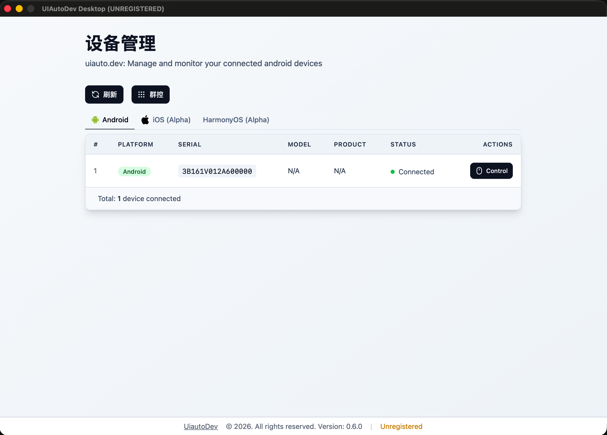
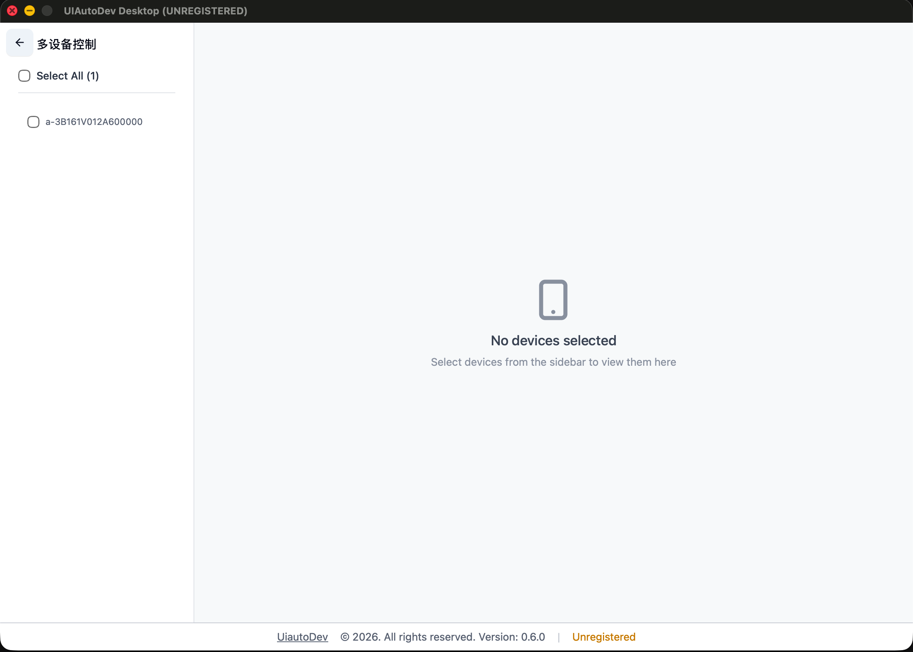
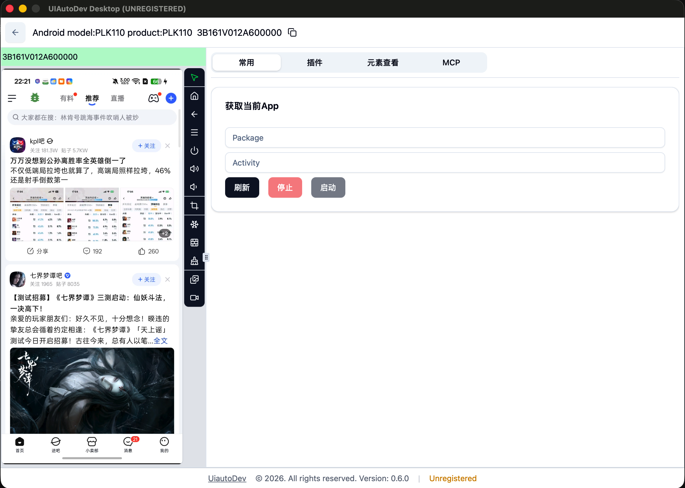
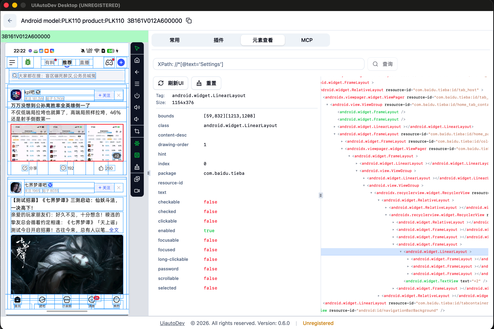
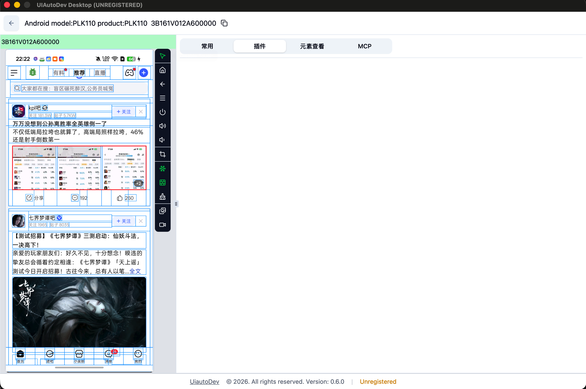
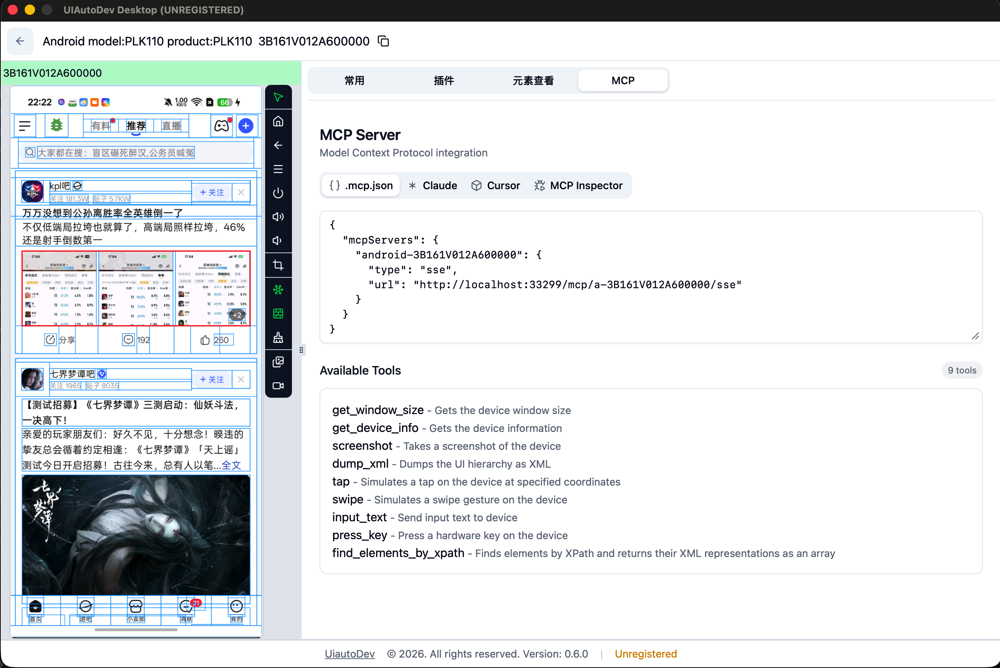

# UIAutoDev Desktop 功能文档

> 基于官方文档（[语雀 UIAutoDev Desktop](https://www.yuque.com/codeskyblue/uiautodev/desktop)）与实际安装版本（v0.6.0，macOS）交互梳理，最后更新于 2026-08-23。

## 1. 产品概述

UIAutoDev Desktop 是一个跨平台桌面应用，用于在电脑上连接、监控和控制 Android（及 iOS/鸿蒙）手机，是移动端 UI 自动化调试与控制的图形化入口。

- **技术形态**：Wails（Go + 内嵌 Svelte 前端）桌面壳，本地同时运行 Web UI 与 API 服务，地址 `http://127.0.0.1:33299`。
- **支持平台**：Windows、macOS（arm64 / intel）。另有服务端（server）单二进制版本，可管理大量手机，便于自动化系统集成。
- **开源情况**：主体闭源，`github.com/uiautodev/uiautodev` 仓库仅提供 npm 启动器（`npx uiautodev`，自动下载对应版本二进制）。
- **版本状态**：当前安装版本 0.6.0（未注册，底部状态栏显示 UNREGISTERED；未注册用户会周期性（20 分钟）弹出 License 输入窗口）。

## 2. 核心能力总览

官方文档定义的五大能力：

| # | 能力 | 说明 |
|---|------|------|
| 1 | 电脑控制手机 | 基于 scrcpy 的实时投屏 + 触控/按键注入 |
| 2 | 查看 DOM 树 | 元素查看器：UI 层级树、属性、XPath 查询 |
| 3 | 插件系统 | HTML 插件，iframe 嵌入设备控制界面，可扩展任意功能 |
| 4 | MCP 扩展 | 面向 AI 的 Model Context Protocol 服务（SSE） |
| 5 | 多设备控制 | 一次管理多个设备（群控），设备列表统一管理 |

另配套提供服务端版本（`uiautodev-server`），支持大规模设备管理与自动化集成。


## 3. 界面结构与交互

主窗口分四个区域：

```
┌──────────────────────────────────────────────────────────────┐
│ 顶部栏：设备选择器（型号/产品/序列号）  [复制序列号]            │
├───────────────┬────┬──────────────────────────────────────────┤
│               │    │  标签页：常用 │ 插件 │ 元素查看 │ MCP      │
│   手机投屏区   │ 控 │──────────────────────────────────────────│
│  (scrcpy 画面) │ 制 │                                          │
│               │ 栏 │         右侧功能面板（标签页内容）        │
│               │    │                                          │
├───────────────┴────┴──────────────────────────────────────────┤
│ 底部栏：版本号 / 反馈入口 / 注册状态（Unregistered）            │
└──────────────────────────────────────────────────────────────┘
```

截图概览：


01-首页-设备管理


02-群控页-多设备控制



03-布局页-常用tab



04-布局页-元素查看tab


05-布局页-插件tab



06-布局页-MCP tab



### 3.1 顶部设备栏
- 设备选择下拉：显示 `model / product / serial`，多设备时在此切换。
- 复制按钮：一键复制设备序列号到剪贴板。

### 3.2 手机投屏区
- 基于 scrcpy 的实时画面，支持直接鼠标操作：
  - **左键** = 点击（tap）
  - **中键** = Home
  - **右键** = Back
- 鼠标悬停画面时，左下角实时显示坐标及百分比（0.7.0 新增）。

### 3.3 投屏右侧控制按钮栏（图标按钮，0.3.4 起有 tooltip）
| 按钮 | 功能 |
|------|------|
| Home / Back / Recents | 安卓导航键（按键注入） |
| Power | 电源键 |
| Volume Up / Volume Down | 音量加减 |
| Copy Screenshot | 复制当前截图到剪贴板 |
| Freeze Screen | 冻结屏幕（防止画面变动） |
| Rotate Device | 旋转设备 |
| Dump Hierarchy | 导出当前 UI 树 |
| Clear Hierarchy | 清除 UI 树叠加层 |
| Crop Screen | 裁切屏幕（Crop Screen，0.6.0 新增） |
| Enable/Disable Touch | 触摸控制开关（默认开启，可切换只读） |

### 3.4 右侧功能面板（四个标签页）
- **常用**：App 快捷管理 —— 「获取当前App」一键读取前台应用，包名/Activity 输入框，以及 **刷新**（应用列表）、**停止**、**启动** 按钮。
- **插件**：已安装插件的卡片/标签页展示（0.7.0 起有独立的插件管理页：启用/禁用/安装/卸载）。
- **元素查看**：UI 层级树浏览器，详见 §5。
- **MCP**：MCP 服务配置与工具列表，详见 §7。

### 3.5 底部状态栏
- 版本号、UiautoDev 官网链接、反馈入口（笑脸图标）、注册状态（点击可输入 LicenseKey）。

## 4. 设备连接与多设备管理

- **Android**：adb 连接，scrcpy 投屏，uiautomator2 / adb dump 两种 UI 层级获取方式；剪贴板粘贴（0.2.2 起支持中文）。
- **iOS（Alpha）**：慢速投屏；UI 元素查看（需预先安装 WDA，包名 `com.facebook.WebDriverAgentRunner.xctrunner`）；自动检测并启动 ios tunnel；对外暴露 wdaUrl 代理 `https://localhost:33299/proxy/devices/{id}/8100/`（8100 可换成自定义 wda 端口，访问时先检查并尝试启动 WDA）。
- **鸿蒙设备**（0.6.0 起）：HDC 连接、屏幕截图、UiDriver 交互、前端展示。
- **多设备/群控**：设备管理页按 Android / iOS(Alpha) / Harmony 分区列出所有设备（状态、平台、型号、序列号、操作列），支持刷新；群控模式一次管理多台设备，通过降低 fps/分辨率优化带宽（0.2.2 起）。

## 5. 元素查看器（DOM 树）

右侧「元素查看」标签页功能：

- **UI 树浏览**：左侧树形展示当前屏幕的 UI 层级（hierarchy），节点高亮；选择节点后右侧展示节点属性（支持「全部属性」）。
- **XPath 查询**：顶部输入框输入 XPath（如 `//*[@text="Settings"]`）后点「查询」，命中节点在树中定位/高亮；0.4.0 起支持 XPath 反查。
- **刷新UI / 重置**：重新 dump 当前 UI 树 / 清空当前选择。
- **Select a node**：在投屏画面上点选元素，联动定位到树节点。
- 0.7.1 起支持 UI 树的**导入/导出**（保存/加载 UI 树文件）。

## 6. 插件系统

- 插件用 **HTML** 编写，通过 iframe 嵌入设备控制界面（卡片或标签页两种展示模式，`display: card|tab`）。
- 插件目录：启动程序目录 或 `~/.uiautodev/plugins`（0.7.x 为 `~/.config/uiautodev/plugins`）。
- 目录结构（`plugin.json` 必须有，用于识别插件）：

```
plugins/
└── helloworld/
    ├── index.html
    └── plugin.json
```

- `plugin.json` 字段（全部可选）：`name`、`description`、`version`、`main`（入口文件，相对路径或 URL，如 vue 调试地址 `http://localhost:5173`）、`homepage`、`display`（card|tab）、`height`（默认自适应）、`platform`（0.3.1 起）。
- iframe 加载地址示例：`http://localhost:33299/plugin/helloworld/index.html?deviceId=a-08a3d291`（携带当前设备 ID）。
- **运行时 API**：插件 index.html 会自动注入 `/plugins/:plugin-id/__runtime.js`，暴露全局 `$u` 对象，提供设备操作常用方法，例如 `$u.deviceId`、`$u.plugin.version`、`await $u.shell('dumpsys battery')` 等；0.5.0 起支持 `$u.fetch` 请求未开启 CORS 的服务。接口定义见 `plugin-runtime.d.ts`。
- **插件管理**（0.7.0 起）：启用/禁用、安装（上传 `.zip` 自动解压到用户插件目录）、卸载，并支持面板刷新重新加载插件。
- **开发参考**：官方模板 https://github.com/uiautodev-plugins/preact-template ；Mac 桌面版按 `Shift+Cmd+F12` 开启开发者选项调试插件（0.4.3 起）。

## 7. MCP 服务（AI 集成）

「MCP」标签页提供 Model Context Protocol 集成，四种入口：

- **.mcp.json**：展示可直接复制到 Claude Desktop / 其他客户端的配置 JSON。
- **Claude**：Claude Desktop 配置引导。
- **Cursor**：一键添加 MCP server 到 Cursor（Deeplink，0.3.0 起）。
- **MCP Inspector**：内置调试工具，用于检查和测试 MCP 服务。

MCP 服务地址（SSE 模式）：`http://localhost:33299/mcp/a-<serial>/sse`

`.mcp.json` 配置示例：

```json
{
  "mcpServers": {
    "android-<serial>": {
      "url": "http://localhost:33299/mcp/a-<serial>/sse"
    }
  }
}
```

**可用工具（9 个）**：

| 工具 | 说明 |
|------|------|
| get_window_size | 获取设备窗口尺寸 |
| get_device_info | 获取设备信息 |
| screenshot | 截取设备屏幕 |
| dump_xml | 导出 UI 层级为 XML |
| tap | 在指定坐标模拟点击 |
| swipe | 模拟滑动手势 |
| input_text | 向设备发送文本输入 |
| press_key | 模拟硬件按键 |
| find_elements_by_xpath | 按 XPath 查找元素，返回其 XML 表示（数组） |

## 8. 命令行与运维

- 一键启动：`npx uiautodev`（0.7.0 起，自动下载并启动对应平台二进制）。
- 启动参数：`--open`（启动后自动打开浏览器，0.7.0 起）、`-proxy-log`（记录代理请求内容，如 WDA 请求）、`-auth <user:pass>`（设置服务器 Basic Auth）、`-license-file`（会员免弹窗，0.3.0 起）。
- 菜单：File → Open Log Directory 快速打开日志目录（0.3.3 起）。
- 内网穿透（0.7.0 起）：`npx uiautodev -ngrok -ngrok-authtoken <token>`，将本地服务暴露到公网（如钉钉远程打卡、远程控制家里手机打游戏）。
- 服务端版额外支持 `--tls-addr`（TLS + 自签名证书，0.5.0 起）。
- License：未注册每 20 分钟弹窗，支持输入 LicenseKey（0.3.4 起提供输入框）。

## 9. 当前版本（0.6.0）与文档差异说明

以下功能在官方文档/更新日志中已发布，但**当前安装的 0.6.0 版本未包含**（升级即可获得）：

- 插件管理界面（启用/禁用/安装/卸载、上传 zip）
- UI 树导入/导出
- 内网穿透（ngrok）
- `npx uiautodev` 一键启动、`--open` 参数
- 屏幕鼠标悬停显示坐标与百分比
- 鸿蒙按键模拟补充、底部反馈入口等

## 10. 常见问题（官方 FAQ 要点）

- **微信元素无法识别**：系统设置 → 无障碍 → 「随选朗读」打开。
- **Chrome 看不到本地设备**：点击地址栏左侧权限设置，开启相关权限（应用需访问本地服务）。
- **模拟器不显示当前界面**：关闭模拟器「后台保活」。
- 已知问题设备会在官方文档持续更新（如部分机型同屏失败但 shell 正常）。

## 11. 相关资源

- 官方文档（语雀）：https://www.yuque.com/codeskyblue/uiautodev
- 下载地址：https://get.uiauto.dev
- 问题反馈：https://github.com/uiautodev/uiautodev/issues
- API 文档（Apifox）：https://uiautodev.apifox.cn
- 插件模板：https://github.com/uiautodev-plugins/preact-template
