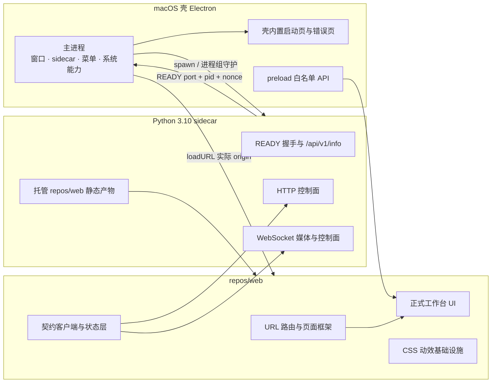
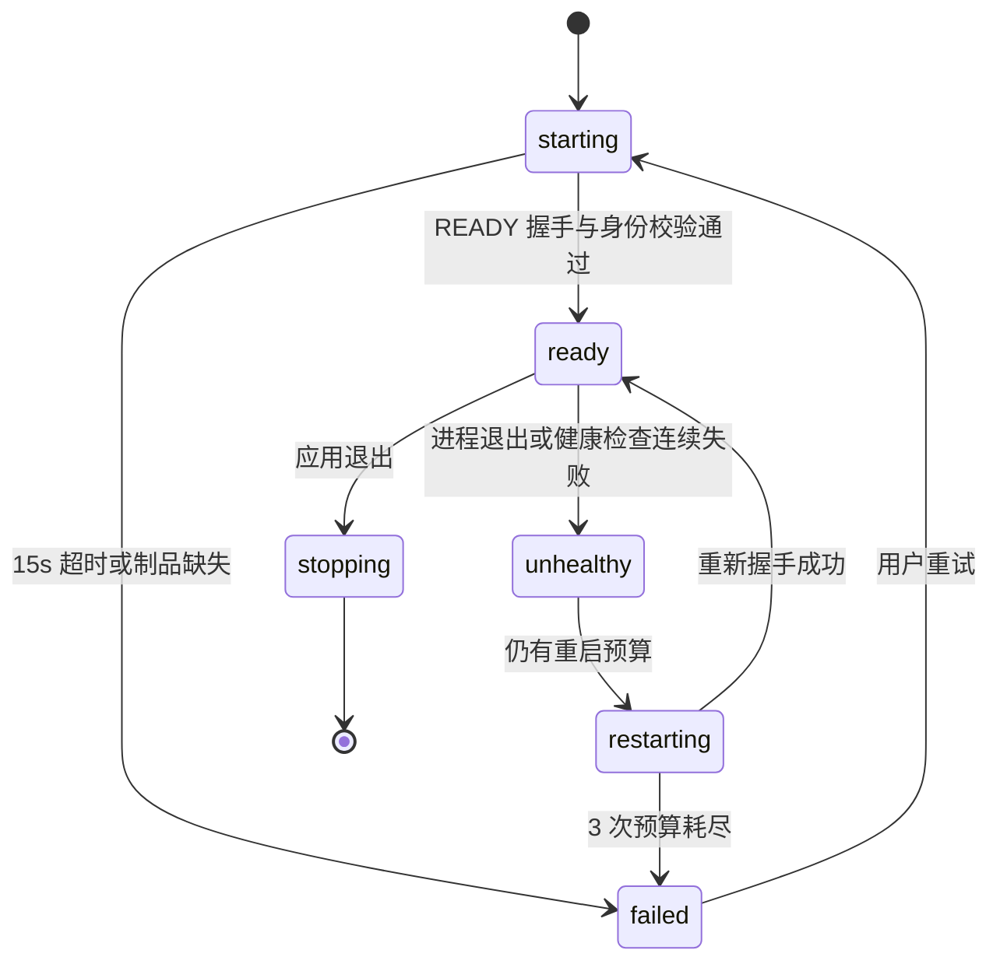

# 技术评审：LayoutSee V0.1 macOS 壳、统一 Web UI 与原生质感动效子方案

> 评审对象：PRD v0.9 中的 macOS 壳、Web 工作台工程化、壳与内核边界、页面与控件动效
> 输入：[PRD](../feature/UI-LayoutSee需求文档PRD.md)、[视觉规范](../designs/DESIGN.md)、[交互原型](../designs/interaction-prototype.md)、[可运行 UI 原型](../../source/layoutsee-prototype/)、[macOS 技术栈调研](./macos-技术栈调研.md)、[ZCode 视觉基准](../research/design/zcode-client-design-spec.md)
> 日期：2026-08-27 ｜ 状态：已修订，评审结论为有条件通过

---

## 一、评审结论与边界

### 1.1 结论

Electron + 单一 React Web UI + Python sidecar 的总体分层合理，可以继续作为 V0.1 的主架构发布评审：

1. 内核 API、媒体协议、插件运行时与 MCP 契约形成独立版本化文档，并有契约测试；
2. 壳内置启动页和错误页，内核未启动时仍能完成重试、复制诊断信息和打开日志目录；
3. 端口由内核原子绑定，壳通过启动随机数校验进程身份；
4. Electron 安全配置、插件沙箱、写操作门禁与审计通过自动化测试；
5. `arm64` 与 `x64` 两套签名、公证、离线启动和进程回收验证通过；
6. PRD 附录 C 的 V0.1 主流程在真实 Android 设备上通过，动效不得成为功能验收的替代品。

### 1.2 本文覆盖什么

- macOS 窗口、菜单、主题、系统能力白名单与 sidecar 生命周期；
- `repos/web` 从 `source/layoutsee-prototype` 迁移到正式工程的边界；
- 壳、前端与内核之间必须冻结的接口形态；
- 页面、Tab、按钮和状态反馈的动效规则；
- 打包、签名、公证、性能与测试门禁。

本文**不是 V0.1 Android 内核全量技术方案**。设备驱动、快照算法、语义摘要、诊断规则、MCP 工具实现和插件协议的内部设计必须另案评审；未完成时不得在 PRD 对照表中标记为“已覆盖”。

### 1.3 输入优先级与冲突裁决

1. PRD 决定版本范围、功能规约和业务验收；
2. 用户指定的可运行 `layoutsee-prototype` 决定当前视觉构图、信息密度和主要交互手感；
3. `DESIGN.md` 决定语义 Token、可访问性和禁止项；
4. 原型与 DESIGN 的几何数值冲突时，本次实现以可运行原型为迁移基线，并把差异显式记录，禁止开发者自行混用两套尺寸；
5. 技术评审只能细化实现，不得把 V0.2/V1.0 能力偷带入 V0.1。

---

## 二、现状证据与迁移边界

### 2.1 当前工程事实

| 项 | 当前事实 | 对 V0.1 的含义 |
|---|---|---|
| `repos/web` | 只有 README 与空目录骨架 | 不是“已有正式前端”，需要初始化、迁移和契约接入 |
| `repos/mac` | 只有 README 与空目录骨架 | 窗口、sidecar、IPC、打包、签名均未实现 |
| 原型技术栈 | Vite 6.4.2、React 19.2、原生 CSS、Hugeicons | 不存在 Tailwind、Zustand、XState、motion 依赖，原评审不得把它们写成既定栈 |
| 原型路由 | `screen` / `workTab` 本地状态 | 只能演示，不支持刷新恢复、深链和浏览器前进后退 |
| 原型数据 | 静态图片、静态设备数据、`setTimeout` 模拟 | 不能直接接真实 API、WS、错误恢复与审计 |
| 原型页面 | 设备、群控、工作台四 Tab | 缺布局智能、完整设置、接入诊断；日志入口当前禁用 |
| 原型动效 | CSS Token 100/180/260ms、hover/active、Toast、弹层、减弱动态效果 | 可复用 Token 与克制方向，不应默认引入弹簧库 |
| 原型布局 | 标题栏 56px、管理侧栏 188px、工作台控制轨 68px | 正式实现按此视觉密度迁移；浏览器模拟交通灯除外 |

### 2.2 原型迁移边界

| 可复用 | 必须重写或新增 |
|---|---|
| 页面构图、三段式工作台、卡片与表格外观 | URL 路由、返回栈和刷新恢复 |
| CSS 语义变量、100/180/260ms 基础动效 | HTTP 契约客户端、轮询、缓存、统一错误结构 |
| 分隔条交互、基础键盘与可访问名称 | WebSocket 媒体与控制通道、背压与降级 |
| 设备画面、右侧任务面板的稳定分区 | 快照、选中节点、只读、冻结、离线恢复状态 |
| 常用、插件、元素、MCP 四个 Tab 的视觉骨架 | 布局智能、完整设置、接入诊断与 V0.1 状态矩阵 |
| Light/Dark 外观和高信息密度 | 原生窗口控制、系统主题初始化、CSP、IPC 与插件沙箱 |

迁移时不得把原型中的以下内容带入生产：模拟交通灯、静态 MCP 工具数、群控广播文案、插件安装管理暗示、900/820/480px 的移动卡片布局。桌面壳最小为 1280×800；小于最小宽度的 Web 端展示最小宽度提示，不改变核心信息架构。

### 2.3 PRD 范围裁决

| 能力 | V0.1 结论 | 裁决依据 |
|---|---|---|
| 工作台布局智能 Tab | 必做，追加在 MCP 后 | PRD 附录 C 明确要求摘要与诊断；里程碑“四 Tab”是文案遗漏 |
| 设置 | 必做完整页面 | 覆盖主题、驱动、轮询、目录与安全设置，不能只做原型快速弹层 |
| 独立日志页 | 不作为本子方案的 V0.1 强制交付 | PRD 只硬性要求日志落盘与打开目录；如保留 P7，需单独增加 Story 与验收 |
| 群控 | 只展示多路画面 | 同步写操作广播属于 V1.0 |
| 插件 | 扫描固定目录、加载 iframe、打开插件目录 | 安装、卸载、启停管理属于 V0.2 |
| MCP | 9 个原子工具 + 3 个高阶工具 | UI 必须从运行时 `tools/list` 派生，不硬编码名称、数量与读写分类 |
| `.lsnap`、diff、裁切、安装应用、自动更新 | 隐藏入口 | 均为 V0.2，不进入 V0.1 生产包 |
| 布尔属性色彩 | 中性文本，不用红/绿表达普通 true/false | PRD B.2.4 与 DESIGN 冲突，错误红色只用于真正诊断错误 |

PRD 中的启动和首帧指标按以下方式统一：内核就绪 P90 ≤10s、硬超时 15s；已建立媒体链路的暖切换首帧 ≤500ms；冷进入工作台首帧 ≤3s。

---

## 三、总体架构



关键边界：

1. 主进程先创建窗口并加载壳内置启动页，再拉起 sidecar；内核失败时错误页仍可达；
2. 内核就绪后，主进程才导航到内核托管的 Web UI；加载后的 `repos/web` 页面本身就是 Electron renderer，不再设置额外“renderer 加载器”；
3. 业务能力只走版本化 HTTP/WS/MCP 契约，系统能力只走 preload 白名单；
4. 前端同源请求使用 `window.location.origin`，不通过查询参数或 preload 再注入端口；
5. 生产环境不连接线上 UI、不依赖浏览器插件、无 License 和联网校验。

---

## 四、macOS 壳方案

### 4.1 工程结构

```text
repos/mac/
├── package.json
├── src/
│   ├── main/
│   │   ├── index.ts
│   │   ├── window.ts
│   │   ├── kernel-supervisor.ts
│   │   ├── ipc.ts
│   │   ├── menu.ts
│   │   └── theme.ts
│   ├── preload/
│   │   └── index.ts
│   └── bootstrap/
│       ├── index.html
│       └── bootstrap.ts
├── build/
└── scripts/
```

V0.1 不打入 `electron-updater` 运行依赖，只保留可扩展接口；自动更新在 V0.2 另案接入。Electron、打包器和全部依赖必须写入 lockfile，禁止使用“当前 stable”作为可复现版本描述。

### 4.2 原生窗口与视觉稿的关系

- `BrowserWindow` 使用 `titleBarStyle: "hiddenInset"`，交通灯由 macOS 绘制；原型中的三枚模拟交通灯仅用于浏览器演示，不迁移；
- Web 标题栏沿用原型 56px 高度，管理侧栏 188px，工作台控制轨 68px；这些数值统一落为 Token，不在组件散写；
- 标题栏设置 `-webkit-app-region: drag`，按钮和输入区域设置 `no-drag`；
- V0.1 不为了局部 `NSVisualEffectView` 引入高风险原生模块，标题栏与侧栏先复用原型的 CSS 材质和不透明回退；系统“减弱透明度”开启时禁用模糊；
- 基准窗口 1480×1060，最小窗口 1280×800。最小尺寸会影响小屏可用面积，因此必须在 13 英寸机型实测，不再表述为“小屏用户不受影响”。

`DESIGN.md` 中 80/210/96px 与当前原型 56/188/68px 存在漂移。本评审按用户指定的可运行视觉稿落地；设计规范应在后续设计评审中同步数值，不能让正式实现同时兼容两套几何常量。

### 4.3 Electron 安全基线

```ts
const webPreferences = {
  nodeIntegration: false,
  contextIsolation: true,
  sandbox: true,
  webSecurity: true,
  webviewTag: false,
  preload,
};
```

还必须满足：

- 内核静态服务返回严格 CSP，默认拒绝内联脚本、任意远程脚本和非白名单连接；
- 仅允许导航到本次启动握手得到的精确 `http://127.0.0.1:{port}`；其余导航、`window.open` 和权限请求默认拒绝；
- preload 不暴露 `ipcRenderer`、`fs`、任意 `openExternal`、任意路径或任意 channel；
- IPC 请求必须校验来源 frame、参数 schema、路径边界和协议白名单；订阅 API 必须返回取消订阅函数；
- 插件 iframe 使用 `sandbox`，不直接获得同源权限；`$u` 通过宿主 `postMessage` 桥接，写操作统一经过只读门禁、授权与 ActionLog；
- 本地 UI 写请求使用每次启动生成的随机 session nonce 与自定义请求头，防止其他本地网页直接发起写操作；这属于 PRD 安全增量，需要同步到协议文档；
- MCP 本地免账号鉴权仍按 PRD 执行，但必须拒绝非 UI 白名单浏览器 Origin，并保留只读门禁和不可关闭的写审计。

### 4.4 preload 白名单

| API | 用途 | 约束 |
|---|---|---|
| `getAppInfo()` | 壳版本、平台、架构 | 只读 |
| `getKernelSession()` | 当前 origin、nonce、状态 | 只读，不落日志 |
| `onKernelStateChange()` | 启动、重启、失败、恢复 | 返回取消订阅函数 |
| `openLogsDir()` | 打开固定日志目录 | 不接受路径参数 |
| `openPluginsDir()` | 打开固定插件目录 | 不接受路径参数 |
| `chooseAdbPath()` | 选择 adb 可执行文件 | 文件类型、存在性与可执行性校验 |
| `chooseArchiveDir()` | 选择存档目录 | 仅返回用户选择结果 |
| `openTrustedExternal(kind)` | 打开帮助或客户端接入页 | `kind` 枚举映射固定 URL/协议，不接受任意 URL |
| `onSystemThemeChange()` | 同步系统主题 | 返回取消订阅函数 |

### 4.5 sidecar 状态机与端口



实现约束：

1. `app.requestSingleInstanceLock()` 保证单实例，第二实例只唤醒现有窗口；
2. 端口唯一所有者是内核。内核从 33299 起原子 bind，冲突时最多递增 10 次；禁止壳先探测再 spawn；
3. 内核在受控标准输出发出 `READY {port,pid,nonce,productVersion,apiVersion,snapshotSchemaVersion}`；壳再调用 `/api/v1/info` 校验同一 nonce，避免误连其他本地服务；
4. 健康检查周期 2s，连续两次失败进入 `unhealthy`；重启退避 1/2/4s，稳定运行 60s 后重置预算；
5. sidecar 必须单独建进程组；退出时先停止新请求与 WS，再向整个进程组发送 SIGTERM，3s 后仍未退出才强杀，scrcpy 等子孙进程一并回收；
6. 重启期间保留最后画面与快照为只读，清理旧 WS；恢复后回设备列表并提示“服务已恢复”；
7. 端口变化时 MCP Tab 从 `/api/v1/info` 刷新地址，并明确提示既有客户端配置已失效；
8. 日志落 `~/.layoutsee/logs/`，内核与壳分文件、按天切分、保留 7 天，不记录 nonce、凭据、完整节点文本或用户隐私。

---

## 五、Web 正式工程方案

### 5.1 技术栈

- Vite 6 + React 19，与原型保持同代；
- 原生 CSS 或 CSS Modules + 语义变量，不引入 Tailwind；
- 正式图标统一到 `@phosphor-icons/react`，迁移时逐屏比对，禁止与 Hugeicons 混用；
- URL 路由负责刷新恢复和深链；页面方向元数据只服务动效，不另建第二套路由状态机；
- HTTP 服务状态使用契约客户端与请求缓存层，局部 UI 状态使用 React reducer/context；不得在没有状态模型和测量证据时先引入 Zustand/XState；
- 简单动效使用 CSS。只有 CSS 无法满足已验收的退出动画或共享元素时，才通过独立技术验证决定是否引入 motion 库。

### 5.2 URL 路由

```text
/devices
/devices/group
/devices/:deviceId/workbench/:tab
/settings/:section?
/logs?source=mcp&deviceId=...   # 仅独立日志页获批后启用
```

- `:tab` 为 `common | plugins | element | mcp | intelligence`；
- `Cmd+[` 与浏览器返回共用 History；
- 设备、Tab、日志筛选和设置分组可从 URL 恢复；
- 快照实体、视频帧和 session nonce 不写入 URL；
- 工作台切 Tab 不销毁快照和选中节点；切换设备保留 Tab，但清理旧设备快照、查询和 WS。

### 5.3 页面与数据分层

| 层 | 职责 |
|---|---|
| `app/` | 路由、全局错误边界、主题、快捷键、壳能力适配 |
| `pages/` | 设备、群控、工作台、设置、诊断入口 |
| `features/` | 投屏、元素树、摘要、诊断、MCP、插件、只读与审计 |
| `components/` | Button、Tab、Table、Tree、Dialog、Toast、ResizeHandle |
| `api/` | OpenAPI/JSON Schema 生成类型、请求与错误映射 |
| `media/` | WS、VideoDecoder Worker、帧队列、截图降级 |
| `motion/` | Token、页面 TransitionSlot、减弱动态效果适配 |

### 5.4 内核契约门禁

以下不是完整协议，但必须在独立协议文档中冻结后，前端和内核才允许并行实现：

| 契约 | 最低要求 |
|---|---|
| `/api/v1/info` | `productVersion`、`apiVersion`、`snapshotSchemaVersion`、`pid`、`port`、`nonce`、`capabilities` |
| 设备 | 列表、状态、诊断、当前应用、命令；统一 `deviceId` |
| 快照 | PRD 定义的 `LayoutSnapshot` 与 `Node` JSON Schema；抓取幂等键与超时 |
| 摘要与诊断 | 请求参数、确定性、`partial`、证据与统一错误码 |
| 写操作 | tap/swipe/input/key/app 操作；只读门禁与 ActionLog 来源 |
| 媒体 WS | 握手、编解码参数、二进制帧封装、控制消息、心跳、背压、重连 |
| 插件 | manifest、sandbox、`postMessage` schema、授权与版本兼容 |
| MCP | 工具名称、input schema、读写分类、错误 `{ok,code,message,hint}` |

OpenAPI/JSON Schema 校验、前端 mock server、内核响应测试和 MCP `tools/list` 快照测试是联调准入条件。`productVersion` 不一致按 PRD 阻断；`apiVersion` 与 `snapshotSchemaVersion` 还必须满足显式兼容矩阵，禁止靠灰度开关跳过校验。

### 5.5 媒体线程与降级

“WebCodecs 一定不占主线程”不能作为前提。目标实现是 `DedicatedWorker + VideoDecoder`，能否使用 `OffscreenCanvas` 由技术验证决定：

- 解码队列最多保留 2 帧，积压时丢旧帧，不允许无限缓存；
- 每个 `VideoFrame` 在绘制或丢弃后立即 `close()`；
- 页面隐藏、设备离线、切换设备和退出工作台时暂停解码并释放 decoder、socket 与画布资源；
- 不支持 WebCodecs、配置失败或连续解码错误时降级为截图轮询，并在 UI 明确标识；
- 动效开启与关闭分别记录解码 FPS、展示 FPS、丢帧率和主线程长任务，不能用“理论上在不同线程”代替测试。

---

## 六、macOS 原生质感动效

### 6.1 原则

“原生质感”在本产品中意味着短促、可预测、与层级一致，而不是给所有控件添加弹簧。当前原型是固定标题栏、左侧导航、稳定设备画面和右侧任务面板；全屏 24px push/pop 更像移动端导航，会破坏工具感，因此改为克制的 crossfade + 8px。

### 6.2 Token

| Token | 值 | 用途 |
|---|---|---|
| `motion.fast` | 100ms | hover、press、颜色反馈 |
| `motion.base` | 180ms | Tab、Toast、同级内容切换 |
| `motion.slow` | 260ms | 页面、弹层、工作台结构切换 |
| `motion.ease` | `cubic-bezier(.2,.8,.2,1)` | 默认曲线 |
| `motion.page.distance` | 8px | 页面与面板进入位移上限 |

Token 同时落为 CSS 变量和 TypeScript 常量。业务组件禁止散写时长、曲线和距离。`prefers-reduced-motion: reduce` 时位移和过渡归零，只保留即时颜色与可见状态变化。

### 6.3 按钮与状态控件

| 类型 | hover | press | release |
|---|---|---|---|
| 主、次、危险文字按钮 | 100ms 颜色/边框变化 | `scale(.98)` 或 `translateY(1px)` | 100ms 回到 1，不 overshoot |
| 图标按钮 | 100ms 背景/颜色变化 | `scale(.96)` | 100ms 回到 1 |
| 控制轨状态按钮 | 背景变化 | 不缩放 | 180ms 切换激活态 |
| 禁用按钮 | 无 | 无 | 无；保留原因 Tooltip |

- 键盘 Enter/Space 必须得到同等状态反馈；
- 焦点环始终保持 2px，不随按压缩窄；
- 动效不得代替 loading、成功、失败、只读或禁用状态；
- 危险操作是否二次确认由业务风险决定，不由按钮样式统一推导。

### 6.4 页面和 Tab

| 场景 | 作用区域 | 动效 |
|---|---|---|
| 设备 ↔ 群控/工作台 | 标题栏保持；内容槽切换 | 旧内容 100ms 淡出，新内容 180ms 淡入并 8px→0 |
| 返回设备页 | 同上 | 反向 8px + crossfade，260ms 内完成 |
| 工作台 Tab | 只替换右侧任务面板 | 180ms crossfade + 4px 上移；设备画面、控制轨、分隔条不重新挂载 |
| 切换设备 | 只替换设备画面和设备上下文 | 遮罩 + 160ms 淡出/淡入，不做位移 |
| 诊断弹层 | 弹层 | 260ms opacity + scale(.98→1) |
| Toast/横幅 | 浮层 | 180ms opacity + 8px 位移 |

侧栏从 188px 切换到 68px 时，不执行持续 `width` 动画。旧页淡出后一次性提交几何变化，只对子元素做 opacity/transform，再让新页淡入，从而满足“动画只改 transform/opacity”并避免大面积布局抖动。

页面过渡只包裹轻量内容槽，禁止同时保留两份视频、3000 节点树或插件 iframe。退出动画若需要双层 DOM，旧层必须是不可交互的轻量快照，并设置 `aria-hidden` 和 `pointer-events: none`。

### 6.5 性能验收

| 项 | 标准与测法 |
|---|---|
| 按压反馈 | `pointerdown` 到首个视觉帧 ≤50ms |
| 页面切换 | 180–260ms；无白屏、无双重点击区、无焦点丢失 |
| Tab 切换 | 180ms ±20%；画面 WS 不重连，快照对象不销毁 |
| 帧率 | Intel 验收机、1280×800、持续切换 30 次；帧时间 P95 ≤18.2ms（约 55fps） |
| 媒体影响 | 同场景动效开/关各 60s；展示丢帧率差值 ≤2 个百分点 |
| 长任务 | 切换期间主线程不得出现 >50ms 长任务；>8ms 任务需记录来源 |
| 减弱动态效果 | 所有位移、缩放、淡入淡出关闭，功能、焦点与状态宣告正常 |

未达标时按顺序降级：取消页面位移 → 取消双层退出动画 → 只保留即时颜色状态。不得通过降低投屏画质掩盖 UI 动效问题。

---

## 七、打包与发行

1. 构建顺序：构建 `repos/web` → 写入内核静态资源 → 构建固定 Python 3.10 内核制品 → 校验制品 hash 与版本 → 组装 Electron App → 递归签名嵌套二进制 → 签名 App → 生成 dmg → 公证 → staple → 干净机验证；
2. V0.1 分别产出 `arm64` 与 `x64` 两套制品，不先承诺 universal；每套内核、adb/scrcpy 相关二进制和 Electron 架构必须一致；
3. PRD 指定 PyInstaller 单文件为目标，但单文件解压启动、嵌套签名和 10s 启动指标必须先做技术验证；失败时改 onedir/Nuitka 需要回写 PRD，不得临时换方案；
4. 最低 macOS 版本、压缩 dmg 大小与安装后 App 大小在首个可运行打包样本上建立基线，再由产品设阈值；删除无证据的“150MB 级”承诺；
5. entitlements 使用最小集，`allow-unsigned-executable-memory` 只有在签名样本证明必需时才允许加入；
6. 前端与内核 `productVersion` 不一致时阻断进入；回滚必须使用兼容制品，不提供关闭校验的生产开关。

---

## 八、风险与验证矩阵

| 风险 | 等级 | 验证与缓解 |
|---|---|---|
| 内核失败时 UI 不可达 | 高 | 壳内置 bootstrap/error 页；缺失制品和 15s 超时自动化测试 |
| 端口被抢占或误连其他服务 | 高 | 内核原子 bind + READY nonce + `/api/v1/info` 二次校验 |
| 插件或 renderer 越权 | 高 | sandbox、CSP、IPC schema、导航/权限拒绝、写审计 |
| PyInstaller 公证与双架构失败 | 高 | 两架构打包技术验证，嵌套签名、公证和离线冒烟 |
| 原型到正式 UI 工作量被低估 | 高 | 按准入里程碑推进，不使用未经估算的人天承诺 |
| WebCodecs 解码积压或泄漏 | 中 | Worker、2 帧队列、VideoFrame close、60s 稳态测试 |
| 大树与过渡争抢主线程 | 中 | 虚拟树、稳定画面槽、轻量 TransitionSlot、性能基线 |
| 两套视觉尺寸继续漂移 | 中 | 正式 Token 只保留原型基线，后续同步 DESIGN 数值 |
| V0.2 能力误入 V0.1 | 中 | 构建期 feature manifest + 页面/菜单可见性测试 |

### 8.1 自动化与人工验证

| 层级 | 必须覆盖 |
|---|---|
| 壳单测 | sidecar 状态机、重启预算、端口冲突、进程组回收、IPC 参数拒绝 |
| 契约测试 | OpenAPI/JSON Schema、统一错误、版本兼容、MCP `tools/list` |
| 前端测试 | URL 恢复、History 返回、Tab 状态保留、设备切换清理、只读门禁 |
| 媒体测试 | WebCodecs、截图降级、背压、页面隐藏、WS 重连与资源释放 |
| 可访问性 | 键盘、焦点、tablist/tree 语义、aria-live、减弱动态效果 |
| 视觉回归 | 1480×1060 与 1280×800，Light/Dark，设备页与五个工作台 Tab |
| 端到端 | 真实 Android：设备 → 工作台 → 抓取 → 元素 → 摘要/诊断 → MCP tap |
| 发行冒烟 | `arm64`/`x64` 干净机离线启动、签名、公证、日志、反复启停 10 次无孤儿 |

---

## 九、实施里程碑与准入条件

不再给出“3 人天/8 人天”这类缺少工程基线的承诺。顺序如下，每一阶段未通过不得进入下一阶段：

| 阶段 | 交付 | 准入条件 |
|---|---|---|
| M0 契约冻结 | API/WS/MCP/插件 schema、错误码、版本矩阵 | 契约测试可运行 |
| M1 壳启动闭环 | 原生窗口、bootstrap/error 页、sidecar、单实例、日志 | 缺失/超时/崩溃/端口冲突测试通过 |
| M2 原型正式迁移 | Token、URL 路由、设备页、工作台骨架、设置 | 视觉回归与键盘检查通过 |
| M3 真实主链路 | 设备列表、投屏、快照、元素树、XPath | 真机主链路和降级路径通过 |
| M4 V0.1 完整面板 | 五 Tab、摘要、诊断、MCP、插件、群控 | PRD 附录 C 范围无缺项、无超范围入口 |
| M5 动效与性能 | TransitionSlot、按钮反馈、reduced-motion | 第 6.5 节全部通过 |
| M6 双架构发行 | 两架构 dmg、签名、公证、安装与回收 | 干净机发行冒烟通过 |
| M7 V0.1 发布评审 | PRD 验收报告、风险关闭记录 | 所有阻断项关闭 |

---

## 十、评审意见

### 10.1 已修正的原方案问题

- 修复全部失效的本地文档链接；
- 将“V0.1 全量评审”收敛为壳、Web 与动效子方案，并补充外部发布门禁；
- 增加壳内置启动/错误页，修复内核失败时错误页不可达；
- 端口改为内核原子绑定，删除查询参数/preload 二选一的未决写法；
- 删除 Tailwind、Zustand、XState、motion 和“当前 stable”的既成假设；
- URL 路由替代纯内存页面状态机；
- 完整补充 Electron、IPC、插件与本地写请求安全基线；
- 按当前可运行原型记录真实尺寸和迁移边界；
- 页面动效改为 crossfade + 8px，按钮释放取消默认 spring；
- 侧栏不再动画 `width`，修复与 transform/opacity 约束的冲突；
- WebCodecs 改为需要 Worker、背压、资源释放和实测的目标架构；
- 删除无证据的包体与人天承诺，补充双架构发行和测试矩阵；
- 明确布局智能、日志、群控、插件、MCP 和 V0.2 入口的 PRD 裁决。

### 10.2 仍需外部方案关闭的阻断项

1. 内核 API/WS/MCP/插件协议的正式文档和负责人；
2. 正式内核制品的工程坐标、构建入口和两架构产物；
3. PyInstaller 单文件在启动、签名、公证上的技术验证结果；
4. 布局智能 Tab 的最终视觉稿；
5. 是否新增独立日志页的产品 Story；
6. PRD 中“四 Tab”、V0.1 `.lsnap` 验收、true/false 红绿色等冲突项的文档回写。

---

## 参考资料

- [PRD v0.9](../feature/UI-LayoutSee需求文档PRD.md)
- [视觉设计规范](../designs/DESIGN.md)
- [交互原型](../designs/interaction-prototype.md)
- [可运行 UI 原型说明](../../source/layoutsee-prototype/overview.md)
- [原型构建与启动](../../source/layoutsee-prototype/setup.md)
- [原型测试说明](../../source/layoutsee-prototype/test.md)
- [macOS 技术栈调研](./macos-技术栈调研.md)
- [ZCode 视觉基准](../research/design/zcode-client-design-spec.md)
- [macOS 壳工程骨架](../../repos/mac/README.md)
- [Web 正式工程骨架](../../repos/web/README.md)
