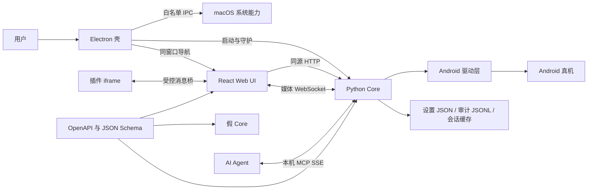
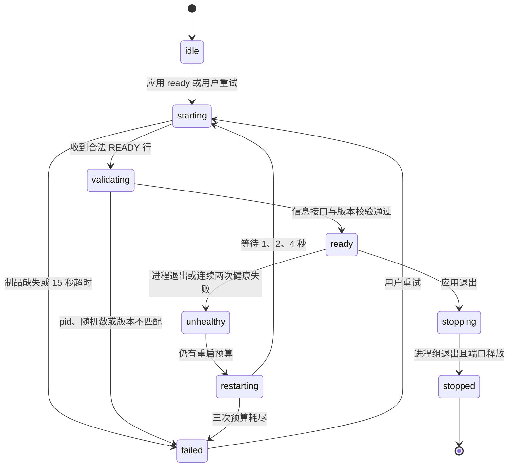
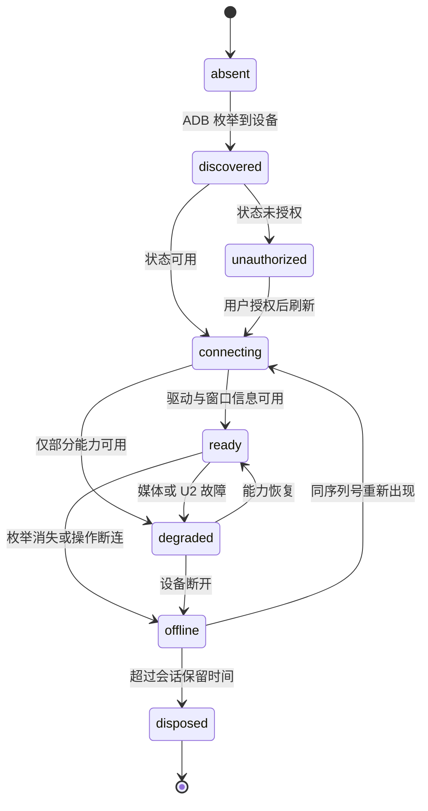
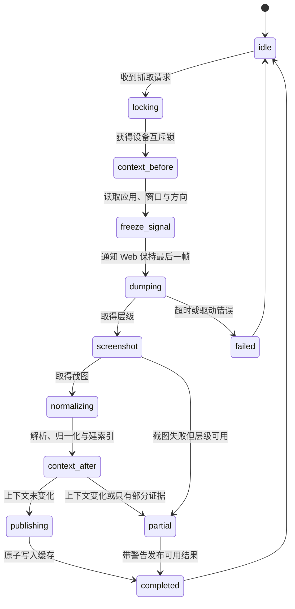
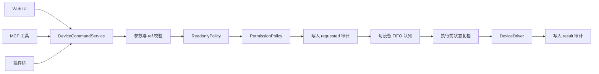
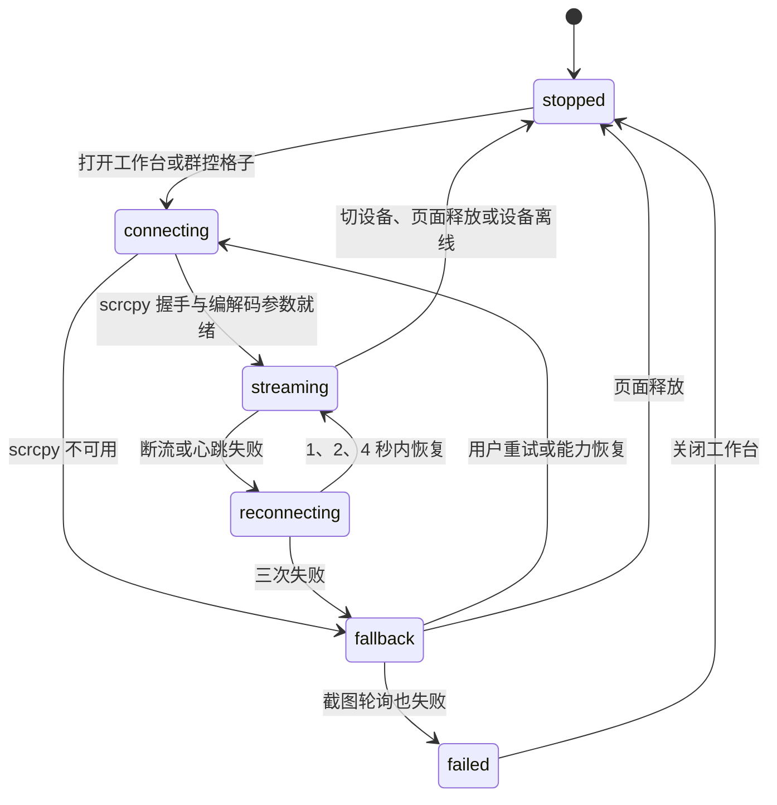
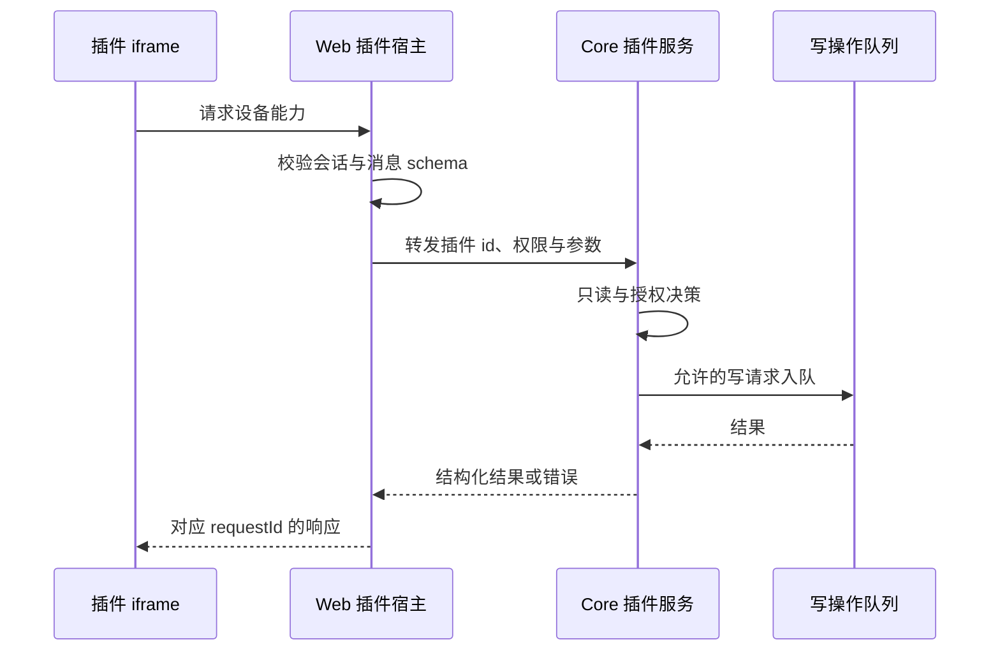

# LayoutSee V0.1 全量编码设计

| 属性 | 内容 |
|---|---|
| Story | Story-0827：macOS 桌面应用 |
| 设计状态 | 已按本文实施（2026-08-28）；两处决策门已实测关闭并回写：§23.2 PyInstaller onedir、§6.2 启动超时 25s + 自动重试 |
| 对应规格 | [spec.md](./spec.md)（实施进展与偏差记录见其文末） |
| 目标版本 | V0.1 MVP |
| 首发范围 | macOS `arm64` / `x64`，Android 真机 |
| 文档目的 | 将已冻结规格展开为可直接拆卡、编码、测试、打包和验收的工程方案 |
| 实施约束 | M5 动效性能、M6 双架构发行、M7 发布评审仍未开始；本文与 `spec.md` 冲突时以 `spec.md` 为准 |

本文补齐 `spec.md` 中“Core 内部实现另立技术方案”的部分，并把 Electron 壳、React Web、Python Core、HTTP、WebSocket、MCP、插件、测试替身和发行链路放入同一份可执行设计。若本文与 `spec.md` 冲突，以 `spec.md` 的产品范围、量化指标和非目标为准；若实现中需要改变本文冻结的公开契约、状态语义或安全边界，必须先更新文档并重新评审。

## 1. 设计目标与非目标

### 1.1 设计目标

1. 为三个第一方工程和一个契约工程确定目录、依赖方向、模块职责与启动顺序。
2. 定义 Core 的设备驱动抽象、布局快照、元素引用、摘要、诊断、写队列、媒体、MCP 与插件实现。
3. 让 Web、真实 Core、假 Core 和自动化测试消费同一份生成契约，消除手写类型漂移。
4. 让 Electron 壳能够识别、守护并回收“本次启动的 Core”，而不是只判断某端口有响应。
5. 把只读、审计、插件授权、输入校验和 loopback-only 设计成服务端门禁，而非仅靠按钮禁用。
6. 给出可以按依赖顺序提交的小步任务、完成定义和回滚边界。

### 1.2 非目标

- 不扩展 `spec.md` 已排除的 iOS、HarmonyOS、Windows、远程 Server、账号、License、自动更新、快照存档与 diff。
- 不把群控扩展为广播写操作。
- 不实现主机任意 shell；插件 `$u.shell` 仅指受限设备 shell。
- 不建设通用插件商店、插件安装器或线上插件源。
- 不把布局摘要或诊断依赖到云端模型；V0.1 必须完全离线且结果可复现。
- 不直接修改或运行时导入 `source/uiautodev`；该目录只提供实现参考、许可来源和回归样例。

## 2. 已确认事实与关键裁决

| 主题 | 裁决 |
|---|---|
| 桌面架构 | Electron 主进程 + 单一 React renderer + Python Core sidecar |
| Web 承载 | 正式 Web 构建产物复制到 Core，由 Core 同源托管；mac 工程不再维护第二套业务 renderer |
| Core 坐标 | 新建第一方 `repos/core`；不从 `source/uiautodev` 运行或相对导入 |
| 契约坐标 | 新建 `repos/contracts`，OpenAPI 与 JSON Schema 是类型和样例的唯一来源 |
| 本地存储 | V0.1 使用原子 JSON、JSONL 和会话临时文件，不引入数据库 |
| 端口 | Core 自己原子绑定 `127.0.0.1`，从 33299 起最多尝试 10 个端口 |
| 身份校验 | 壳生成 256 位启动随机数；Core 在 `READY` 和 `/api/v1/info` 原样回显 |
| 快照事实源 | `LayoutSnapshot` 同时承载层级、截图、上下文与同步质量；摘要、诊断和 `ref` 均基于它 |
| 写操作 | UI、MCP、插件全部进入同一设备串行队列、只读门禁和 ActionLog |
| 媒体 | scrcpy 为主；WebCodecs Worker 解码，失败后降级为截图轮询 |
| MCP | 运行时 `tools/list`；V0.1 固定 9 个原子工具和 3 个高阶工具，不暴露任意 shell |
| 插件 | 固定目录扫描、清单校验、sandbox iframe、宿主消息桥；设备能力由 Core 统一执行 |
| 自动化接缝 | 真实 Electron + 可控假 Core 子进程 + 正式 Web 构建产物 |
| 发行 | `arm64`、`x64` 分别构建、签名、公证和验证；整包一起回滚 |

不引入数据库的原因是 V0.1 没有多用户、服务端查询、快照归档或独立日志浏览需求。引入数据库会增加迁移、锁、损坏恢复和签名包测试面，却不改善当前主链路。若后续引入持久快照或基线管理，再以独立 Story 迁移。

## 3. 总体架构



### 3.1 依赖规则

```text
repos/contracts ──生成──> repos/web
       │
       ├──────────生成──> repos/core
       │
       └──────────生成──> repos/mac（仅握手、IPC 与错误类型）

repos/web/dist ──复制──> repos/core/static
repos/core/dist ──暂存──> repos/mac/resources/core/<arch>
```

- `repos/web` 不导入 `repos/mac` 源码，只通过 `window.layoutseeShell` 的窄接口感知壳。
- `repos/core` 不导入 Web 源码，只托管构建产物；不导入 `source/uiautodev`。
- `repos/mac` 不实现设备、快照、诊断、摘要、MCP 或插件业务逻辑。
- `repos/contracts/generated` 由命令生成且禁止手改；源文件修改必须同时更新兼容样例和契约测试。
- 所有跨进程时间均使用 Unix 毫秒；持续时长使用单调时钟；所有标识为不透明字符串。

## 4. 目标工程结构

```text
LayoutSee/
├── package.json
├── package-lock.json
├── repos/
│   ├── contracts/
│   │   ├── openapi/core-v1.yaml
│   │   ├── schemas/
│   │   │   ├── common/
│   │   │   ├── snapshot/
│   │   │   ├── websocket/
│   │   │   ├── mcp/
│   │   │   └── plugin/
│   │   ├── compatibility/versions.json
│   │   ├── fixtures/valid/
│   │   ├── fixtures/invalid/
│   │   ├── generated/typescript/
│   │   ├── generated/python/
│   │   └── tests/
│   ├── core/
│   │   ├── pyproject.toml
│   │   ├── poetry.lock
│   │   ├── src/layoutsee_core/
│   │   │   ├── bootstrap/
│   │   │   ├── domain/
│   │   │   ├── ports/
│   │   │   ├── adapters/android/
│   │   │   ├── services/
│   │   │   ├── api/
│   │   │   ├── mcp/
│   │   │   ├── plugins/
│   │   │   └── static/
│   │   ├── resources/scrcpy/
│   │   ├── scripts/
│   │   ├── packaging/
│   │   └── tests/
│   ├── web/
│   │   ├── src/app/
│   │   ├── src/api/
│   │   ├── src/components/
│   │   ├── src/features/
│   │   ├── src/media/
│   │   ├── src/styles/
│   │   └── tests/
│   └── mac/
│       ├── src/main/
│       ├── src/preload/
│       ├── src/bootstrap/
│       ├── src/shared/
│       ├── scripts/
│       └── tests/
├── source/
│   ├── index.md
│   ├── core/{overview,setup,test}.md
│   ├── web/{overview,setup,test}.md
│   └── mac/{overview,setup,test}.md
└── specs/[Story-0827]-mac-app/
```

根目录使用 npm workspaces 编排 TypeScript 工程与跨工程命令；Python 由 Poetry 锁定。初始化每个正式工程时必须同时补齐 `source/index.md` 与对应的 `overview.md`、`setup.md`、`test.md`，保证后续 Agent 不从 README 猜测构建方式。

## 5. 契约工程设计

### 5.1 唯一来源与生成流程

1. HTTP 接口由 `openapi/core-v1.yaml` 定义。
2. WebSocket 帧头、控制消息、插件消息和 MCP 快照由 JSON Schema 定义。
3. `npm run contracts:generate` 生成 TypeScript 类型、请求客户端和 Python Pydantic 模型。
4. `npm run contracts:check` 在临时目录重新生成并比较差异，发现未提交生成物即失败。
5. 真实 Core、假 Core和 Web 测试均加载同一批 `fixtures`；无效样例必须明确失败的错误码。
6. 兼容矩阵明确 `productVersion`、`apiVersion`、`snapshotSchemaVersion` 的可接受组合，不使用模糊的“向后兼容”。

### 5.2 公共响应与错误

```ts
type ApiEnvelope<T> =
  | { ok: true; data: T; requestId: string }
  | {
      ok: false;
      error: {
        code: ErrorCode;
        message: string;
        retryable: boolean;
        details?: Record<string, unknown>;
      };
      requestId: string;
    };
```

稳定错误码至少包括：

| 类别 | 错误码 | HTTP | 恢复动作 |
|---|---|---:|---|
| 设备 | `DEVICE_NOT_FOUND` | 404 | 返回设备页或刷新 |
| 设备 | `DEVICE_OFFLINE` | 409 | 保留旧数据并等待重连 |
| 设备 | `DEVICE_UNAUTHORIZED` | 409 | 引导用户在真机授权 |
| 工具链 | `ADB_NOT_FOUND` | 503 | 指定 adb 路径 |
| 快照 | `SNAPSHOT_IN_PROGRESS` | 409 | 等待当前请求 |
| 快照 | `SNAPSHOT_STALE` | 409 | 重新抓取并取得新 `ref` |
| 元素 | `REF_NOT_FOUND` | 404 | 重新查询元素 |
| 元素 | `AMBIGUOUS_ELEMENT` | 409 | 从候选元素中选择 |
| 查询 | `INVALID_XPATH` | 422 | 修正 XPath |
| 安全 | `READ_ONLY_MODE` | 403 | 关闭只读后重试 |
| 安全 | `PERMISSION_REQUIRED` | 403 | 发起一次授权 |
| 兼容 | `VERSION_INCOMPATIBLE` | 426 | 更新整套应用 |
| 服务 | `CORE_UNAVAILABLE` | 503 | 由壳重启 Core |
| 超时 | `OPERATION_TIMEOUT` | 504 | 保留证据并重试 |

服务端日志记录 `requestId`、错误码和脱敏上下文；响应不返回堆栈、绝对路径、启动随机数或底层驱动原始异常。

### 5.3 核心数据模型

```ts
type EvidenceKind = "structure" | "visual" | "inference";

interface NodeBounds {
  left: number;
  top: number;
  right: number;
  bottom: number;
}

interface LayoutNode {
  nodeKey: string;
  parentKey: string | null;
  depth: number;
  childIndex: number;
  className: string;
  resourceId?: string;
  text?: string;
  contentDescription?: string;
  boundsPx: NodeBounds;
  boundsNormalized: NodeBounds;
  visible: boolean;
  enabled: boolean;
  clickable: boolean;
  scrollable: boolean;
  drawingOrder?: number;
  raw: Record<string, string>;
}

interface LayoutSnapshot {
  snapshotId: string;
  deviceId: string;
  createdAt: number;
  foreground: { packageName: string; activity?: string };
  windowSizePx: { width: number; height: number };
  density?: number;
  hierarchyAccuracy: "exact" | "best_effort" | "limited";
  synchronization: "exact" | "best_effort" | "context_changed";
  screenshot: { width: number; height: number; contentUrl: string } | null;
  roots: string[];
  nodes: LayoutNode[];
  warnings: string[];
}
```

`structure` 表示来自层级或系统接口的事实，`visual` 表示来自截图像素的事实，`inference` 表示算法推断。诊断结果必须携带证据类型与置信度，不能把推断伪装成设备事实。

## 6. Electron 壳编码设计

### 6.1 主进程模块

| 模块 | 责任 | 禁止事项 |
|---|---|---|
| `AppLifecycle` | 单实例、ready、activate、before-quit、退出编排 | 不处理设备业务 |
| `WindowController` | 创建唯一主窗口、加载启动页、导航正式 UI、恢复窗口 | 不允许任意导航 |
| `KernelSupervisor` | 生成随机数、spawn、解析 READY、健康检查、重启、回收进程组 | 不由壳预占端口 |
| `KernelHandshakeVerifier` | 校验 READY、`/api/v1/info`、版本矩阵、pid 和随机数 | 不只校验 HTTP 200 |
| `NavigationPolicy` | 精确 origin、外链枚举、弹窗和权限拒绝 | 不接受 renderer 传入任意 URL |
| `ShellIpcRegistry` | 注册窄 IPC、校验 frame 与参数 schema | 不暴露 `ipcRenderer` |
| `AppMenu` | 标准 macOS 菜单、前进后退、刷新策略 | 不提供开发者菜单到生产 |
| `ThemeController` | 启动主题、系统主题变更、减弱动态效果 | 不覆盖用户显式主题 |
| `LogManager` | 固定目录、滚动、脱敏诊断摘要 | 不接受路径参数 |
| `ArtifactLocator` | 按架构定位 Core、adb、scrcpy 与版本清单 | 不从开发目录兜底 |

### 6.2 Core 生命周期状态机



实现细节：

- 壳用加密安全随机源生成 32 字节随机数，仅通过子进程环境变量传递，不写日志和持久化。
- Core 原子绑定端口后输出一行 UTF-8 JSON：`READY {"port":33299,"pid":123,"nonce":"...","productVersion":"0.1.0","apiVersion":"1.0","snapshotSchemaVersion":"1.0"}`。
- READY 解析器限制单行 8KiB、只接受一次、字段严格校验；额外标准输出只作为脱敏日志。
- 壳随后请求 `/api/v1/info`，要求端口、pid、随机数和三个版本字段完全一致，才允许导航。
- 健康检查每 2 秒执行一次，连续两次失败才进入 `unhealthy`；Core 稳定 60 秒后重置重启预算。
- 重启等待为 1、2、4 秒，共三次；恢复期间 Web 保留最后一帧和已取得快照，但写入口全部禁用。
- 启动 Core 时创建独立进程组；退出先发送 `SIGTERM`，等待 3 秒后再终止整个进程组，最后确认 pid、子孙进程和端口全部消失。
- **启动超时决策更新（2026-08-28，arm64 实测）**：spec 的 15 秒硬超时在本机被 macOS 对新 inode 首次执行的安全评估打破——PyInstaller onedir 新副本首执行实测 7.5–19.9 秒（与路径、页缓存、ad-hoc 签名无关，最小 hello-world 包同样受影响；系统签名二进制与单文件 Go 二进制不受影响），热启动仅 0.27 秒。壳启动超时调整为 **25 秒**，并在 `CORE_READY_TIMEOUT` 时自动重试一次（评估完成后第二次执行即秒开）；启动页持续显示已等待秒数。量化验收按「热启动 P90 ≤ 10 秒、首次安装一次性 ≤ 25 秒」执行。

### 6.3 preload 白名单

```ts
interface LayoutSeeShellApi {
  getAppInfo(): Promise<{ version: string; platform: string; arch: string }>;
  getKernelSession(): Promise<{ origin: string | null; state: KernelState }>;
  retryKernel(): Promise<void>;
  getSanitizedDiagnostics(): Promise<string>;
  openLogsDir(): Promise<void>;
  openPluginsDir(): Promise<void>;
  chooseAdbPath(): Promise<{ path: string } | null>;
  openTrustedExternal(kind: "adb-help" | "mcp-client-help"): Promise<void>;
  onKernelStateChange(listener: (state: KernelState) => void): () => void;
  onSystemThemeChange(listener: (theme: "light" | "dark") => void): () => void;
}
```

每个 IPC handler 必须校验调用 frame 是否来自启动页文件或本次握手后的精确 origin，并使用契约 schema 校验参数与返回值。打开目录的 IPC 不接受路径；外链只接受枚举。生产构建拒绝任意新窗口、下载、未知协议和权限请求。

### 6.4 启动页与错误页

启动页完全内置于 `repos/mac/src/bootstrap`，不依赖 Core。它只呈现当前状态、已等待时间和退出入口。错误页至少支持：重试、复制脱敏诊断、打开日志目录。错误页不能显示启动随机数、用户主目录、完整环境变量或底层堆栈。

## 7. Core 启动、安全与存储

### 7.1 应用工厂与启动顺序

Core 使用 `create_app(settings, services)` 工厂，不保留模块级 FastAPI 单例。启动顺序为：

1. 解析只允许壳传入的最小环境变量，校验资源清单和数据目录权限。
2. 创建并原子绑定 `127.0.0.1` socket；端口冲突则顺序尝试下一个端口。
3. 初始化设置、日志、审计、设备提供者、会话管理器、插件清单与 MCP 注册表。
4. 把已绑定 socket 交给 Uvicorn，启动 HTTP、WebSocket 与静态服务。
5. 自检 `/health/ready` 所需组件后输出唯一 READY 行。
6. 收到 `SIGTERM` 后停止接收写任务、关闭媒体、取消设备队列、清理临时文件，再退出。

Core 不提供无鉴权的 HTTP shutdown 接口。生产仅绑定 IPv4 回环地址；启动时若实际地址不是 `127.0.0.1` 立即失败。

### 7.2 HTTP 安全

- 正式 Web 与 API 同源，API 不需要通配 CORS；如开发态需要跨端口，只允许明确列出的开发 origin。
- 静态响应配置严格 CSP：脚本、样式、图片、Worker、连接目标按实际构建清单允许；生产禁止任意远程 origin。
- 所有 UI 写请求必须携带本次启动随机数派生的会话令牌头；只在内存中比较，使用恒定时间比较。
- MCP 使用独立本地会话，不复用 UI 令牌，但同样只监听回环、受只读门禁和审计约束。
- 请求体、XML、截图、插件清单和消息均有尺寸上限；超限返回稳定错误，不进入业务执行。
- XML 解析禁用外部实体、DTD 和网络访问；XPath 禁用扩展函数和网络解析。

### 7.3 本地目录与保留策略

```text
Application Support/LayoutSee/
├── settings.json
├── permissions.json
├── plugins/
├── logs/layoutsee-YYYY-MM-DD.log
├── audit/action-YYYY-MM-DD.jsonl
└── sessions/<boot-id>/
    ├── snapshots/<snapshot-id>.json
    ├── screenshots/<snapshot-id>.png
    └── raw/<snapshot-id>.xml
```

- `settings.json` 与 `permissions.json` 采用“临时文件 → `fsync` → 原子替换”，权限设为 `0600`，包含 `schemaVersion`。
- 日志和 ActionLog 按天滚动并保留 7 天；启动时删除过期文件。
- 快照仅为本次会话缓存，每台设备保留最近 3 份且最长 10 分钟；退出时清理会话目录。
- 截图、XML 和节点文本默认不写普通日志；审计中的输入文本只保存长度与哈希。
- 崩溃遗留会话目录在下次启动清理，但保留最近一次脱敏崩溃诊断文件供错误页复制。

## 8. Core 领域与服务模块

### 8.1 分层

```text
domain/       纯数据模型、错误、枚举，不依赖 FastAPI 或 Android 库
ports/        DeviceProvider、DeviceDriver、MediaBackend、SnapshotRepository 等协议
adapters/     adbutils、uiautomator2、scrcpy、文件系统的具体实现
services/     用例编排、状态机、算法、权限、队列与缓存
api/          HTTP/WS 输入校验、错误映射与响应封装
mcp/          MCP 传输与工具适配，只调用 services
plugins/      清单、权限与消息协议适配，只调用 services
```

### 8.2 关键接口

```python
class DeviceProvider(Protocol):
    async def list_devices(self) -> list[DeviceDescriptor]: ...

class DeviceDriver(Protocol):
    async def current_app(self) -> ForegroundApp: ...
    async def window_metrics(self) -> WindowMetrics: ...
    async def dump_hierarchy(self) -> RawHierarchy: ...
    async def screenshot(self) -> bytes: ...
    async def execute(self, action: DeviceAction) -> ActionResult: ...

class MediaBackend(Protocol):
    async def open(self, device_id: str, options: MediaOptions) -> MediaSession: ...
    async def close(self, session_id: str) -> None: ...

class SnapshotRepository(Protocol):
    async def put(self, snapshot: LayoutSnapshot) -> None: ...
    async def get(self, snapshot_id: str) -> LayoutSnapshot | None: ...
    async def latest(self, device_id: str) -> LayoutSnapshot | None: ...
```

adbutils、uiautomator2 和 scrcpy 都包含阻塞调用，适配器必须通过每台设备独立的串行执行器或 AnyIO 线程桥运行，禁止阻塞 FastAPI 事件循环。取消 HTTP 请求不等于中断底层 ADB；服务层必须设置硬超时，并在后台调用结束后丢弃过期结果。

### 8.3 上游复用策略

从 `source/uiautodev` 可借鉴：设备枚举、U2/ADB 双驱动、XML 节点解析、scrcpy 会话和触控坐标换算。落地时采用以下规则：

1. 优先围绕 adbutils、uiautomator2 的公开 API 编写第一方适配器。
2. 必须复制代码时，只复制最小片段，保留原 MIT 许可、来源文件和修改说明。
3. scrcpy server 二进制纳入资源清单，记录版本、架构、哈希和许可证；构建时校验。
4. 不复用上游的全局 FastAPI app、通配 CORS、原始错误返回、任意 shell 和无身份 shutdown。
5. 上游 XML、触控和设备样例可以复制为固定测试夹具，并在夹具元数据中注明来源。

## 9. 设备发现、驱动与会话

### 9.1 设备状态机



`DeviceRegistry` 每 5 秒增量枚举，也响应手动刷新。枚举超时保留上一轮成功结果，只更新 `lastError`；设备消失后 5 秒内标记 `offline`，保留最后一帧和最近快照。相同序列号重连复用设备级 UI 偏好，但创建新的媒体与驱动会话。

### 9.2 驱动选择

- 默认使用 U2 驱动获取层级与执行结构化操作；ADB 驱动是用户在设置中显式选择的备选。
- 不在一次操作失败后静默切换驱动，避免语义和坐标系变化。对已知的 dump 临时错误，只允许同一驱动按固定次数重试。
- 设备设置按序列号保存驱动偏好；驱动不可用时进入 `degraded` 并给出可执行诊断。
- 当前应用、窗口尺寸、方向和 density 由同一设备执行器读取，写入快照上下文。
- 所有坐标先转换为设备物理像素，再由驱动适配器完成方向与输入坐标换算；旋转后旧媒体尺寸和旧快照 `ref` 不再用于写操作。

## 10. 原子布局快照

### 10.1 抓取状态机



### 10.2 抓取算法

```text
capture(deviceId, idempotencyKey):
  1. 若相同 key 已完成，返回原结果；若正在执行，返回同一任务句柄
  2. 获取 deviceId 级互斥锁，暂停该设备写队列出队
  3. 读取 before = currentApp + windowMetrics + orientation
  4. 发布 freezeRequested，Web 保持最后一帧并显示抓取状态
  5. 在硬超时内依次取得 rawHierarchy 与 screenshot
  6. 安全解析 XML，构建节点树、归一化 bounds 和空间索引
  7. 读取 after = currentApp + windowMetrics + orientation
  8. before 与 after 一致时标为 best_effort；驱动提供同帧能力时才标 exact
  9. 上下文变化时标 context_changed，默认丢弃写入并最多重试一次
 10. 原子写入快照、截图和原始 XML，更新 latest 指针
 11. 恢复写队列并通知 Web 解冻；返回 snapshotId 与同步质量
```

“冻结”表示 Web 保持最后一帧并暂时阻止输入，不宣称 Android 画面真的停止。普通 U2 dump 与 screenshot 无法保证同一显示帧，因此默认只能是 `best_effort`。只有驱动提供可验证的同帧原语时才使用 `exact`。

### 10.3 节点标准化

- 使用安全 XML 解析器，节点总数上限 3000，深度上限 128，属性与文本分别设长度上限。
- `nodeKey` 是当前快照内稳定的树路径键，不跨快照承诺稳定。
- `boundsPx` 校验非负、左右上下顺序与窗口边界；保留原值到 `raw` 便于诊断。
- `boundsNormalized` 以 `[0,1]` 表示，所有高亮与命中先在快照坐标系完成，再映射画布。
- `hierarchyAccuracy` 记录层级来源能力；无法取得系统窗口或绘制顺序时不得伪造。
- 用前序数组、父子索引、属性倒排索引和空间网格一次建索引，供 XPath、命中、摘要与诊断复用。

### 10.4 画面命中

候选节点满足点位落入 `boundsPx`，随后按以下稳定规则排序：可见优先、深度更深优先、面积更小优先、绘制顺序更高优先、前序序号更后优先。选择结果返回 `nodeKey` 与所有接近候选，Web 在 200 毫秒内同步树定位和属性面板。

## 11. XPath、选择器与元素引用

### 11.1 XPath

- 查询仅针对快照保存的原始 XML，不重新从设备 dump。
- 表达式最长 512 字符；快照最多 3000 节点；解析禁用实体、DTD、网络和扩展函数。
- 只允许节点选择、属性、布尔、字符串、位置与数值等白名单能力；拒绝未知函数。
- 在隔离工作线程中执行，硬超时 300 毫秒；超时销毁任务并返回 `OPERATION_TIMEOUT`。
- 结果只返回匹配 `nodeKey`、计数和必要摘要，不返回整个 XML。

### 11.2 稳定选择器生成

候选按以下顺序产生：

1. 唯一完整 `resource-id`。
2. 唯一 `text + className`。
3. 唯一 `contentDescription + className`。
4. 最近具有唯一 id 的祖先 + 后代属性。
5. `className` 与兄弟序号组成的最短路径。

每个候选必须在同一快照上重新执行，输出 `matchCount`、`stable`、`reason`；最多返回 5 个。没有唯一候选时仍可返回不稳定候选，但 UI 和 MCP 必须明确标记。

### 11.3 `ref` 注册表

`ref` 采用 `r<snapshotToken>_<base36Ordinal>`。`snapshotToken` 是以本次启动内存密钥对 `snapshotId` 计算的短 HMAC，`ordinal` 是过滤后前序序号。注册表只保存最近有效快照的 `ref → nodeKey` 映射。

- token 对应已知旧快照：返回 `SNAPSHOT_STALE`，提示重新抓取。
- token 无法验证或 ordinal 不存在：返回 `REF_NOT_FOUND`。
- `ref` 不跨 Core 启动、不跨快照复用，也不作为持久选择器。
- 所有基于 `ref` 的写操作在执行前再次检查快照是否仍为设备最新、窗口和方向是否一致。

## 12. 语义摘要算法

### 12.1 输出目标

摘要服务面向 Agent，必须在典型页面中保留所有可见可交互元素、关键语义文本及其必要祖先；同一快照和同一规范化参数必须字节级一致；估算后实际不超过 1200 token。V0.1 不调用大模型。

### 12.2 处理流程

```text
summarize(snapshot, options):
  1. 规范化 options，形成稳定缓存键
  2. 标记必须保留节点：可见可交互、可滚动、可编辑、选中态、焦点态
  3. 标记语义节点：非空 text/description/id，排除纯装饰和重复内容
  4. 向上补齐连接必须节点所需的最小祖先集合
  5. 折叠无语义、单子节点、同 bounds 的冗余容器
  6. 为节点计算角色、短标签、ref、bounds、状态和优先分
  7. 按稳定前序生成紧凑文本，重复属性使用分支上下文继承
  8. 使用保守估算器累计预算；先去掉低优先静态文本，再压缩祖先
  9. 若仍超预算，返回 partial=true、遗漏统计、续查提示和游标
 10. 缓存并返回文本、估算量、覆盖统计与 snapshotId
```

优先分只决定非交互内容的裁剪顺序：交互性、可见性、文本意义、状态、视口内位置依次加权；纯容器和重复文本降权。可交互节点不能因低分静默删除。

### 12.3 Token 预算与确定性

- 内部目标预算设为 1000 个保守估算单位，为不同客户端 tokenizer 留出余量。
- CJK 字符按 1，ASCII 连续词按 `ceil(length/4)`，标点和结构符号单独计入；最终验收使用目标 MCP 客户端的真实 tokenizer。
- 所有字典键、节点和候选都使用显式稳定排序；不依赖 Python 集合顺序、当前时间或随机数。
- 缓存键为 `snapshotId + canonicalOptions + algorithmVersion`。
- 超预算时输出 `partial`、`omittedInteractiveCount`、`omittedTextCount` 与调用 `find_element` 的建议；若 `omittedInteractiveCount > 0`，结果不能标为成功验收。

复杂度为建索引后 `O(n)`，内存 `O(n)`。3000 节点基准必须在独立性能测试中记录 P50、P90 与最大值。

## 13. 元素查找算法

`find_element(query)` 是确定性词法与结构检索，不使用云端模型。候选分值示例：完整文本匹配 100、完整描述匹配 95、id 完整或后缀匹配 90、文本包含 75、分词重合最高 60，再叠加可见、可交互、类名角色和视口位置的小权重。

```text
find(query, snapshot):
  1. 规范化大小写、空白、常见角色词和资源 id
  2. 从 text、description、resource-id、class 倒排索引取候选并集
  3. 计算字段匹配分、可见性与交互性分，不改变候选稳定次序
  4. 按 score 降序、前序序号升序排列
  5. 最高分低于阈值则返回未找到
  6. 第一与第二名差值低于安全边界则返回 AMBIGUOUS_ELEMENT 与候选
  7. 否则注册并返回 ref、节点摘要与证据字段
```

50 例指定元素集用于调整固定权重，但不能根据测试集动态学习。每次修改权重或阈值必须提升 `algorithmVersion` 并跑全量回归。

## 14. 布局诊断算法

### 14.1 公共输出

```ts
interface DiagnosticFinding {
  findingId: string;
  type:
    | "overlap"
    | "occlusion"
    | "out_of_bounds"
    | "small_touch_target"
    | "text_truncation"
    | "invisible_interactive";
  severity: "error" | "warning" | "info";
  nodeKeys: string[];
  evidenceKind: EvidenceKind;
  confidence: "high" | "medium" | "low";
  metrics: Record<string, number | string | boolean>;
  evidence: string;
  suggestion: string;
}
```

所有规则共享一次构建的树索引、属性索引和 64dp 空间网格，结果按严重度、类型、首节点键稳定排序。诊断整体目标为 3000 节点不超过 300 毫秒；规则复杂度目标为 `O(n log n + k)`，其中 `k` 为真实相交候选数。

### 14.2 六类规则

| 规则 | 检测方法 | 证据与置信度 | 降噪 |
|---|---|---|---|
| 重叠 | 空间网格枚举非祖先关系的可见交互节点，计算交集/较小面积比例 | bounds 是结构事实；超过阈值为高或中置信 | 排除父子、滚动容器、同组装饰和允许叠放角色 |
| 遮挡 | 结合交叠比例与 `drawingOrder` 判断被覆盖节点 | 有可靠绘制顺序时高；只有前序推断时中 | 无绘制顺序时不得报高置信 |
| 越界 | 与屏幕和可裁切父节点求差集，容忍 1px | 超屏幕为高；父裁切未知为中 | 排除滚动内容与已知过渡容器 |
| 触控区域过小 | 找自身或最近可点击祖先，按 density 转换 dp，与 44dp 比较 | 尺寸与 density 为结构事实 | 无 density 时只给 px 事实，不下 dp 结论 |
| 文本截断 | 优先识别 ellipsis；其次结合单行、maxLines、字体和离线字宽估算 | ellipsis 为高；字宽估算为中；缺字段则不评估 | 不通过截图主观猜测；OCR 仅作可选视觉证据 |
| 不可见可交互 | clickable+enabled 且不可见、零面积、完全离屏或高比例遮挡 | 组合结构与视觉证据并标注来源 | 排除系统隐藏节点和不可验证窗口 |

离线字宽估算可以使用 Pillow 与随包字体度量，但必须记录字体替代、可用宽度与估算值。缺少字体、行数或宽度时返回“未评估”，不能为了提高检出率制造结论。

### 14.3 基准样本

测试集至少包含每类 20 个正样本和 20 个相似负样本，覆盖竖屏、横屏、滚动容器、弹窗、系统栏、密度差异和层级精度受限场景。验收同时计算整体检出率、每类召回率、误报率和未评估率，不能只报告总准确率。

## 15. 写操作队列、只读与审计

### 15.1 统一执行路径



UI、MCP 和插件不能直接调用驱动。`DeviceCommandService` 是唯一写入口，负责：

- 按 `actionId` 幂等，重复请求返回原任务或原结果。
- 每台设备一个有界 FIFO `asyncio.Queue`，默认最大等待 5 秒；超时返回可重试错误。
- 入队前与执行前两次检查只读、设备状态、授权、快照新鲜度和参数范围。
- 抓取快照时暂停该设备写任务出队；媒体采集不受影响。
- 设备断开时取消尚未执行的任务，正在运行的底层调用超时后丢弃结果。
- 来源统一枚举为 `ui`、`mcp`、`plugin`，审计记录插件 id 或 MCP 会话 id。

### 15.2 操作类型

`DeviceAction` 使用有辨识度的联合类型：`tap`、`swipe`、`input_text`、`press_key`、`start_app`、`stop_app`、`set_orientation`、`device_shell`。坐标输入必须同时包含产生它的 `snapshotId` 或当前媒体尺寸；Core 完成边界和方向转换，Web 不提交原始 ADB 命令。

`device_shell` 仅允许插件授权路径使用，命令先解析为参数数组，不通过宿主 shell 拼接。永久授权只允许安全命令前缀白名单；涉及卸载、清数据、重启、权限修改、文件删除等命令永远只能单次确认。

### 15.3 ActionLog

执行前先以追加并 `fsync` 的方式写 `requested` 记录，成功、失败或拦截后追加 `result` 记录。字段包含：`actionId`、时间、来源、设备 id 哈希、动作类型、脱敏参数、授权决策、结果码、耗时、`requestId`。文本输入只记录字符数和哈希，禁止记录启动随机数、完整节点文本、剪贴板内容或主机绝对路径。

只读模式下，所有读取、已有快照查看和媒体仍可用；所有写动作在服务端返回 `READ_ONLY_MODE`，并记录 `blocked` 审计。按钮禁用只是用户体验，不是安全实现。

## 16. 媒体与控制协议

### 16.1 Core 媒体状态机



### 16.2 WebSocket 路径与消息

路径：`/ws/v1/devices/{deviceId}/media`。连接首先发送 JSON `hello`，包含协议版本、设备尺寸、方向、编码、时间基准与会话 id；随后视频使用二进制帧，状态与控制回执使用 JSON。

二进制帧头固定为网络字节序：

| 字段 | 大小 | 说明 |
|---|---:|---|
| magic | 2 字节 | 固定 `LS` |
| version | 1 字节 | 媒体协议版本 |
| kind | 1 字节 | 配置、关键帧、普通帧、截图 |
| flags | 1 字节 | 关键帧、方向变更等位标志 |
| sequence | 4 字节 | 单会话递增序号 |
| timestampUs | 8 字节 | 单调时间戳 |
| payloadLength | 4 字节 | 负载长度上限校验 |

协议细节必须单独写入 `repos/contracts/schemas/websocket/media-v1.md` 并提供二进制金样。WebSocket 只承担媒体和必要的心跳/状态，不承载通用业务 RPC；tap、swipe 等写操作仍走 HTTP 命令服务，便于幂等、错误映射与审计。

### 16.3 Web 解码与背压

- `MediaSession` 管理连接、状态和重连；`DecoderWorker` 运行 `VideoDecoder`。
- 待解码队列最多保留 2 帧，积压时优先丢弃旧非关键帧并累计指标。
- 每个 `VideoFrame` 绘制或丢弃后立即 `close()`；切设备、页面隐藏、离线和卸载组件时关闭 socket、decoder、Worker 与画布资源。
- 是否使用 `OffscreenCanvas` 由 M0.5 验证决定；无论选择哪条路径，公开协议和 UI 状态不变。
- `VideoDecoder` 不可用、配置失败或连续解码错误时切换为 500–1000 毫秒可配置截图轮询，显示“截图模式”而不是伪装成实时视频。
- 页面恢复可见后重新握手，不能继续消费旧设备或旧方向的帧。

### 16.4 坐标换算

Web 根据画布实际内容矩形去除 letterbox，得到 `[0,1]` 归一化坐标；Core 结合最新媒体尺寸、方向和设备窗口转换为像素。所有写请求携带媒体会话 id 与尺寸版本，版本过期时拒绝执行，避免旋转后的旧坐标误触。

## 17. HTTP API 设计

以下为 V0.1 路径基线；字段以 OpenAPI 为最终单一来源。

| 方法 | 路径 | 用途 | 写门禁 |
|---|---|---|---|
| GET | `/health/live` | 进程存活 | 否 |
| GET | `/health/ready` | 依赖就绪 | 否 |
| GET | `/api/v1/info` | 版本、pid、端口、启动身份 | 否 |
| GET | `/api/v1/devices` | 设备列表及能力 | 否 |
| POST | `/api/v1/devices/refresh` | 手动刷新枚举 | 否 |
| GET | `/api/v1/devices/{id}/diagnostics` | 接入诊断 | 否 |
| GET | `/api/v1/devices/{id}/current-app` | 当前应用 | 否 |
| GET | `/api/v1/devices/{id}/apps` | 已安装应用与搜索 | 否 |
| POST | `/api/v1/devices/{id}/actions` | 执行有类型设备动作 | 是 |
| POST | `/api/v1/devices/{id}/snapshots` | 原子抓取；要求 `Idempotency-Key` | 抓取锁 |
| GET | `/api/v1/devices/{id}/snapshots/latest` | 最新快照元数据 | 否 |
| GET | `/api/v1/snapshots/{snapshotId}` | 快照节点与上下文 | 否 |
| GET | `/api/v1/snapshots/{snapshotId}/screenshot` | 快照截图 | 否 |
| POST | `/api/v1/snapshots/{snapshotId}/xpath` | XPath 查询 | 否 |
| POST | `/api/v1/snapshots/{snapshotId}/selectors` | 生成选择器 | 否 |
| POST | `/api/v1/snapshots/{snapshotId}/summary` | 生成语义摘要 | 否 |
| POST | `/api/v1/snapshots/{snapshotId}/diagnostics` | 六类布局诊断 | 否 |
| GET | `/api/v1/settings` | 读取设置 | 否 |
| PUT | `/api/v1/settings` | 更新允许设置 | UI 身份 |
| PUT | `/api/v1/devices/{id}/readonly` | 切换设备只读 | UI 身份 |
| GET | `/api/v1/plugins` | 合法插件清单和状态 | 否 |
| POST | `/api/v1/plugins/reload` | 重新扫描固定目录 | UI 身份 |
| GET | `/api/v1/mcp/tools` | 当前工具元数据 | 否 |

资源 id、查询体、分页、尺寸和超时均由 OpenAPI 限定。可能改变设备状态的 `POST` 统一要求会话令牌与 `actionId`；抓取快照虽不向设备注入输入，也必须经过设备协调锁。

## 18. MCP 设计

### 18.1 传输与注册

每台设备提供 `/mcp/{deviceId}/sse`，MCP 适配器只做参数映射与结果压缩，业务逻辑全部委托给 Core services。优先采用官方 Python SDK，但确切版本必须在 M0.5 验证后锁入 `poetry.lock`。

### 18.2 V0.1 工具清单

| 类型 | 工具 | 读写 | 实现服务 |
|---|---|---|---|
| 原子 | `get_device_info` | 读 | `DeviceRegistry` |
| 原子 | `get_current_app` | 读 | `DeviceSessionManager` |
| 原子 | `capture_layout` | 读/抓取 | `CaptureCoordinator` |
| 原子 | `get_layout` | 读 | `SnapshotStore` |
| 原子 | `query_xpath` | 读 | `XPathService` |
| 原子 | `get_screenshot` | 读 | `SnapshotStore` |
| 原子 | `tap` | 写 | `DeviceCommandService` |
| 原子 | `swipe` | 写 | `DeviceCommandService` |
| 原子 | `input_text` | 写 | `DeviceCommandService` |
| 高阶 | `get_layout_summary` | 读 | `SummaryBuilder` |
| 高阶 | `diagnose_layout` | 读 | `DiagnosticEngine` |
| 高阶 | `find_element` | 读 | `ElementFinder` 与 `RefRegistry` |

不包含 `shell`、`exec`、`save_snapshot`、`diff_snapshots` 或内置 Inspector。`get_layout_summary`、`diagnose_layout` 和 `find_element` 接受 `snapshotId`；调用方明确要求时可先抓取最新快照，并在结果中返回实际使用的 id。`tap` 接受坐标或 `ref`，使用 `ref` 时执行完整的新鲜度检查。

### 18.3 MCP 结果与安全

- `tools/list` 由注册表生成，Web MCP Tab 也从运行时接口读取，不在 UI 硬编码数量。
- 工具结果优先返回紧凑文本和结构化内容，错误使用稳定错误码。
- 每个会话限制并发、请求体、单次返回大小和超时；设备写仍进入统一 FIFO。
- MCP 连接建立后锁定 deviceId，不能在参数中越权切换设备。
- 只读开启后写工具仍可见，但调用明确返回 `READ_ONLY_MODE`，便于客户端理解原因。
- 契约测试对 `tools/list` 做 12 工具快照，并验证无 V0.2 或任意 shell 工具。

## 19. 插件运行时设计

### 19.1 清单

插件目录固定为 `Application Support/LayoutSee/plugins/<plugin-id>/`。`manifest.json` 至少包含 `schemaVersion`、`id`、`name`、`version`、`entry`、`platforms`、`permissions`。`id`、入口相对路径、文件大小和平台枚举必须通过 schema；入口解析后必须仍位于插件目录内。

生产环境只加载本地文件，不允许任意远程 origin。开发服务地址仅在显式开发构建和命令行标志同时开启时允许，生产制品扫描必须确认相关开关不可达。

### 19.2 iframe 隔离与桥接

插件 iframe 使用不含 `allow-same-origin` 的 sandbox。宿主生成插件会话令牌，通过 `MessageChannel` 建立专用端口；后续消息包含 `requestId`、`pluginId`、`sessionId`、方法和 schema 校验后的参数。



插件无法直接获得 UI 会话令牌、Core origin、Node.js、文件系统或 macOS IPC。插件崩溃、超时和协议错误只终止该插件会话，不得使工作台或其他插件失效。

### 19.3 权限决策

- 读取设备信息、当前快照等低风险能力按清单声明授权。
- tap、swipe、输入等设备写能力先过只读门禁，并展示插件名、设备与动作。
- `$u.shell` 默认关闭；用户可拒绝、本次允许或对安全前缀永久允许。
- 破坏性设备命令永远不提供“始终允许”。
- 永久授权写入 `permissions.json`，键包含插件 id、插件版本、权限与命令前缀；插件版本变化后重新确认。

## 20. Web 工程编码设计

### 20.1 技术基线

- React 19、TypeScript、Vite 6 作为原型迁移候选，具体补丁版本在 M0.5 后锁定。
- 路由使用 `react-router-dom`，数据请求与缓存优先 TanStack Query；是否引入以初始化变更评审为准。
- 页面局部交互使用 reducer 与 Context；不为了统一而引入全局巨型状态库。
- 图标统一迁移到 Phosphor，禁止把 emoji 或 Unicode 符号当生产图标。
- 样式以 `docs/designs/DESIGN.md` 的语义 Token 为准，几何采用可运行原型冻结的 56/188/68px 基线。

### 20.2 模块结构

```text
src/
├── app/
│   ├── router.tsx
│   ├── AppShell.tsx
│   ├── ShellBridge.ts
│   ├── FeatureManifest.ts
│   └── GlobalErrorBoundary.tsx
├── api/
│   ├── generated/
│   ├── client.ts
│   ├── errors.ts
│   └── queryKeys.ts
├── components/
│   ├── layout/
│   ├── feedback/
│   ├── data-display/
│   └── controls/
├── features/
│   ├── devices/
│   ├── group-preview/
│   ├── workbench/
│   ├── snapshots/
│   ├── intelligence/
│   ├── plugins/
│   ├── mcp/
│   ├── settings/
│   ├── readonly/
│   └── audit/
├── media/
│   ├── MediaSession.ts
│   ├── DecoderWorker.ts
│   ├── FrameRenderer.ts
│   └── ScreenshotFallback.ts
└── styles/
    ├── tokens.css
    ├── reset.css
    └── motion.css
```

### 20.3 URL 路由

| 路径 | 页面 |
|---|---|
| `/devices` | 设备管理 |
| `/group` | 群控预览 |
| `/devices/:deviceId/workbench/:tab` | 工作台五 Tab |
| `/settings` | 设置 |

`tab` 只允许 `common`、`plugins`、`element`、`mcp`、`intelligence`。非法设备或 Tab 路径进入可恢复错误状态，不静默回首页。浏览器 History、`Cmd+[` 和应用菜单走同一导航器。刷新由 Core 静态服务回退到 `index.html`，但 `/api`、`/ws` 和 `/mcp` 不参与回退。

### 20.4 状态组织

避免把工作台写成一个组合爆炸的大状态机。以下模式正交维护：

- 会话：设备 id、在线状态、能力与最近错误。
- 媒体：连接、流式、重连、截图降级、失败。
- 快照：空、抓取中、可用、部分、失败。
- 交互：`live`、`frozen`、`inspect`。
- 安全：`writable`、`readonly`。
- 选择：当前 `snapshotId`、`nodeKey`、`ref`、XPath 结果。

切换 Tab 保留设备、媒体、快照和选中节点；切换设备保留当前 Tab，但必须关闭旧 WebSocket、取消旧请求、清空旧快照引用和选中节点。返回设备页释放媒体、Worker、叠加层与设备专属订阅。

### 20.5 工作台组件

- `WorkbenchShell` 固定控制轨、设备画面、任务面板三段结构。
- 一级分隔条控制设备面板宽度，范围 330–720px；二级分隔条控制属性与层级区域。
- `ResizeHandle` 使用 `role="separator"`、方向与 `aria-valuemin/max/now`；方向键步长 12px，Shift 步长 32px，Home/End 到边界，双击恢复默认值。
- 每台设备保存自己的宽度偏好；窗口尺寸变化后先夹紧到新边界再持久化。
- 最小窗口 1280×800 下任务面板保持可操作，不把正式页面切为原型的移动卡片布局。
- `DeviceCanvas` 统一承担视频、最后一帧、截图降级、高亮、hover 坐标、审查点击和输入模式，不在每个 Tab 重建连接。

### 20.6 错误与恢复

所有错误组件必须回答三件事：发生了什么、现在哪些内容仍可用、用户下一步能做什么。请求级错误留在触发区域；设备离线和 Core 恢复使用状态横幅；一次性成功使用 Toast；需要明确决策才用 Dialog。不得用成功 Toast 掩盖后端失败。

### 20.7 动效与可访问性

- 基础时长使用 100/180/260 毫秒 Token，只对 opacity、transform 和颜色做克制过渡。
- 投屏、抓取和 3000 节点树接入前不做最终动效调优。
- `prefers-reduced-motion` 开启时取消位移、缩放与淡入淡出，状态与焦点仍必须可见。
- Tab、Tree、Separator、Dialog、Toast、横幅和图标按钮必须有正确角色、名称、状态与焦点顺序。
- 颜色不是唯一状态通道；普通布尔值用中性文字，红色只表示真实错误或诊断风险。

## 21. 假 Core 与端到端测试架构

### 21.1 测试原则

主自动化不直接挂载 React 组件，而是启动真实 Electron 主进程、preload、启动页和正式 Web 构建。假 Core 是真实子进程，执行与正式 Core 相同的端口、READY、HTTP、WebSocket、MCP 和插件协议。

### 21.2 场景 DSL

```json
{
  "schemaVersion": "1.0",
  "boot": { "readyDelayMs": 20, "nonceMode": "echo" },
  "devices": [{ "id": "pixel-7", "state": "ready" }],
  "responses": {},
  "media": { "mode": "frames", "disconnectAfter": null },
  "mcp": { "tools": "v0.1" },
  "faults": [],
  "staticAssets": { "source": "web-dist" }
}
```

场景文件只描述输入与故障，不写测试断言；断言保留在测试代码，防止场景既当实现又当预期。场景本身通过 JSON Schema 校验。

假 Core 另开只在测试态启用的 Unix domain socket 控制通道，并要求随机控制令牌。支持命令：`get-events`、`set-device-state`、`drop-media`、`set-response`、`crash`、`spawn-child`、`ignore-sigterm`、`metrics`、`shutdown`。该通道不监听 TCP，也不能进入正式 Core 或生产包。

### 21.3 测试注入边界

仅在 `!app.isPackaged` 且测试构建标志为真时读取：

```text
LAYOUTSEE_TEST_CORE_EXECUTABLE
LAYOUTSEE_TEST_SCENARIO
LAYOUTSEE_TEST_CONTROL_SOCKET
LAYOUTSEE_TEST_USER_DATA_DIR
LAYOUTSEE_TEST_WEB_DIST
```

生产制品扫描必须断言不存在假 Core、场景目录、控制 socket 实现及上述字符串。测试启动为每例创建独立临时用户目录和 socket；单实例与 Core 生命周期套件串行运行，其余按资源隔离并行。

### 21.4 Electron 场景

Playwright 通过 Electron 入口启动真实应用：先断言启动页可见，再等待假 Core READY 后同窗口进入设备页；后续只通过角色、可访问名称、键盘、鼠标和公开 URL 操作。测试通过控制 socket 读取服务收到的公开请求、连接数、事件与子进程状态。

故障矩阵至少覆盖：

- Core 制品缺失、READY 超时、非法 JSON、随机数不匹配、版本不匹配。
- 默认端口占用、Core 崩溃、重启预算耗尽、子进程忽略 `SIGTERM`。
- 无设备、未授权、离线、恢复、枚举超时、ADB 缺失。
- 媒体断流、连续解码失败、WebCodecs 不可用、截图降级。
- 快照超时、空层级、上下文变化、部分截图、旧 `ref`。
- 只读拒绝、插件权限拒绝、非法 IPC、非法导航与未知 origin。

## 22. 测试分层与验收命令

| 层级 | 范围 | 典型断言 |
|---|---|---|
| 契约 | Schema、生成物、样例、兼容矩阵 | 真/假 Core 与 TS/Python 类型一致 |
| Core 单元 | 标准化、索引、XPath、摘要、查找、诊断、权限 | 金样、性质测试、复杂度与确定性 |
| Core 集成 | FastAPI、设备适配器替身、缓存、队列、MCP | API 错误、并发、取消、审计 |
| Web 单元 | reducer、坐标、错误映射、分隔条 | 纯函数和可访问语义 |
| Web 集成 | 正式页面 + 假协议服务 | 路由、状态保留、资源释放 |
| Electron 端到端 | 真实壳 + 假 Core + 正式 Web | 启动、恢复、IPC、进程回收 |
| 真机 | 正式三层应用 + Android | 主链路、坐标、性能、兼容性 |
| 发行 | 签名 dmg 干净机 | Gatekeeper、公证、离线、无孤儿进程 |

根目录最终提供以下稳定入口；确切命令在工程初始化后写入 `source/*/test.md`：

```bash
npm ci
npm run contracts:check
npm run lint
npm run typecheck
npm run test:unit
npm run test:integration
npm run test:electron
npm run build:all
npm run verify:artifacts
poetry -C repos/core run pytest
```

### 22.1 算法测试

- XML 标准化使用固定夹具、随机树性质测试和恶意实体/深度/超长输入。
- XPath 验证允许表达式、拒绝表达式、3000 节点超时和结果稳定性。
- 摘要验证同输入字节一致、真实 tokenizer 上限、交互元素覆盖和 partial 语义。
- `find_element` 使用冻结的 50 例目标集并输出混淆候选报告。
- 诊断使用正负样本，逐类报告召回、误报、未评估和耗时。
- 连续抓取 100 次记录常驻内存差值，排查图片、XML、节点索引和线程泄漏。

### 22.2 性能采集

Web 用 `performance.mark/measure` 和 `PerformanceObserver` 采集首帧、重连、选中联动、长任务与页面切换。媒体记录接收帧、提交解码帧、展示帧、丢弃帧、活动 WebSocket、decoder 和未释放帧数。绝对 FPS 门槛只在固定硬件、固定分辨率与固定场景上比较，不能把 CI 虚拟机抖动当产品回归。

## 23. 构建、签名与发行

### 23.1 构建顺序

1. 校验 Node、Python、Poetry、Xcode 命令行工具与目标架构。
2. 生成并校验 contracts，运行所有快速测试。
3. 构建 `repos/web/dist`，校验无远程资源和源映射泄露。
4. 将 Web 产物以清单和哈希复制到 `repos/core/src/layoutsee_core/static`。
5. 用锁定 Python 3.10 依赖构建目标架构 Core，打入 adb、scrcpy 与许可证。
6. 验证 Core 自检、启动时延、资源哈希、二进制架构和协议版本。
7. 将 Core 制品暂存到 Electron resources，并生成整包 `artifact-manifest.json`。
8. 构建 Electron，递归签名嵌套可执行文件，再签名应用和 dmg。
9. 提交公证、等待成功、staple，运行 Gatekeeper 与签名校验。
10. 在对应架构干净机完成离线启动、主链路、反复启停和孤儿进程检查。

### 23.2 PyInstaller 决策门

目标先验证 PyInstaller 单文件，但 M0.5 必须量化冷启动、解包目录、嵌套签名、公证、杀毒误报和退出清理。若任一阻断无法解决，允许改为 PyInstaller onedir 或 Nuitka，但必须更新本文、制品布局、签名脚本和验收，不得在编码中静默替换。

**决策已关闭（2026-08-28，arm64 实测）**：PyInstaller 单文件在本机每次启动需 7-8 秒自解压，首启动实测 19.9 秒，超过 15 秒硬超时，属不可接受阻断。同机 onedir 首启动 8.1 秒（新 inode 一次性系统评估）、热启动 0.27 秒。因此 V0.1 切换为 **PyInstaller onedir**：制品布局改为 `Resources/core/layoutsee-core`（可执行文件）+ `Resources/core/_internal/`（运行库），壳 spawn 路径不变；后续 M6 递归签名对 onedir 全部嵌套二进制执行。

### 23.3 架构一致性

`artifact-manifest.json` 记录应用版本、协议版本、目标架构、Electron、Core、Python、adb、scrcpy、Web 哈希和许可证清单。`verify:artifacts` 对每个 Mach-O 执行架构检查，拒绝 `arm64` 包混入仅 `x86_64` 制品，反之亦然。

### 23.4 回滚

Electron、Web、Core 和契约按一个产品版本整体发布与回滚，不支持独立降级某一组件。版本矩阵只用于阻断错误组装，不用于长期维持混合版本。自动更新不在 V0.1，因此回滚通过重新分发上一套已公证 dmg 完成。

## 24. 持续集成门禁

| 流水线 | 触发 | 内容 |
|---|---|---|
| PR 快速门禁 | 每次变更 | 契约漂移、lint、类型、单元、Core 集成、Web 集成、假 Core Electron 主链路 |
| 夜间门禁 | 每晚 | 完整故障矩阵、算法大样本、内存、长时间媒体、目标架构构建、可用真机 |
| 发布门禁 | 版本标签 | 双架构构建、递归签名、公证、staple、干净机、离线与 10 次启停 |
| 人工签收 | 候选版本 | 三台 Android、视觉、动效、macOS 原生手感、无障碍与诊断业务意义 |

PR 门禁不得依赖固定睡眠；异步场景通过 READY、HTTP、控制 socket 或 DOM 状态事件等待。真实设备作业必须独占设备并在失败时保存脱敏日志、性能 JSON、截图和协议事件，不上传原始用户数据。

## 25. 分阶段编码计划

### M0：契约与工程初始化

1. 初始化根 npm workspaces、`repos/contracts`、`repos/core`、`repos/web`、`repos/mac`。
2. 补齐 `source/index.md` 和三个正式工程的 overview/setup/test。
3. 冻结公共错误、版本矩阵、设备、快照、媒体、插件与 MCP schema。
4. 生成 TypeScript/Python 类型，建立 valid/invalid/compatibility 测试。
5. 实现最小假 Core 与场景 DSL，只提供握手、info、静态页和控制 socket。

完成定义：`contracts:check` 可重复通过；真/假 Core 的 `/api/v1/info` 使用同一模型；生成物无手改差异。

### M0.5：高风险验证

1. 分别构建最小 `arm64`、`x64` Core 并由 Electron 拉起。
2. 验证 PyInstaller 单文件、进程组回收、签名、公证和干净机启动。
3. 验证 Electron sandbox、精确 origin、CSP 与 preload 白名单。
4. 用录制 H.264 样例验证 Worker、WebCodecs、背压、资源释放和截图降级。
5. 验证插件 sandbox、MessageChannel、开发 origin 隔离与制品扫描。
6. 锁定 Electron、打包器、Playwright、MCP SDK 与 Python 依赖版本。

完成定义：每个风险有可执行样例、测量结果、通过/否决结论和回写后的最终选型。

### M1：壳启动闭环

1. 实现 `AppLifecycle`、`WindowController`、启动/错误页和单实例。
2. 实现 `KernelSupervisor`、READY 解析、信息校验、健康检查和重启预算。
3. 实现白名单 IPC、日志目录、脱敏诊断、主题与导航策略。
4. 扩展假 Core 故障注入，完成缺失、超时、版本、端口、崩溃、顽固子进程测试。

完成定义：不依赖真实 Core 业务即可通过全部壳生命周期和安全端到端测试。

### M2：正式 Web 骨架

1. 迁移 Token、窗口构图、路由、错误边界和五 Tab 空骨架。
2. 迁移两级分隔条的鼠标、键盘、复位、响应式夹紧与设备级持久化。
3. 建立生成 API 客户端、Query key、设备状态和壳状态桥。
4. 完成 1480×1060、1280×800、浅色、深色与减弱动态效果基线。

完成定义：刷新恢复、History、五 Tab 稳定区、分隔条与无障碍自动化通过；不包含静态假业务数据。

### M3：真实设备与快照主链路

1. 实现 Core 应用工厂、设置、日志、审计和设备注册表。
2. 实现第一方 ADB/U2 适配器、接入诊断、当前应用和基本动作。
3. 实现 scrcpy 媒体、Web Worker 解码与截图降级。
4. 实现 `CaptureCoordinator`、XML 标准化、快照缓存、树/画面/属性联动。
5. 实现 XPath、选择器、`ref` 和只读队列。

完成定义：真实 Android 完成“发现 → 投屏 → 操作 → 抓取 → 定位 → XPath”；离线、旋转、空层级、降级与只读路径通过。

### M4：完整 V0.1 能力

1. 实现常用、插件、元素、MCP、布局智能五 Tab。
2. 实现摘要、元素查找、六类诊断及其金样和性能基准。
3. 实现 MCP 12 工具、插件清单/沙箱/授权和统一 ActionLog。
4. 实现群控只读预览和多路资源降级策略。
5. 扩展假 Core 覆盖所有公开成功与错误样例。

完成定义：PRD V0.1 功能对照无缺项，生产 UI 无后续死入口，三条写来源全部命中同一门禁与审计。

### M5：性能、动效与资源

1. 在真实媒体、3000 节点树和插件 iframe 上完成动效。
2. 优化首帧、抓取、选中、XPath、摘要与诊断性能。
3. 完成连续抓取、切 Tab、切设备、隐藏恢复与长时间媒体泄漏测试。
4. 完成降低动态效果、降低透明度和键盘全流程。

完成定义：`spec.md` 全部量化指标有脚本、固定输入、结果 JSON 和评审记录。

### M6：双架构发行

1. 固化两套架构构建、资源清单和递归签名脚本。
2. 完成公证、staple、Gatekeeper、干净机离线启动。
3. 每架构反复启停 10 次并检查进程、端口、临时文件和默认外联。
4. 生成 SPDX 或等价第三方许可证清单。

完成定义：两套 dmg 均通过发行门禁，且可回滚到上一套完整产品版本。

### M7：发布评审

提交契约报告、算法报告、真机矩阵、安全、无障碍、性能、双架构发行和未关闭风险。只有 `spec.md` 中阻断项全部关闭后，文档状态才可改为“可实施/已验收”。

## 26. 建议的提交拆分

每项保持可独立验证，禁止一个提交同时改协议、三端实现和大面积视觉：

1. `chore: 初始化四工程与文档入口`
2. `feat: 冻结 Core v1 契约与代码生成`
3. `test: 建立假 Core 场景与契约夹具`
4. `feat: 完成 Electron 启动和 Core 身份握手`
5. `feat: 完成壳安全桥与错误恢复`
6. `feat: 初始化正式 Web 路由与设计 Token`
7. `feat: 迁移可访问双层分隔条`
8. `feat: 完成 Core 设备注册与接入诊断`
9. `feat: 完成媒体协议、解码与截图降级`
10. `feat: 完成原子快照和节点标准化`
11. `feat: 完成元素联动、XPath、选择器与 ref`
12. `feat: 完成统一写队列、只读与审计`
13. `feat: 完成确定性布局摘要与元素查找`
14. `feat: 完成六类布局诊断`
15. `feat: 完成 MCP 十二工具`
16. `feat: 完成插件沙箱和授权`
17. `feat: 完成群控只读预览`
18. `perf: 达成媒体、快照与智能算法指标`
19. `build: 完成双架构签名公证流水线`

## 27. 需求覆盖矩阵

| 规格域 | 本文实现章节 | 主要验证 |
|---|---|---|
| 启动、单实例、恢复、退出 | 6、7 | Electron 故障注入与进程检查 |
| 设备发现、授权、ADB 诊断 | 8、9、17 | Core 集成与三台真机 |
| 群控预览 | 16、20、25 | 多路媒体、单格离线、资源指标 |
| 工作台、操控、冻结、只读 | 10、15、16、20 | 公开 UI、ActionLog、坐标误差 |
| 双层布局与可访问性 | 20 | 键盘、ARIA、视觉回归 |
| 常用 Tab | 9、15、17、20 | 当前应用、启停、只读拒绝 |
| 快照、元素、XPath、选择器 | 10、11 | 金样、真机、性能 |
| 摘要与元素查找 | 12、13 | token、确定性、50 例正确率 |
| 六类布局诊断 | 14 | 正负样本、检出率、300ms |
| MCP | 18 | 12 工具快照与 100 次闭环 |
| 插件 | 19 | sandbox、权限、故障隔离 |
| 日志和审计 | 7、15 | JSONL、脱敏、保留策略 |
| 安全 | 6、7、15、18、19 | origin、IPC、CSP、只读、制品扫描 |
| 打包发行 | 23、24、25 | 双架构、公证、干净机、离线 |

## 28. 编码前仍需关闭的决策门

以下事项不阻止评审本文，但阻止进入对应里程碑：

| 决策 | 最晚关闭点 | 交付证据 |
|---|---|---|
| 最低 macOS 版本 | M0.5 | 目标硬件与 Electron 能力验证 |
| Electron、打包器、Playwright 精确版本 | M0.5 | 锁文件和最小发行样例 |
| PyInstaller 单文件或备选 | M0.5 | 冷启动、签名、公证与清理报告 |
| MCP Python SDK 精确版本 | M0.5 | 12 工具互操作样例 |
| WebCodecs 绘制路径 | M0.5 | Worker、背压、释放与降级数据 |
| Apple 签名身份、公证凭据和 CI 责任 | M0.5 | 机密管理说明与成功公证样例 |
| 布局智能最终视觉稿 | M4 前 | 不改变冻结功能范围的设计签收 |
| Android 三机与 Intel 干净机资源 | M3/M6 前 | 设备矩阵和执行负责人 |

具体依赖版本、最低系统版本和包体阈值不得凭经验写死；高风险样例完成后，把结果回写到本文和锁文件。

## 29. 评审检查清单

### 架构

- [ ] 三层责任无重复，Core 第一方工程坐标明确。
- [ ] 生产运行时不依赖 `source/uiautodev` 或原型工程。
- [ ] 契约生成方向单向且存在漂移门禁。
- [ ] Web 只存在一套业务 renderer。

### Core 与算法

- [ ] 快照同步质量没有被描述为无法保证的“同帧”。
- [ ] 结构事实、视觉事实和推断在结果中可区分。
- [ ] `ref` 的过期和非法错误语义不同。
- [ ] 摘要可复现、可验证 token 上限和交互元素覆盖。
- [ ] 六类诊断都有证据、置信度、负样本与未评估路径。
- [ ] UI、MCP、插件写操作走同一队列、只读与审计。

### 安全

- [ ] Core 只绑定 `127.0.0.1`，壳校验 pid、随机数与版本。
- [ ] preload、导航、目录和外链均为枚举白名单。
- [ ] 生产无任意 CORS、远程插件 origin、HTTP shutdown 或主机 shell。
- [ ] 审计不记录敏感文本、启动随机数和绝对路径。
- [ ] 假 Core 与测试开关不会进入生产制品。

### 质量与发行

- [ ] 自动化使用真实 Electron、假 Core 子进程和正式 Web 构建。
- [ ] 量化指标都有固定输入、命令、编程式断言与结果留档。
- [ ] 真实 Android 与双架构干净机仍是发布门禁。
- [ ] Electron、Web、Core 和契约以完整产品版本回滚。

## 30. 参考输入

- [产品需求文档](../../docs/feature/UI-LayoutSee需求文档PRD.md)
- [交互原型说明](../../docs/designs/interaction-prototype.md)
- [设计规范](../../docs/designs/DESIGN.md)
- [macOS 壳与原生动效技术评审](../../docs/story/技术评审-macos桌面壳与原生动效.md)
- [macOS 技术栈调研](../../docs/story/macos-技术栈调研.md)
- [可运行 UI 原型](../../source/layoutsee-prototype/)
- [上游 uiautodev 参考工程](../../source/uiautodev/)

本文已于 2026-08-28 按 M0–M4（部分）完成实施，交付 arm64 本地候选包；执行偏差与里程碑状态以 `spec.md` 文末「实施进展与偏差记录」为准。下一步为 M5（动效与性能）、M6（双架构签名公证发行）与 Playwright 端到端测试基建；`§28 编码前仍需关闭的决策门` 中仅剩 Apple 签名身份、Intel 干净机与布局智能视觉稿三项未关闭。
