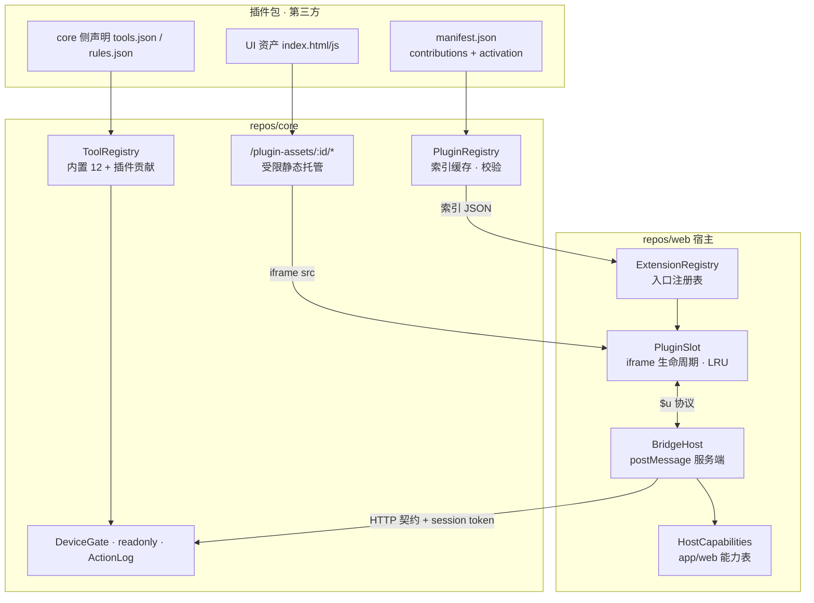
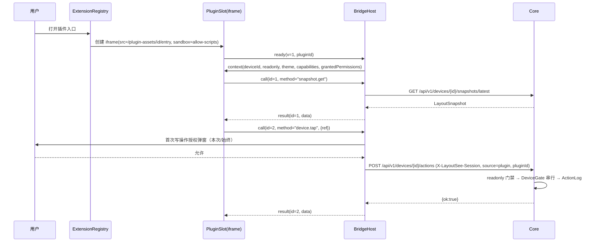

# LayoutSee 插件模块通用接口层设计文档

| 属性 | 内容 |
| --- | --- |
| 文档状态 | 待评审 |
| 目标版本 | V0.1 契约冻结，V0.1/V0.2 分批实现 |
| 文档用途 | 插件模块的方案事实源，与 PRD 4.8、技术评审 4.3/5.4 冲突时以本文为准并回写上游 |
| 关联输入 | [PRD 4.8 插件系统](../../docs/feature/UI-LayoutSee需求文档PRD.md)、[技术评审](../../docs/story/技术评审-macos桌面壳与原生动效.md)、[模块索引](../../INDEX.md) |

## 背景和目标

当前插件能力只到「扫目录 + 校验清单 + 列表展示」，运行时、能力桥、扩展点全部缺失（`PluginsTab.jsx:81` 自带说明横幅）。本次要一次性把接口层定死，避免后面每加一个插件都改宿主代码。

可判定目标：

1. **零宿主改动扩展**：新增一个插件只需向插件目录放一个包，不修改 `WorkbenchPage.TAB_IDS`、不改 Core 路由、不改 preload 白名单，即可出现入口并运行。
2. **冷启动不劣化**：插件数量从 0 增到 50 时，Core `build_core` 到 READY 的耗时增量 ≤ 20ms（插件扫描不在启动路径上）；Web 首屏（设备页）JS 体积与请求数不随插件数变化，插件相关请求为 0。
3. **按需激活**：插件 UI 代码与 iframe 仅在其入口被打开时创建；未激活插件对主线程与内存的占用为 0（无 iframe、无脚本、无定时器）。
4. **双平台同源**：同一个插件包在 Electron 壳与浏览器直连本地 Core 两种宿主下行为一致；宿主能力差异通过能力查询降级，不通过环境嗅探分叉。
5. **能力最小化**：插件不持有 session token、不能直接 fetch Core API、不能跨设备操作；写操作 100% 经过只读门禁与 ActionLog，日志可回溯到 `pluginId`。

## 当前代码库现状

| 能力 | 现状 | 位置 |
| --- | --- | --- |
| 插件发现 | 每次请求全量遍历目录、逐个 `json.loads`，无缓存、无索引 | `core/server.py:512 _list_plugins` |
| 清单契约 | `schemaVersion 1.0`，字段 `id/name/version/entry/platforms/permissions` | `contracts/schemas/plugin/manifest.json` |
| 清单语义冲突 | schema 的 `platforms` 枚举只允许 `android`（设备平台语义），而 Core 校验要求包含 `macos`（宿主端语义），两者互斥，合法清单在实现里必定被判 `skipped` | `manifest.json:14` 对 `server.py:531` |
| 资源托管 | 无插件资源路由；未知路径全部回落 SPA `index.html` | `core/server.py:547 _serve_static` |
| CSP | 主文档 `frame-src 'none'`，当前状态下 iframe 插件必然被拦 | `core/server.py:96` |
| MCP 工具表 | `TOOL_CATALOG` 为模块级常量，`ToolDispatcher.call` 用 `getattr(self, f"_tool_{name}")` 取实现，无注册机制 | `core/mcp_catalog.py:19,84` |
| 诊断规则 | `diagnose(record, snapshotId)` 纯函数，六类规则硬编码 | `core/diagnostics.py` |
| 前端 Tab | `TAB_IDS` 常量 + 五个 `tab === "x" ? <XTab/>` 分支，静态 import | `web/features/workbench/WorkbenchPage.jsx:22,361` |
| 宿主能力 | `ShellBridge` 已有「无壳降级」思路（`exportLayout` 走 IPC，浏览器兜底下载），但没有能力清单查询 | `web/app/ShellBridge.js` |
| 审计 | `ActionLog` 已支持 `source` 取 `ui/mcp/plugin`，但没有 `pluginId` 维度 | `core/audit.py`、`core/server.py:421` |
| 权限授权 | 无授权状态存储，无授权弹窗 | 缺失 |

结论：插件模块目前只有「清单读取」一层，且这一层与契约不自洽。本设计要新增四层，并顺带修掉清单语义冲突。

## 架构和技术设计

### 三条设计原则

1. **声明式入口，命令式加载**：入口（Tab、卡片、命令）只由 manifest 的 `contributions` 声明，宿主读清单就能画出入口；插件代码只在入口被触发时才加载。这是"插件多但冷启动不劣化"的唯一支点。
2. **能力查询取代环境嗅探**：插件与前端代码永远问 `capabilities` 有没有某个能力，不问"是不是 Electron"。宿主差异收敛在一个能力表里。
3. **单向能力流**：插件 → 宿主桥 → Core 契约。插件不持有凭据、不直接访问 Core、不访问 DOM 之外的宿主状态。

### 分层



四层职责：

| 层 | 归属 | 职责 | 不做什么 |
| --- | --- | --- | --- |
| 清单层 `PluginRegistry` | Core 新模块 `plugins.py` | 发现、校验、索引缓存、平台/版本过滤、资源路径解析 | 不执行插件代码 |
| 托管层 `/plugin-assets` | Core `server.py` 路由 | 只读、受限后缀、独立严格 CSP 的插件静态资源 | 不做目录列举、不跟随符号链接 |
| 宿主运行时 | `web/features/plugins/` | 入口注册、懒加载、iframe 沙箱、桥服务端、权限授权 UI | 不感知具体插件业务 |
| 贡献层 | Core `ToolRegistry` + `diagnostics` | 插件声明的 MCP 工具与诊断规则并入运行时目录 | V0.1 不加载第三方 Python 代码 |

### 增量加载与冷启动预算

问题在于「插件越多越慢」通常来自三处：启动时全量扫盘解析、首屏打包进插件代码、入口渲染时预创建 iframe。逐个封掉：

| 阶段 | 规则 | 预算 |
| --- | --- | --- |
| Core 启动 | `build_core` 只构造 `PluginRegistry` 对象并记录目录路径，**不扫盘**。首次索引发生在第一次请求 `/api/v1/plugins/index` 时（懒触发） | 启动路径增量 ≤ 20ms，与插件数无关 |
| 索引缓存 | 索引落 `plugins/.index.json`，键为 `(相对路径, mtime_ns, size)` 三元组；命中则零 `json.loads`，只 `stat` 每个插件目录的 `manifest.json` | 50 插件命中缓存 ≤ 15ms；未命中全量解析 ≤ 150ms |
| 首屏 | 设备页、工作台骨架不请求插件索引，不 import 任何插件宿主代码；`PluginSlot` 与 `BridgeHost` 走 `React.lazy` 动态 chunk | 首屏插件相关请求数 = 0 |
| 入口渲染 | 插件 Tab 打开时只渲染清单卡片（名称、图标、状态），仍不创建 iframe | 单次索引请求 ≤ 1 |
| 激活 | 用户点开某插件（或 `activation` 命中）才创建 iframe，`loading="lazy"`，并发上限 2 | 激活到首帧 ≤ 800ms |
| 回收 | 同一工作台内切走的插件 iframe 保留最多 1 个隐藏实例（LRU），超出销毁；离开工作台路由、切换设备、页面隐藏 60s 一律销毁全部 iframe | 未激活插件常驻内存 = 0 |

`activation` 允许值与含义：

- `onOpen`（默认）：入口被点开时激活；
- `onSnapshot`：抓取完成后若插件入口可见才激活，仅用于需要跟随快照的插件；
- `onCommand`：仅被命令面板或其他插件显式调用时激活；
- 禁止 `onStartup` 一类"启动即激活"，schema 层不提供该枚举值，从协议上杜绝插件拖慢冷启动。

页面级过渡与技术评审 6.4「禁止过渡期间同时保留插件 iframe」对齐：路由切换前先卸载所有插件 iframe，再执行 crossfade。

### 双平台适配（app 壳 / web 浏览器）

`hosts` 只决定入口是否出现，能力差异由宿主能力表兜底：

| 能力键 | app（Electron） | web（浏览器直连 Core） | 缺失时的宿主行为 |
| --- | --- | --- | --- |
| `fs.openPluginsDir` | 走 `plugins:open` IPC | 不可用 | 改为展示绝对路径 + 复制按钮 |
| `fs.saveFile` | 保存对话框 | Blob 下载 | 都可用，实现不同 |
| `system.theme` | 原生主题同步 | `prefers-color-scheme` | 都可用 |
| `clipboard.write` | 都可用 | 都可用（需用户手势） | 拒绝并提示手势要求 |
| `device.*` / `snapshot.*` | 同源 Core | 同源 Core | 一致，无差异 |

因此结论是：**设备与快照类能力在两个宿主上完全一致（都由同源 Core 提供），只有系统集成类能力有差异**。插件调用不可用能力时，桥返回 `HOST_CAPABILITY_UNAVAILABLE`，插件必须按 SDK 文档做降级，不允许直接崩溃。宿主侧同时用能力表驱动自身 UI：`PluginsTab` 的「打开插件目录」按钮在 web 宿主下自动换成路径展示。

## 数据流或调用链

插件从激活到发起一次写操作：



关键点：`deviceId` 由宿主注入且插件不可覆盖（桥忽略插件传入的 deviceId）；session token 只存在于宿主，插件永远看不到；授权决策存 `SettingsStore`，按 `pluginId + permission` 记录。

## 关键接口与数据结构

### 1. manifest v2（`schemas/plugin/manifest.json` 升级为 `schemaVersion: "2.0"`）

```jsonc
{
  "schemaVersion": "2.0",
  "id": "layoutsee.selector-helper",       // 反查目录名不可信，以 id 为准
  "name": "节点选择器助手",
  "version": "1.0.0",
  "engines": { "layoutsee": ">=0.1.0 <0.3.0" },
  "hosts": ["app", "web"],                  // 宿主端；缺省视为两者都支持
  "devicePlatforms": ["android"],           // 设备平台；与 hosts 正交，修掉现存语义冲突
  "activation": "onOpen",                   // onOpen | onSnapshot | onCommand
  "permissions": ["snapshot.read", "device.read", "device.write"],
  "contributions": {
    "workbenchTabs": [
      { "id": "selector", "title": "选择器", "icon": "puzzle", "entry": "ui/index.html", "order": 500 }
    ],
    "workbenchCards": [
      { "id": "summary-card", "slot": "element.sidebar", "entry": "ui/card.html", "height": 220 }
    ],
    "commands": [
      { "id": "selector.generate", "title": "生成选择器" }
    ],
    "mcpTools": { "source": "core/tools.json" },
    "diagnosticRules": { "source": "core/rules.json" }
  }
}
```

约束：`entry` 与 `source` 必须是插件目录内相对路径，禁止绝对路径、`..`、符号链接（沿用 `fixtures/invalid/plugin-path-escape.json` 的 `PERMISSION_REQUIRED` 判定）；`permissions` 未声明的能力在桥层直接拒绝，不看运行时是否已授权。

### 2. 插件索引响应（新 schema `plugin/index.json`）

```jsonc
// GET /api/v1/plugins/index → data
{
  "schemaVersion": "1.0",
  "directory": "/Users/x/Library/Application Support/LayoutSee/plugins",
  "generatedAt": 1756000000000,
  "cacheHit": true,
  "items": [
    { "id": "layoutsee.selector-helper", "name": "节点选择器助手", "version": "1.0.0",
      "origin": "builtin",                        // builtin | local | registry(预留)
      "status": "ready",                          // ready | incompatible | invalid | host-mismatch | device-mismatch
      "contributions": { /* 原样透出，宿主据此渲染入口 */ },
      "permissions": ["snapshot.read"],
      "activation": "onOpen" },
    { "id": "broken.demo", "status": "invalid", "error": { "code": "PLUGIN_INVALID", "message": "清单缺少 contributions" } }
  ]
}
```

`origin: builtin` 的内置插件随包发行，目录在 App 资源内只读；`local` 为用户目录；索引把两者合并去重，`local` 同 id 覆盖 `builtin` 并在响应里标注 `overrides: "builtin"`。

### 3. 能力桥协议（新 schema `plugin/bridge.json`）

```ts
// 插件 → 宿主
type Call  = { v: 1; kind: "call"; id: number; method: string; params?: unknown };
// 宿主 → 插件
type Ok    = { v: 1; kind: "result"; id: number; data: unknown };
type Err   = { v: 1; kind: "error";  id: number; error: { code: string; message: string; hint?: string } };
type Event = { v: 1; kind: "event";  name: "context" | "snapshot" | "device" | "theme" | "readonly"; payload: unknown };
```

方法白名单（`method` 与 `permissions` 一一映射，宿主侧硬编码，插件不能扩展）：

| method | 所需权限 | 说明 |
| --- | --- | --- |
| `host.getContext` | 无 | deviceId、readonly、theme、capabilities、已授权权限 |
| `snapshot.get` / `snapshot.query` | `snapshot.read` | 最新快照 / XPath 查询，均复用 Core 现有端点 |
| `device.info` / `device.currentApp` | `device.read` | 只读设备信息 |
| `device.tap` / `device.swipe` / `device.inputText` | `device.write` | 写操作，经授权 + 只读门禁 + 审计 |
| `mcp.callTool` | `mcp.call` | 只允许调用 `kind: "read"` 工具，写工具必须走上面的显式方法 |
| `storage.get` / `storage.set` | `storage.local` | 每插件命名空间，容量 64KB，落 SettingsStore 旁的 `plugin-storage.json` |
| `host.saveFile` / `host.copyText` | `host.integration` | 能力缺失时返回 `HOST_CAPABILITY_UNAVAILABLE` |
| `ui.toast` / `ui.confirm` | 无 | 走宿主组件，避免插件自绘遮挡 |

宿主校验顺序：`event.source` 是本 slot 的 `contentWindow` → `event.origin === "null"`（sandbox 不含 `allow-same-origin`，来源必为 opaque） → 方法在白名单 → manifest 声明了权限 → 运行时已授权 → 速率限制（默认 20 次/秒/插件，写操作 2 次/秒）→ 参数 schema 校验。任一步失败返回 `error`，并记 `[LayoutSee][插件]` 日志。

### 4. Core 侧接口签名

```python
# core/plugins.py（新增）
class PluginRegistry:
    def __init__(self, plugins_dir: Path, builtin_dir: Path | None, product_version: str) -> None: ...
    def index(self, *, refresh: bool = False) -> dict[str, object]: ...   # 懒扫盘 + .index.json 缓存
    def resolve_asset(self, plugin_id: str, relative: str) -> Path: ...   # 逃逸即 CoreError("PERMISSION_REQUIRED")
    def contributions(self, kind: str) -> list[dict[str, object]]: ...    # mcpTools / diagnosticRules

# core/mcp_catalog.py（改造）
class ToolRegistry:
    def register_builtin(self, spec: dict, handler: Callable) -> None: ...
    def register_contributed(self, plugin_id: str, spec: dict) -> None: ...  # 名称强制 plugin.{id}.{tool}
    def list(self) -> list[dict[str, object]]: ...                          # catalog() 由此派生
    def resolve(self, name: str) -> tuple[dict, Callable]: ...              # 取代 getattr(self, f"_tool_{name}")
```

`ToolDispatcher.call` 改为从 `ToolRegistry.resolve` 取 handler，只读门禁与审计逻辑不变（`_write_guarded` 保持唯一写入口）。

### 5. Core 侧插件的执行模型（关键裁决）

V0.1 **不加载第三方 Python 代码**：直接 `import` 或 `exec` 插件脚本会绕过全部安全边界，也与 Mimosa hook 对 subprocess 的约束冲突。取而代之，`core` 类型贡献是**声明式组合**：

```jsonc
// core/tools.json
{ "schemaVersion": "1.0",
  "tools": [{
    "name": "tap_by_text",  "kind": "write",
    "description": "按文本查找元素并点击",
    "inputSchema": { "type": "object", "required": ["text"], "properties": { "text": { "type": "string", "maxLength": 200 } } },
    "steps": [
      { "call": "find_element", "args": { "query": "$.input.text" }, "alias": "hit" },
      { "require": "$.hit.ref", "otherwise": { "code": "AMBIGUOUS_ELEMENT", "message": "未唯一命中" } },
      { "call": "tap", "args": { "ref": "$.hit.ref" } }
    ] } ] }
```

```jsonc
// core/rules.json：诊断规则也只用谓词 + 阈值，不用代码
{ "schemaVersion": "1.0",
  "rules": [{ "type": "tiny_text", "severity": "warning",
    "when": { "all": [{ "field": "text", "op": "nonempty" }, { "field": "boundsPx.height", "op": "lt", "value": 12 }] },
    "evidence": "文本节点高度不足 12px，可能被裁切" }] }
```

步骤只能引用 `ToolRegistry` 里已存在的读工具与三个写工具，表达式只支持 `$.input.*` / `$.{alias}.*` 取值，无循环、无算术、无 IO。字段名刻意避开 `with`/`as`/`assert`/`else` 等 Python 保留字，否则契约生成物无法编译（W1 已踩过）。这样插件能扩展 Agent 能力，却拿不到任意代码执行。需要真正自定义逻辑的插件走 V0.2 的 `runtime: "sidecar"`（子进程 + stdio JSON-RPC），本次只在 manifest 里预留枚举值，不实现。

### 6. Web 宿主接口签名

```js
// web/features/plugins/registry.js
export function buildExtensionModel(indexData, { host, devicePlatform, productVersion });
//  → { tabs: [{ id, title, icon, order, pluginId, entryUrl }], cards: {...}, commands: [...], problems: [...] }

// web/features/workbench/WorkbenchPage.jsx 改造点
const tabs = useWorkbenchTabs();      // 内置五个 + 插件贡献，按 order 合并；TAB_IDS 不再是常量
<PluginSlot pluginId={...} entryUrl={...} visible={tab === id} />  // 内部管 iframe 生死与 LRU

// web/app/HostCapabilities.js（由 ShellBridge 升级）
export const host = { kind: "app" | "web", can(key), invoke(key, payload) };
```

### 7. 插件侧 SDK

内置插件与文档统一使用 `$u`（PRD 4.8 命名，兼容竞品）：`$u.deviceId`、`$u.snapshot()`、`$u.summary()`、`$u.query(xpath)`、`$u.tap({ref})`、`$u.storage`、`$u.host.can(key)`、`$u.on(event, cb)`。实现为一个约 4KB 的 `runtime.js`，由 `/plugin-assets/__runtime__/runtime.js` 提供（不进插件包，保证协议随宿主升级）。PRD 里的 `$u.fetch` 与 `$u.shell` **不在 V0.1 开放**：`fetch` 与「插件不得自行联网」矛盾，`shell` 需要授权链路与破坏性命令确认，均记入 V0.2。

落地修正（2026-08-31）：
- runtime 落在 `repos/web/public/plugin-runtime.js`，插件页用 `<script src="/plugin-runtime.js">` 引入。走 web 静态产物而不是 `/plugin-assets/__runtime__/`，省掉 Core 里一条虚拟插件路由，升级语义不变（随宿主发布）。
- 命名空间按域收敛：`$u.snapshot.get/query`、`$u.device.tap/swipe/inputText/info/currentApp`、`$u.mcp.callTool`、`$u.storage.get/set`、`$u.host.getContext/can/saveFile/copyText`、`$u.ui.toast/confirm`、`$u.on`。
- 授权决策存宿主前端 `localStorage`（键 `layoutsee.pluginGrants`）而不是 Core `SettingsStore`：授权是「当前宿主的用户」做出的决策，壳与浏览器各自独立，Core 不为无凭据的浏览器会话背授权状态。重启后保留这一验收口径不变。

## 错误处理、兼容性和边界情况

新增错误码（补 `core/errors.py` 映射表与 `schemas/common/error.json` 枚举）：

| code | HTTP | 触发 |
| --- | --- | --- |
| `PLUGIN_NOT_FOUND` | 404 | 索引里没有该 pluginId 或资源不存在 |
| `PLUGIN_INVALID` | 422 | 清单解析失败、字段缺失、贡献声明非法（已存在） |
| `PLUGIN_INCOMPATIBLE` | 426 | `engines.layoutsee` 不满足当前 `productVersion` |
| `PLUGIN_PERMISSION_DENIED` | 403 | 调用未声明或未授权的能力 |
| `PLUGIN_RATE_LIMITED` | 429 | 超过桥限流 |
| `HOST_CAPABILITY_UNAVAILABLE` | 501 | 当前宿主没有该系统能力 |

边界与降级：

- **资源路径逃逸**：`resolve_asset` 先 `Path.resolve()` 再校验前缀，且拒绝 `is_symlink()` 的任一路径段；后缀白名单 `.html .js .mjs .css .json .png .svg .woff2`，其余 404。
- **插件白屏 / 入口 404**：`PluginSlot` 8s 未收到 `ready` 视为失败，展示错误态 + 重新加载 + 打开日志，主界面不受影响。
- **插件崩溃或死循环**：iframe 天然隔离，桥限流兜住消息洪泛；连续 3 次限流触发后本次会话内自动停用该插件并提示。
- **设备离线 / 只读**：宿主主动推 `readonly`、`device` 事件；写方法在门禁前先本地拒绝，避免无意义请求。
- **切设备**：宿主重发 `context` 事件，插件必须按新 deviceId 重置状态；插件不保留跨设备缓存（`storage` 键自动带 deviceId 前缀）。
- **清单版本兼容**：`schemaVersion 1.0` 的旧清单按「`platforms` 视为 devicePlatforms、`entry` 视为单 Tab 贡献、`activation=onOpen`」升级读取，不要求用户改包；索引响应标注 `legacy: true`。同时把 Core 里错误的 `"macos" in platforms` 校验删掉。
- **CSP 变更**：主文档 `frame-src 'none'` → `frame-src 'self'`；插件资源响应使用独立更严 CSP，`connect-src 'none'` 让「插件不得自行联网」成为浏览器强制约束而不是纸面规定。
  落地修正（2026-08-31）：插件 CSP 不能用 `'self'`。iframe 用 `sandbox="allow-scripts"`（无 `allow-same-origin`）后文档 origin 是 opaque，`'self'` 序列化成 `null`，匹配不到任何来源，脚本与样式会被自己的策略拦掉。实际下发的是显式回环 origin：
  `default-src 'none'; script-src http://127.0.0.1:{port} http://localhost:{port}; style-src <同上> 'unsafe-inline'; img-src <同上> data: blob:; font-src <同上> data:; connect-src 'none'; frame-ancestors <同上>; base-uri 'none'; form-action 'none'`。
  两套策略互斥下发（`_csp_override` 每请求重置），不叠加成交集。
- **iframe 属性**：`sandbox="allow-scripts"`（不给 `allow-same-origin`、不给 `allow-top-navigation`、不给 `allow-popups`）、`referrerpolicy="no-referrer"`、`allow=""`。
- **审计**：`ActionLog.requested/result` 增加 `pluginId` 字段，`source="plugin"` 时必填；审计不可关闭。

## 测试策略

| 层 | 接缝 | 命令 | 通过标准 |
| --- | --- | --- | --- |
| 契约 | schema + fixtures | `npm run test:contracts` | manifest v2 合法样例通过、逃逸样例判 `PERMISSION_REQUIRED`、v1 清单升级读取样例通过、生成物无漂移（`check-generated`） |
| Core 单测 | `PluginRegistry` / `ToolRegistry` | `npm run test:core` | 缓存命中不重解析（打桩计数）、逃逸与符号链接拒绝、`engines` 不匹配标 `incompatible`、`local` 覆盖 `builtin`、贡献工具进 `tools/list` 且命名带前缀、声明式 composite 工具走 `_write_guarded` |
| Core 性能 | 索引 | `npm run test:core`（生成 50 个临时插件目录） | 冷解析 ≤ 150ms、热命中 ≤ 15ms，断言写进测试 |
| 前端单测 | `buildExtensionModel` + BridgeHost 纯函数 | `cd repos/web && node --test` | order 合并顺序、host/device 过滤、未声明权限拒绝、伪造 origin/source 拒绝、限流计数、deviceId 不可被插件覆盖 |
| 前端行为 | `PluginSlot` | 同上（jsdom 或 DOM 桩） | 未激活不创建 iframe、切走保留 ≤1 隐藏实例、离开路由全销毁 |
| 端到端 | 内置示例插件 | 人工 + 真机 | 放入插件目录即出现 Tab；读快照成功；写操作弹授权、拒绝后不执行、允许后 ActionLog 有 pluginId；只读模式下写操作被拒 |
| 双平台 | 同一插件包 | 壳内 + 浏览器打开同一 Core | 除「打开插件目录」外行为一致，能力缺失走降级不报错 |

## 工作项拆分

| 编号 | 交付物 | 类型 | 关注文件 | 验收口径 |
| --- | --- | --- | --- | --- |
| W1 | 插件契约冻结：manifest v2、index、bridge、contribution schema、错误码、fixtures、生成物 | 改造 + 新增 | `repos/contracts/schemas/plugin/*`、`schemas/common/error.json`、`fixtures/*`、`openapi/core-v1.yaml`、`repos/core/src/layoutsee_core/errors.py` | `npm run test:contracts` 全绿，`check-generated` 无漂移，v1→v2 升级读取样例存在 |
| W2 | Core 清单层与资源托管：`PluginRegistry`、索引缓存、`/api/v1/plugins/index`、`/plugin-assets/{id}/*`、CSP 调整、删除 `macos` 误校验 | 新增模块 + 改造 | `repos/core/src/layoutsee_core/plugins.py`（新）、`server.py`、`bootstrap.py` | `npm run test:core` 新增用例全绿，含 50 插件性能断言与逃逸拒绝；启动路径不扫盘（用打桩断言） |
| W3 | Core 贡献层：`ToolRegistry` 重构、声明式 composite 工具执行器、诊断规则贡献、审计 `pluginId` | 改造 | `mcp_catalog.py`、`diagnostics.py`、`audit.py` | 贡献工具出现在 `tools/list` 且带 `plugin.` 前缀；写类 composite 走只读门禁并留审计；内置 12 工具行为不变（回归用例） |
| W4 | Web 宿主运行时：`buildExtensionModel`、动态 Tab 合并、`PluginSlot` 懒加载与 LRU、`PluginsTab` 升级为入口清单 | 新增 + 改造 | `web/src/features/plugins/*`（新）、`features/workbench/WorkbenchPage.jsx`、`tabs/PluginsTab.jsx` | `node --test` 覆盖合并与生命周期；首屏无插件请求；未激活插件无 iframe（DOM 断言） |
| W5 | 能力桥与 SDK：`BridgeHost` 方法白名单、权限授权弹窗与持久化、限流、`runtime.js`（`$u`） | 新增 | `web/src/features/plugins/bridge.js`、`web/src/features/plugins/runtime/`、`core/settings.py`（授权与 plugin-storage） | 伪造来源/未声明权限/超限流三类攻击用例被拒；授权状态重启后保留；插件不可覆盖 deviceId |
| W6 | 双平台与内置插件：`HostCapabilities`、web 降级路径、内置示例插件随包打进 App 资源 | 改造 + 新增 | `web/src/app/HostBridge`、`repos/mac/scripts/package.mjs`、`plugins/builtin/*` | 同一插件在壳与浏览器均可用；DMG 内含内置插件且索引标 `origin: builtin`；打开目录能力缺失时 UI 自动降级 |

依赖顺序：W1 → W2 →（W3 与 W4 可并行）→ W5 → W6。W4 依赖 W2 的索引响应，W5 依赖 W4 的 slot 与 W1 的桥 schema。

## 明确不做

- **不实现插件安装/卸载/启停管理界面**：PRD 归 V0.2，本次只做目录发现与内置插件。
- **不加载第三方 Python/Node 代码**：安全边界优先，`runtime: "sidecar"` 仅预留枚举，不实现。
- **不开放 `$u.shell` 与 `$u.fetch`**：需要破坏性命令确认与出网策略，V0.2 另案。
- **不做远端插件注册表**：`origin: "registry"` 只在 schema 里占位，无任何拉取代码。
- **不做插件间通信、插件访问其他设备、插件自定义主题**：均无当前需求。
- **不引入前端状态库或打包器变更**：动态加载用原生 `import()` 与 `React.lazy`，不引 Zustand/XState（技术评审 5.1 约束）。

## 需要评审确认的裁决点

1. **Core 侧插件用声明式组合，而不是执行第三方代码**（第 5 节）。若产品要求插件能跑任意 Python，本设计的安全模型需整体重做。
2. **`$u.fetch` / `$u.shell` 移出 V0.1**，与 PRD 4.8 第 2、3 条冲突，需回写 PRD。
3. **manifest `platforms` 拆成 `hosts` + `devicePlatforms`**，需同步回写 PRD 4.8 与契约文档；旧清单兼容读取不要求用户改包。
4. **主文档 CSP 放宽 `frame-src 'self'`**，同时给插件资源单独更严 CSP（`connect-src 'none'`）。这是插件系统能否落地的前置条件，需安全口径确认。
5. **插件贡献的 MCP 工具会进入 `tools/list`**，意味着 Agent 可见工具集随插件变化，需确认这是期望行为（技术评审已要求 UI 从运行时派生，方向一致）。


