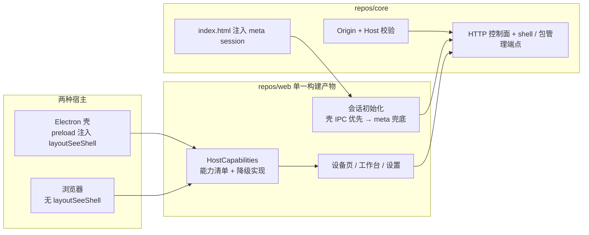

# LayoutSee Web 通用端设计文档

| 属性 | 内容 |
| --- | --- |
| 文档状态 | 待评审 |
| 目标版本 | V0.1 |
| 文档用途 | Web 通用端（浏览器直连本地 Core）的方案事实源，与 PRD、技术评审冲突时以本文为准并回写上游 |
| 关联输入 | [PRD](../../docs/feature/UI-LayoutSee需求文档PRD.md)、[技术评审](../../docs/story/技术评审-macos桌面壳与原生动效.md)、[模块索引](../../INDEX.md)、[设计规范](../../docs/DESIGN.md)、[插件接口层](../[Story-0831]-plugins/doc.md) |
| 参考实现 | `source/uiautodev`（只读参考，不改动）、线上 Web 版 `uiauto2.devsleep.com` |

## 背景与目标

mac 桌面壳已可用，但 Web 端只在「壳内」可用：`session token` 唯一来源是 `window.layoutSeeShell.getKernelSession()`（`web/app/ShellBridge.js:16`），浏览器直接打开 `http://127.0.0.1:33299` 时 token 为 `null`，`_require_session()` 会拒绝抓取快照、点击注入、只读切换、设置保存与日志上报（`core/server.py:185`）。也就是说当前浏览器里只剩「看设备列表 + 看实时画面」，核心链路全废。

本次目标是让浏览器成为与桌面壳对等的一等宿主，同时按 uiautodev 的功能与手感补齐三块能力。

可判定目标：

1. **零配置可用**：`npm run dev:web` 或 Core 带 `--static-dir` 启动后，浏览器打开打印出的 URL，无需任何手工填 token，即可完成「设备列表 → 工作台 → 抓取 → 选节点 → XPath → tap」全链路。
2. **宿主能力对等**：桌面壳独有能力（保存对话框、打开目录、选 adb 路径、原生主题）在浏览器下全部有明确降级路径，UI 不出现死按钮，不靠 `ShellBridge.available` 散落判断。
3. **层级体验对齐 uiautodev**：画面 / 属性+XPath / 层级树 三栏并列；XPath 支持按 `id | text | class` 生成、多命中序号切换、反查定位；底部状态栏显示分辨率、鼠标坐标与百分比。
4. **包管理与终端落地**：包管理支持第三方/系统应用切换、启动、停止、清除数据、卸载；终端支持自由输入 adb shell 命令，受只读门禁与 ActionLog 约束。
5. **安全不倒退**：写操作仍需 session token；新增 Origin 与 Host 校验，其他本地网页无法跨源触发写操作与终端命令。

非目标（明确不做）：颜色取色、命令(Beta)、录制(Beta)、VIP、安装 APK（需要文件上传通道，留 V0.2）、局域网/公网暴露、复刻 uiautodev 视觉（视觉一律走 `docs/designs/DESIGN.md` 与 `web/styles/tokens.css`）、改动 `source/uiautodev`。

## 现状与差距

| 能力 | 现状 | 差距 | 位置 |
| --- | --- | --- | --- |
| 会话令牌 | 只从壳 IPC 取 | 浏览器下 `null`，写操作与抓取全被拒 | `web/app/ShellBridge.js:16`、`core/server.py:185` |
| 跨源防护 | 无 CORS 响应头（跨源读被浏览器拦），但**无 Origin / Host 校验** | 其他本地网页可发简单请求触发副作用；DNS rebinding 无防护 | `core/server.py:95 end_headers` |
| 宿主能力 | `ShellBridge` 逐个方法 `shell ? : ` 兜底，只有 `exportLayout` 有真降级 | 无能力清单；`openLogsDir` / `chooseAdbPath` 在浏览器下静默失败 | `web/app/ShellBridge.js:36` |
| 层级布局 | 已是 属性 \| 树 两栏 grid，加左侧画面事实上已三栏 | 缺 XPath 生成模式、命中序号切换、底部状态栏 | `web/features/workbench/tabs/ElementTab.jsx:336` |
| 包管理 | 当前应用、启停、第三方应用列表 | 缺系统应用切换、清除数据、卸载 | `web/features/workbench/tabs/CommonTab.jsx`、`core/adb.py:194` |
| 终端 | 无 | Core 无 shell 端点，前端无 Tab | 缺失 |
| 开发链路 | `vite` 无 proxy，dev 下 `/api` 必 404 | 只能 build 后由 Core 托管才能联调 | `web/vite.config.js` |
| 媒体降级 | `DeviceCanvas` 已有 live / snapshot / 截图三态 | 未在非 Chromium 浏览器验证 WebCodecs 缺失路径 | `web/media/scrcpyStream.js` |

结论：浏览器宿主缺的是「会话 + 能力抽象 + 开发链路」三件基础设施，层级只需补交互细节，包管理与终端是增量功能。

## 目标架构



一条原则：**Web 只有一套代码与一套构建产物**，宿主差异全部收敛到 `HostCapabilities`，不做 `if (isElectron)` 式环境嗅探分叉，与插件模块「双平台同源」的既定方向一致。

## 关键设计

### 1 会话注入与本地安全边界

Core 在托管 `index.html` 时把当前 session token 注入 meta 标签，浏览器同源加载即拿到令牌。选 meta 而非内联 `<script>`，因为现有 CSP 是 `script-src 'self'`，内联脚本会被拦（`core/server.py:96`）。

```html
<!-- repos/web/index.html 预留占位，构建产物保留 -->
<meta name="layoutsee-session" content="__LAYOUTSEE_SESSION__" />
```

Core 侧只在 `_send_file` 命中 `index.html` 时做一次字符串替换（`Content-Length` 按替换后长度重算，`Cache-Control: no-store` 已存在）：

```python
def _render_index(self, content: bytes) -> bytes:
    return content.replace(b"__LAYOUTSEE_SESSION__", self.context.session_token.encode("ascii"))
```

前端初始化顺序：壳 IPC 优先（壳内 Core 重启后 token 会变，需要走 `onKernelStateChange` 刷新），无壳时读 meta，两者都没有时进入「只读观察模式」并给出明确横幅，而不是让每个写操作各自报错。

配套的安全补强（缺了它注入 token 等于降低安全水位）：

| 校验 | 规则 | 拒绝码 |
| --- | --- | --- |
| Host | 必须是 `127.0.0.1:{port}` 或 `localhost:{port}`，否则拒绝 | `PERMISSION_REQUIRED` |
| Origin | 存在时必须等于 `http://127.0.0.1:{port}` 或 `http://localhost:{port}`；缺失（同源导航、MCP 客户端）放行 | `PERMISSION_REQUIRED` |
| 生效范围 | 所有 `/api/**` 与 `/mcp/**`，读写都校验；静态资源不校验 | — |

这条同时关闭技术评审 4.3 里「拒绝非 UI 白名单浏览器 Origin」这项未落地要求，并防住 DNS rebinding（把恶意域名解析到 127.0.0.1 后 Host 头不匹配）。

安全边界的显式声明：**只支持 loopback 访问**。Core 只 bind `127.0.0.1`，不提供 `--host` 参数。局域网 IP 访问既不可达，也会丢失 secure context（`crypto.randomUUID`、`navigator.clipboard`、WebCodecs 均依赖它）。

### 2 宿主能力抽象与降级

`ShellBridge` 升级为 `HostBridge`，对外暴露一份能力清单，UI 按能力渲染，不再猜宿主。

```js
// web/app/HostBridge.js
export const HostBridge = {
  kind: "shell" | "browser",
  can: { saveFile, openDirectory, pickAdbPath, nativeTheme, quit, retryKernel },
  // 能力为 false 时，方法要么给出等效降级，要么由调用方隐藏入口
};
```

| 能力 | 壳 | 浏览器降级 |
| --- | --- | --- |
| 导出布局 XML | 保存对话框 | Blob 下载（现状已有） |
| 打开日志目录 | `shell.openPath` | 隐藏按钮，改为「日志路径」文本 + 复制按钮 |
| 打开插件目录 | 同上 | 同上 |
| 选择 adb 路径 | 文件选择器 | 设置页改为手工输入路径，保存时由 Core 校验存在性与可执行位 |
| 系统主题 | 原生 `nativeTheme` | `matchMedia("(prefers-color-scheme: dark)")` |
| 退出应用 / 重试 Core | IPC | 隐藏（浏览器不管进程生命周期） |
| 诊断复制 | 壳汇总 | 前端汇总 `/api/v1/info` + 设备诊断，`navigator.clipboard` 写入 |

### 3 层级三栏（对齐 uiautodev 手感）

布局形态不重写：工作台在 `element` Tab 下已经是 `设备画面 | 属性 | 层级树` 三栏（`ElementTab.jsx:336` 的 `inspector-grid` + 外层 `device-stage`）。本次只做三处交互补齐，视觉沿用现有 token。

1. **XPath 生成模式**：表达式框左侧加 `XPath by [id | text | class | 自定义]` 下拉。选中节点时按所选维度生成表达式并回填输入框。生成逻辑复用 Core 的 `/selectors`（`core/selectors.py:19` 已产出 resource-id、text+class、content-desc+class、祖先 id+后代、class+序号五类候选），但当前响应只有中文 `reason` 字符串，前端无法可靠筛选，因此给候选补一个机器可读字段 `kind: "id" | "text" | "desc" | "ancestor" | "index"`，前端按 `kind` 取用。不在前端重写一套生成规则。
2. **多命中序号切换**：查询命中 N 个时，输入框下方渲染 `1 2 3 … N` 序号按钮，点击切换当前定位节点（更新选中态 + 树滚动 + 画面高亮），命中集合的黄色高亮保持不变。上限 200 个按钮，超出折叠为输入框跳转。
3. **底部状态栏**：工作台底部常驻一行：`设备分辨率`、`鼠标像素坐标`、`百分比坐标`、`Core 版本`、`当前快照节点数`。坐标来自 `DeviceCanvas` 的 `pointermove`（节流 60ms），换算沿用既有的物理分辨率换算逻辑（不是推流分辨率，见 INDEX.md 已知坑 3）。

### 4 包管理

`CommonTab` 升级为「包管理」语义，保留当前应用与启停，新增系统应用切换、清除数据、卸载。

Core `adb.py` 现有 `apps()` 固定 `pm list packages -3`，需要加参数：

```python
def apps(self, serial: str, query: str = "", include_system: bool = False) -> list[dict[str, str]]
```

新增两个动作走既有 `action` 通道（不新增端点，天然继承只读门禁 + ActionLog + 设备串行锁）：

| 动作 | 实现 | 前端约束 |
| --- | --- | --- |
| `clear_app` | `pm clear <pkg>` | 二次确认，说明会清空数据与登录态 |
| `uninstall_app` | `pm uninstall <pkg>` | 二次确认，仅对第三方应用启用；系统应用禁用并给出原因 tooltip |

### 5 终端

浏览器与壳共用一个新端点，自由输入命令，风险靠门禁与审计控制而不是靠限制表达能力（用户已拍板「自由输入 + 门禁」）。

```
POST /api/v1/devices/{deviceId}/shell
body: { "command": "dumpsys battery", "timeoutMs": 15000 }
resp: { "exitCode": 0, "stdout": "...", "stderr": "", "truncated": false, "durationMs": 412 }
```

实现约束（几条都是硬要求）：

- 主机侧零 shell：`AdbClient.run(["shell", command])`，`shell=False`，命令整串作为**一个** argv 传给设备端 `sh`，因此管道与重定向在设备上生效，主机侧无注入面。这也满足 Mimosa hook 对 subprocess 拼接的拦截规则。
- 走 `_require_session()` + 只读门禁 + 设备串行锁：只读模式下整个终端禁用（shell 无法静态判定读写），UI 显示原因而不是报错。
- 每条命令写 ActionLog（`source=ui`，含完整命令、退出码、耗时），日志不记录 stdout 内容以免泄漏隐私。
- 输出上限 256 KB，超出截断并置 `truncated: true`；默认超时 15s，上限 60s。
- 前端对高危前缀（`reboot`、`rm -rf /`、`pm uninstall`、`factory` 等）弹二次确认；这是提醒不是安全边界，Core 不做命令黑名单（黑名单既拦不住又会破坏体验）。
- 前端保留最近 100 条命令历史（`localStorage`，按设备隔离），支持上下键翻历史、Ctrl+L 清屏。

### 6 开发与访问入口

新增 `scripts/dev-web.mjs`，一条命令拉起浏览器可用的完整环境，解决 dev 下 `/api` 404 与 token 缺失两个问题：

```
npm run dev:web
  → 生成 64 hex nonce
  → 启动 Core（不带 --static-dir）
  → 读 READY 行拿到 port，按 handshake 金样派生 session token
  → 启动 vite（proxy /api /mcp → Core；define token 注入）
  → 打印 http://127.0.0.1:4173
```

生产访问路径不变：`Core --static-dir <web dist>` 后打开 READY 行里的 `http://127.0.0.1:{port}`，token 由 meta 注入。Core 新增 `--open` 参数（默认关闭）用于自动开浏览器。

token 在 dev 下经 vite `define` 注入，属于本机开发态；构建产物不含任何 token 常量，只有运行时 meta。

## 契约变更

| 契约 | 变更 | 动作 |
| --- | --- | --- |
| `POST /api/v1/devices/{id}/shell` | 新增 | 回填 `contracts/openapi/core-v1.yaml` + 请求/响应 schema |
| `GET /api/v1/devices/{id}/apps` | 新增 `includeSystem` 查询参数 | 回填 OpenAPI |
| `POST /api/v1/devices/{id}/actions` | 新增 `clear_app`、`uninstall_app` | 更新动作枚举 schema |
| `POST /api/v1/snapshots/{id}/selectors` | 候选新增 `kind` 字段 | 更新响应 schema，前端按 kind 筛选 |
| 错误码 | 复用 `PERMISSION_REQUIRED`、`DEVICE_BUSY`、`OPERATION_TIMEOUT`，不新增 | — |
| 既有漂移 | scrcpy 流、`ui-logs`、`window-size` 未回填（INDEX.md 已记） | 本次顺带补齐，让 `contracts:check` 真实可信 |

## 工作项拆分

| 编号 | 交付物 | 类型 | 关注文件 |
| --- | --- | --- | --- |
| W1 | 会话注入 + Origin/Host 校验：浏览器打开即可抓取与点击，跨源写被拒 | 改造 | `core/server.py`、`web/index.html`、`web/app/ShellBridge.js`、`core/tests/` |
| W2 | `dev:web` 编排脚本 + vite proxy，浏览器联调链路可用 | 新增 | `scripts/dev-web.mjs`、`web/vite.config.js`、根 `package.json` |
| W3 | `HostBridge` 能力清单与全部降级实现，设置页 adb 路径手输 | 改造 | `web/app/HostBridge.js`、`web/features/settings/SettingsPage.jsx`、`web/features/workbench/tabs/*` |
| W4 | 层级三栏交互补齐：XPath by 模式、命中序号切换、底部状态栏 | 改造 | `core/selectors.py`、`web/features/workbench/tabs/ElementTab.jsx`、`DeviceCanvas.jsx`、`WorkbenchPage.jsx`、`styles/app.css` |
| W5 | 包管理：系统应用切换、清除数据、卸载 | 改造 | `core/adb.py`、`core/server.py`、`web/features/workbench/tabs/CommonTab.jsx` |
| W6 | 终端：Core shell 端点 + 终端 Tab | 新增 | `core/server.py`、`core/adb.py`、`web/features/workbench/tabs/TerminalTab.jsx`、`WorkbenchPage.jsx` |
| W7 | 契约回填与漂移门禁，`contracts:check` 通过 | 改造 | `contracts/openapi/core-v1.yaml`、`contracts/schemas/**` |

依赖关系：W1 是所有浏览器验证的前提；W2 依赖 W1（脚本要派生 token）；W4/W5/W6 依赖 W2 才能高效验证；W7 跟随 W5/W6 落地。

## 验收与验证

| 层级 | 验证内容 | 命令 / 方式 |
| --- | --- | --- |
| Core 单测 | session 注入替换、Host/Origin 拒绝矩阵、shell 端点门禁与截断、`apps(include_system)` | `npm run test:core` |
| 契约 | 新端点 schema、生成物无漂移 | `npm run test:contracts && npm run contracts:check` |
| Web 单测 | XPath 命中序号切换纯函数、终端历史环形缓冲 | `cd repos/web && node --test` |
| Lint | 全仓 | `npm run lint` |
| 壳回归 | 桌面壳内 token 仍走 IPC，Core 重启后 token 刷新 | `npm --workspace @layoutsee/mac run test` + 手动 |
| 浏览器真机 | Chrome：设备 → 工作台 → 抓取 → 选点 → XPath → tap → 终端 → 包管理全链路 | `npm run dev:web` + 真机 |
| 浏览器降级 | Safari（WebCodecs 缺失或部分支持）落到截图轮询并有明确标识 | 手动 |
| 安全 | 从 `http://localhost:4173` 之外的本地页面发起写请求被拒；伪造 Host 被拒 | Core 单测 + curl |

## 风险

| 风险 | 等级 | 缓解 |
| --- | --- | --- |
| meta 注入 token 后被同机其他页面利用 | 高 | Origin + Host 双校验；token 每次启动随机；不写入 URL 与日志 |
| 终端成为任意命令通道 | 高 | 只读模式全禁、session 必需、全量审计、超时与输出上限、高危二次确认 |
| 浏览器媒体链路不如壳稳定 | 中 | 保留截图轮询降级；在 Chrome 之外只承诺降级路径可用 |
| dev token 注入泄漏进构建产物 | 中 | `define` 只在 dev 分支；构建产物做字符串扫描断言 |
| 三栏交互改动波及壳内既有体验 | 中 | 复用同一套组件与 token，壳与浏览器共用一套构建产物并各跑一遍主链路 |
| 契约漂移继续扩大 | 中 | W7 把既有未回填端点一并补齐，`contracts:check` 进入验收门禁 |

## 上游回写

落地后需要同步的上游文档（不在本文档内改）：

1. PRD：补充「浏览器宿主」为一等运行形态，明确终端与包管理进入 V0.1 范围。
2. 技术评审：4.3 的 Origin 白名单要求已由本文落地，需标注实现位置；`preload` 白名单表补 `HostBridge` 能力对应关系。
3. `INDEX.md`：新增 `TerminalTab`、`HostBridge`、`scripts/dev-web.mjs` 与 shell 端点。
4. `source/web/overview.md`、`setup.md`：补浏览器访问方式与 `dev:web`。

