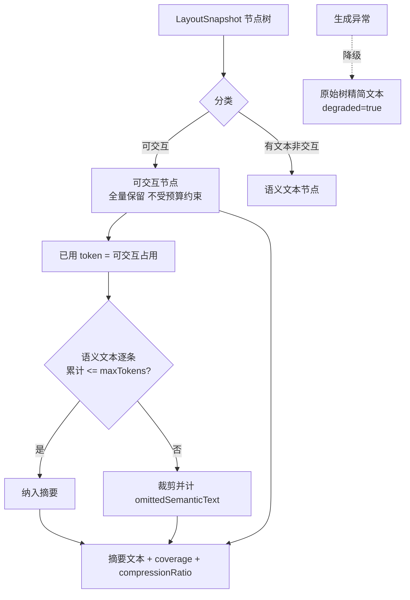
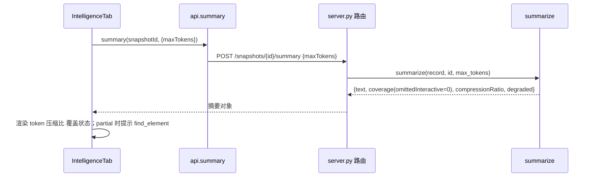

# 布局智能板块优化 设计文档

| 属性 | 内容 |
| --- | --- |
| 文档状态 | 待评审 |
| 目标版本 | V0.1 收尾（第一期）加 V0.2（第二、三期） |
| 文档用途 | 本次布局智能优化的方案事实源，冲突时以本文为准 |
| 关联 PRD | docs/feature/UI-LayoutSee需求文档PRD.md（4.3 语义化布局摘要、异常诊断章节、附录 API 契约） |

## 背景和目标

布局智能是 LayoutSee 面向 Agent 的高阶感知 Tab，核心价值是让 Agent 以结构化节点树而非截图理解界面，做到少调用、少读、少猜。当前 V0.1 已落地语义摘要与六类布局诊断，但对照 PRD 存在一处底线违背、一处契约承诺未兑现，以及多项规划未落地。

本次优化目标（均可判定）：

1. 语义摘要在任何页面都不丢弃可交互元素：密集页 `coverage.omittedInteractive` 恒为 0。
2. `get_layout_summary` 支持 `maxTokens` 入参并端到端生效，默认值对齐 PRD 的 1200。
3. 前端摘要面板展示压缩比与裁剪策略配置入口，与 PRD 4.3 一致。
4. 诊断结果对多节点问题（重叠、遮挡）在画面上框出全部涉及节点并连线，与 PRD 一致。
5. token 估算与文本截断判定的准确性可度量地提升。
6. 补齐 V0.2 规划：快照存档与基线、快照 diff、Skill 联动导出。

## 当前代码库现状

### 功能定义（PRD 规划）

布局智能 Tab 规划四类能力：

- 语义摘要（P0 / V0.1）：原始节点树裁剪聚合为低 token 结构描述，可交互元素带短 `ref`，Agent 可用 `ref` 直接操作。目标不超过 1200 token 每轮，对应 MCP `get_layout_summary`。
- 异常诊断（P0 / V0.1）：遮挡、重叠、越界、触控热区过小、文本截断、隐形可交互六类问题，画面标注加 severity 排序，对应 MCP `diagnose_layout`。
- 快照存档与基线（P1 / V0.2）：快照落盘归档、标记基线、按设备与应用分组。
- 快照 diff 与 Skill 联动导出（P1 / V0.2）：两快照结构对比，导出 layout-inspector 兼容格式。

### 已实现（V0.1，代码事实）

- `repos/core/src/layoutsee_core/summary.py`：`summarize(record, snapshot_id)`，确定性生成，CJK 计权 token 估算，两阶段输出（先可交互后语义文本），预算常量 `TARGET_BUDGET=1000`，输出 coverage 统计与 `partial` 标记。
- `repos/core/src/layoutsee_core/diagnostics.py`：`diagnose(record, snapshot_id)`，六类规则纯函数，重叠与遮挡走 `_overlap_and_occlusion`，越界含 `_parent_clipped`。
- `repos/core/src/layoutsee_core/finder.py`：`find_element` 词法与结构检索，`SAFE_MARGIN` 消歧。
- `repos/web/src/features/workbench/tabs/IntelligenceTab.jsx`：摘要与诊断的触发、指标展示、结果列表。
- 路由：`server.py` 的 `POST /api/v1/snapshots/{id}/summary` 与同路径 `/diagnostics`。

### 问题清单（按严重度，均已核对代码）

| 编号 | 位置 | 问题 | 对照 PRD | 严重度 |
| --- | --- | --- | --- | --- |
| P0-1 | summary.py:80-116 | 可交互元素随预算被裁剪：phase1 与 phase2 共用 `budget_exhausted`，可交互元素本身累计超预算即丢弃。实测截图 48 个可交互仅保留 37 | 风险表「可交互元素必保留」底线被违背 | 严重 |
| P0-2 | server.py:466-469 与 summary.py:44 | `maxTokens` 未打通，`TARGET_BUDGET=1000` 写死且低于目标 | 附录契约 `get_layout_summary maxTokens 可选` 未兑现，目标 1200 未达 | 严重 |
| P1-3 | IntelligenceTab.jsx:85-89 | 缺压缩比展示 | 4.3 要求「原始 XML 字符数到摘要字符数」压缩比 | 中 |
| P1-4 | IntelligenceTab.jsx | 缺配置裁剪策略入口 | 4.3 要求右上角「配置裁剪策略」入口 | 中 |
| P1-5 | IntelligenceTab.jsx:129 | 多节点问题仅高亮 `nodeKeys[0]`，无连线 | 异常诊断要求「框出涉及节点并连线标注」 | 中 |
| P1-6 | diagnostics.py:80,143,86 与 summary.py:31 | 阈值写死：44dp、30% 重叠、24px、label 120 字 | 无法按设备或场景调整 | 中 |
| P2-7 | summary.py:35-41 | token 估算为启发式，与真实分词器有偏差 | 影响 token 预算判定精度 | 中 |
| P2-8 | diagnostics.py:92-97 | 文本截断仅认省略号结尾 | 漏检无省略号的真实截断 | 中 |
| 缺-9 | 未实现 | 快照存档与基线管理 | P1 / V0.2 规划 | 缺失 |
| 缺-10 | 未实现 | 快照 diff | P1 / V0.2 规划 | 缺失 |
| 缺-11 | 未实现 | Skill 联动导出 layout-inspector 格式 | P1 / V0.2 规划 | 缺失 |

结论：诊断能力基础扎实，语义摘要存在一处会让 Agent 漏看控件的底线缺陷（P0-1）与一处契约未兑现（P0-2），这两项是本次优先级最高的修复目标。

## 架构和技术设计

改造核心是把「预算裁剪」的作用域从「全体节点」收窄到「语义文本节点」，可交互节点无条件保留。摘要生成异常时降级为原始树精简文本，保证接口不 500。



诊断侧不改判定算法，仅改前端消费：`finding.nodeKeys` 全量框选并在多节点间连线；阈值从写死改为可配（默认值不变）。

## 数据流或调用链

语义摘要：



布局诊断链路不变：`POST /snapshots/{id}/diagnostics` 调 `diagnose`，前端按 `nodeKeys` 全量高亮。

## 关键接口与数据结构

摘要函数签名变更（`summary.py`）：

```python
# 变更前
def summarize(record, snapshot_id) -> dict
# 变更后：max_tokens 关键字入参，默认 1200 对齐 PRD
def summarize(record, snapshot_id, *, max_tokens: int = 1200) -> dict
```

关键行为约束：

- 可交互节点全量进入 `lines`，不参与预算裁剪；预算裁剪只作用于语义文本阶段。
- `coverage.omittedInteractive` 恒为 0；仅 `omittedSemanticText` 可能大于 0。
- 可交互节点自身即超 `max_tokens` 时，仍全量输出，置 `interactiveOverBudget=true`，绝不裁剪。
- 生成异常时返回 `degraded=true` 与原始树精简文本，HTTP 仍为 200。

摘要响应新增字段（契约增量，向后兼容）：

```json
{
  "estimatedTokens": 986,
  "maxTokens": 1200,
  "compressionRatio": { "rawChars": 20480, "summaryChars": 1180, "ratio": 0.06 },
  "degraded": false,
  "interactiveOverBudget": false,
  "coverage": { "omittedInteractive": 0, "omittedSemanticText": 12 }
}
```

诊断阈值改为可配（`settings.py` 的 `UPDATABLE_KEYS` 白名单，`diagnose` 读取，缺省不变）：

```
diagnostics.touchTargetDp = 44
diagnostics.overlapRatio  = 0.3
diagnostics.touchTargetPxFallback = 24
summary.labelMaxChars = 120
```

契约同步点：`repos/contracts/openapi/core-v1.yaml`（summary 请求加 `maxTokens`、响应加上述字段）与 `schemas/snapshot`；改后必须重跑 `generate` 并过 `contracts:check`（`generated/` 禁手改）。

## 错误处理、兼容性和边界情况

- 摘要降级：`summarize` 内部异常时返回 `degraded=true` 与原始树精简文本，不抛 500，对应 PRD「摘要失败自动降级为原始树」。
- 契约兼容：新增字段均为增量，旧前端忽略即可；`maxTokens` 缺省走 1200，旧调用方无感。
- 可交互元素极多：即使自身超 `maxTokens` 也全量输出，`estimatedTokens` 可能超 `maxTokens`，此时 `degraded=false` 且 `interactiveOverBudget=true`，前端提示「可交互元素超预算但已完整保留」。
- 阈值配置越界：非法值回退默认并记审计，遵循 `SettingsStore` 既有白名单与静默忽略策略。
- 确定性不变：同一快照与同一 `maxTokens` 必须字节级一致，`ALGORITHM_VERSION` 随算法变更递增。
- 空快照或无可交互元素：返回空摘要与 `partial=false`，不报错。

## 测试策略

- core 单测 `npm run test:core`：
  - 密集页夹具断言 `coverage.omittedInteractive == 0`（P0-1 回归底线）。
  - 传入 `max_tokens` 生效、缺省为 1200（P0-2）。
  - 降级路径：构造异常输入，断言 `degraded=true` 且 HTTP 200。
  - 阈值可配：改 settings 后 `diagnose` 结果随阈值变化。
  - 文件：`tests/test_summary_selectors.py`、`tests/test_diagnostics_settings.py`。
- 契约 `npm run contracts:check`：改 openapi 与 schema 后不漂移。
- web 单测 `npm run test:web`：压缩比渲染、`maxTokens` 入参透传、多节点高亮的纯函数切片。
- 人工可视化（人负责）：真机抓密集页确认摘要不丢可交互；诊断重叠项连线正确框出两个节点。

## 工作项拆分

按优先级分三期。第一期修复底线与契约，是发版必做；第二、三期为增强与 V0.2 能力。

第一期，V0.1 收尾（P0 加关键 P1）：

| 编号 | 端 | 标题 | 内容描述 | 关注文件与目录 | 依赖 |
| --- | --- | --- | --- | --- | --- |
| W1 | 服务端 | 语义摘要保底与 maxTokens 打通 | 可交互元素全量保留，预算只裁语义文本；`summarize` 加 `max_tokens` 默认 1200；生成异常降级；路由透传 body.maxTokens；同步契约并过漂移门禁 | summary.py、server.py、repos/contracts、tests/test_summary_selectors.py | 无 |
| W2 | 前端 | 摘要面板对齐 PRD 4.3 | 展示压缩比（原始 XML 到摘要字符）；新增裁剪策略配置入口驱动 maxTokens | IntelligenceTab.jsx、api/client.js | W1 |
| W3 | 前端 | 诊断多节点连线标注 | 高亮 finding 全部 nodeKeys 并连线，重叠遮挡两节点均框出 | IntelligenceTab.jsx、DeviceCanvas.jsx、WorkbenchPage.jsx、styles/app.css | 无 |

第二期，准确性与可配（P1 加 P2）：

| 编号 | 端 | 标题 | 内容描述 | 关注文件与目录 | 依赖 |
| --- | --- | --- | --- | --- | --- |
| W4 | 服务端 | token 估算准确性增强 | 改进启发式贴近真实分词，评估是否引入轻量分词表；不引入常驻重型依赖 | summary.py、tests | 无 |
| W5 | 服务端 | 文本截断诊断增强 | 省略号之外增加容器溢出与 ellipsize 启发式 | diagnostics.py、tests | 无 |
| W6 | 服务端 | 诊断阈值可配 | 阈值提取到 settings 白名单，`diagnose` 读取，默认值不变 | diagnostics.py、summary.py、settings.py、repos/contracts、tests | 无 |

第三期，V0.2 能力：

| 编号 | 端 | 标题 | 内容描述 | 关注文件与目录 | 依赖 |
| --- | --- | --- | --- | --- | --- |
| W7 | 服务端 | 快照存档与基线管理 | 快照落盘归档、标记基线、按设备与应用分组 | snapshots.py、server.py、settings.py、repos/contracts | 无 |
| W8 | 全栈 | 快照 diff | 后端结构对比（增删、位移、文本变化）加前端双栏 diff 视图 | 新增 diff.py、server.py、IntelligenceTab.jsx 或新页面、repos/contracts | W7 |
| W9 | 服务端 | Skill 联动导出 | 导出与 layout-inspector 兼容的文件与目录约定 | 新增导出模块、server.py、repos/contracts | W7 |

## 明确不做

- 诊断的 O(n²) 重叠与遮挡计算性能优化：当前 73 节点耗时 1ms，无瓶颈，遵循 YAGNI，待真机出现密集大页再评估。
- 引入 tiktoken 等重型分词器常驻进程：PyInstaller onedir 打包体积敏感，token 估算优先轻量方案。
- 群控多设备的批量布局智能：不在本次范围。
- `find_element` 权重的学习化改造：本次仅围绕摘要与诊断，检索算法维持现状。

